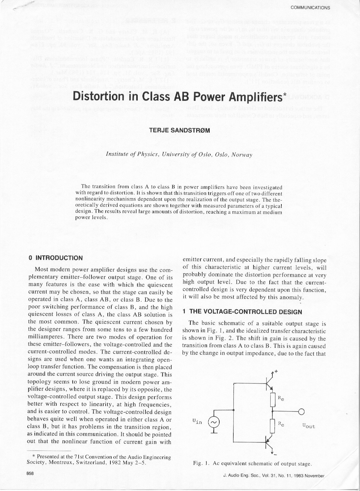
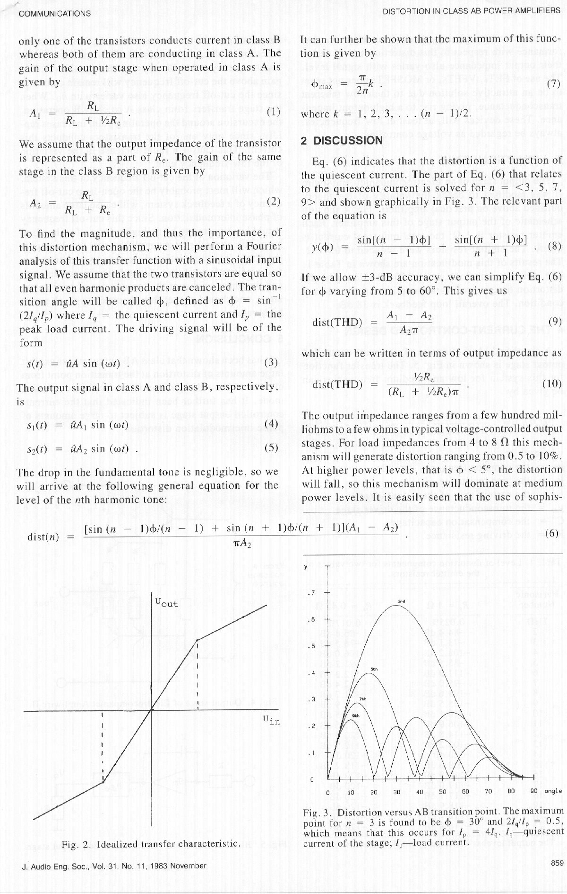
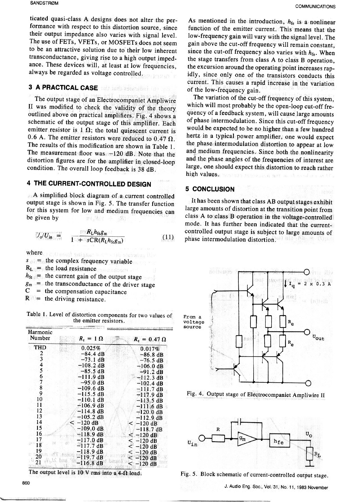
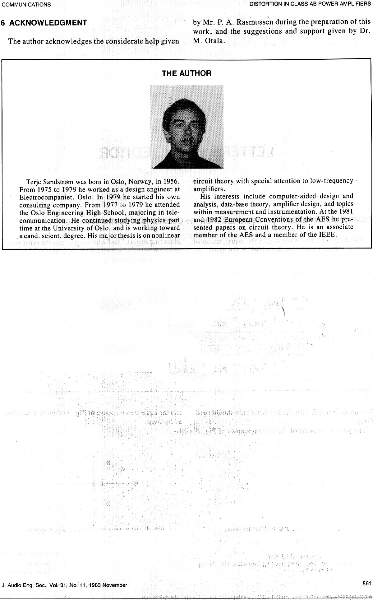

+++
title = "AES Paper: AB Distortion in Output Stages"
weight = 30
+++

My Audio Engineering Society journal article on class AB distortion in power
amplifier output stages, 1983 — referenced throughout the [Schematics](/schematics/)
and [Theory](/theory/) sections.

**"Distortion in Class AB Power Amplifiers"**, Terje Sandstrøm (Institute of
Physics, University of Oslo). Presented first as an AES convention paper, then
published in the Journal:

- AES Convention 71, Paper Number 1870, presented 6 March 1982 —
  [AES E-Library entry](https://www.aes.org/e-lib/browse.cfm?elib=11886)
- *Journal of the Audio Engineering Society*, Vol. 31, Issue 11, pp. 858–861,
  November 1983 —
  [AES Journal Forum entry](https://secure.aes.org/forum/pubs/journal/?elib=4540)

This was one of two papers I presented at AES conventions in the early '80s;
this is the one that made it into the Journal. I haven't been able to
identify the other one — if you know its title, let me know via
[the about page](/about/).

