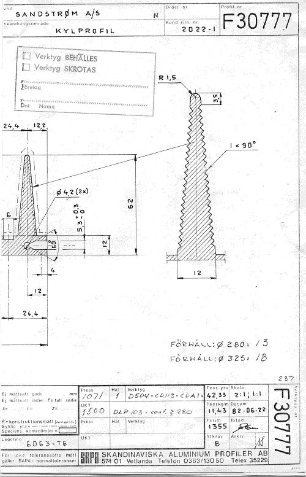

+++
title = "The Ultimate Cooling Fins"
weight = 20
+++

These cooling fins may be the best-engineered fins ever made for an audio
amplifier. They are the result of a strong interest in thermodynamics I had
at the time. The fins are much thicker at the base than ordinary fins, and
are gradually made thinner outwards. This was done to improve heat transfer
through the fins, while at the same time ensuring a well-defined air flow and
an even surface temperature — thus the lowest overall heat-transfer
resistance.

The fins were very carefully designed, and every aspect was calculated to
give optimal performance. The compromise in size and weight was found
acceptable for the performance gained.

*(The overview photo of the finished fin, `CoolingFin1.jpg`, was referenced
on the old site but the image file itself was never found in the archive —
only the close-up below survived.)*

If you take a closer look at a fin:

Note the zig-zag pattern — this was done to increase the overall surface area
of the fin by 40%. Not bad, huh?

We made a few dozen of these fins, and they performed as intended. However,
none ever made it into a commercial amplifier.
