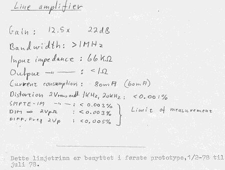
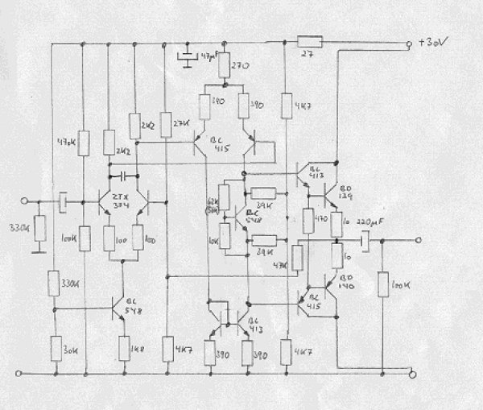

+++
title = "The May '78 Preamplifier"
weight = 40
+++

Details on this preamplifier will be added over time. First, the line stage —
the specifications achieved are shown below:

The design was made very similar to the "Otala" designs. It was a
single-power-supply design — note the input and output capacitors. It was
designed to replace our old, completely single-ended preamplifier, which was
never a big hit.

At Electrocompaniet this preamp was named "Model II". It was designed in the
period January to July 1978 — I don't remember why it ended up being called
the May '78 preamp.
