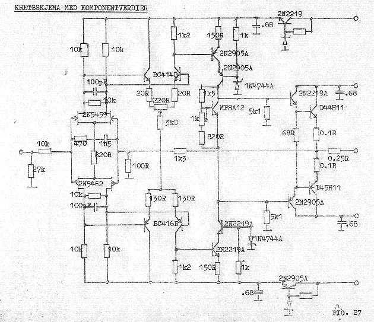

+++
title = "The School Amplifier"
weight = 10
+++

Øistein Klevhus, now at FHI (the Norwegian Institute of Public Health), and
myself did a project together at the end of our engineering school. I am
greatly in debt to Øistein, because he was the one who made it possible for
me to go through with that school — I was far too busy with EC, and had far
too little time for school. Øistein came over to me at EC with schoolwork
tasks and other stuff I had to do, and in that way it was possible for me to
get through the school without nearly being present. I am forever grateful
for that!

The amplifier: it was a very special design, fully complementary, and used
matched single field-effect transistors at the input, along with some very
interesting output transistors that had a very low turnover point.

More info on the matching of the input transistors will follow, but for now:
they required manual matching, and it wasn't easy to find a pair that worked.
Note also the very low emitter resistors on the output stage — this matches a
later paper I did for the AES; see [the AB distortion paper](../ab-distortion).

The matched input JFETs were Siliconix U430/U431 dual n-channel devices —
see the datasheet below.

## Technical Report

- [The School Amplifier — Technical Report (1979)](school-amplifier-report-en/) —
  Complete English translation of the practical year project report with circuit design,
  theory, and measurements.
- [Skoleforsterkeren — full transcription (Norwegian)](skoleforsterkeren-report/) —
  the complete 1979 report in the original Norwegian, transcribed page by page with
  formulas and every scanned figure and table.

## Original design notes (kuriositet)

- [Skoleforsterkeren — original design notes (PDF, scanned)](skoleforsterkeren-original-notes.pdf)
- [Siliconix U430/U431 matched dual JFET datasheet (PDF, scanned)](siliconix-u430-u431-datasheet.pdf)
