+++
title = "The School Amplifier — Practical Year Project (1979)"
weight = 11
math = true
+++

*[Norwegian original](../skoleforsterkeren-report/)*

**Practical year project by Øistein Klevhus and Terje Sandstrøm, OIH 79 2TA.
LF stereo power amplifier.**

Full English translation of the original 1979 report, translated directly
from the [Norwegian transcription](../skoleforsterkeren-report/). Figures and
tables are the same scanned images as the Norwegian page; the formulas below
are set with MathJax for readability but follow the original's notation.

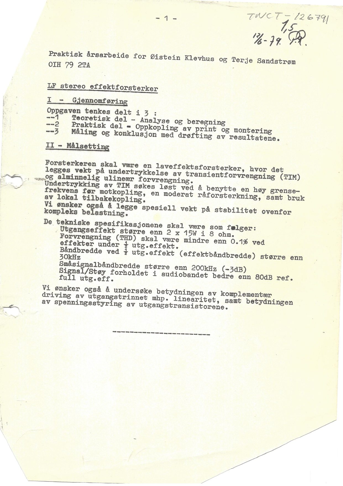

## Introduction

### On how the project was carried out

Part I of the assignment covers pages 3 to 27, with accompanying figures and
tables. Part III of the assignment covers pages 28 to 31.

Part II of the assignment, the PCB layout, is shown in fig. 30. The amplifier
itself is mounted on a chassis plate with a shared cooling fin for both
channels, mounted at the rear. The circuit boards are fixed to the chassis
plate with spacers. All connections to the circuit board are brought out to
a terminal block mounted on the front of the chassis plate. The power supply
wiring is shared between both channels, while the ground connections are
separate.

Under the project goals we mentioned investigating the significance of
complementary driving of the output transistors with respect to linearity,
and the significance of voltage-driving the output transistors is treated
theoretically on pages 7 to 12, within the analysis of the output stage.
Comments on these same topics are also scattered throughout the report.
There are comments specifically on this in Part III too, on the significance
of this for the final result.

Work on the amplifier, and especially writing this report, has taken longer
than we had budgeted for at the outset. We have therefore not included as
many measurement results as we would have liked. The trend in the
measurements we have taken is, however, positive enough that the project's
goals must be considered met.

## Part I — Theory and Design

### Project goals

We want an output power of 15W into an 8 ohm load, but will also take a
4 ohm load into account.

$P_{ut} = 15W$ at $R_L = 8$ ohm gives:

$$I_{peak} = \sqrt{2P_{ut}/R_L} = 1.94\text{ A} \tag{1}$$

If we disregard losses in the output, the power into 4 ohm should be 30W.
This gives:

$$I_{peak(4)} = 2.74\text{ A} \tag{2}$$

The maximum output swing becomes:

$$U_{peak} = I_{peak} R_L = 15.5\text{ V} \tag{3}$$

This gives an rms voltage of:

$$U_{rms} = U_{peak}/\sqrt{2} = 10.95\text{ V} \tag{4}$$

We further want an input sensitivity corresponding to 0 dBm, which gives
$U_{inn} = 0.775\text{ V}_{rms}$. The gain then becomes:

$$A_{cl} = U_{rms}/U_{inn} = 14.13\text{ X, i.e. } 23\text{dB} \tag{5}$$

### TIM - DIM - SID

Transient InterModulation, Dynamic InterModulation, and Slewing Induced
Distortion are closely related concepts describing how high-frequency
distortion can arise in certain cases in feedback amplifiers.

Fig. 1 shows a general model for feedback amplifiers. A1 represents all
amplifying stages ahead of the compensation network A2, which determines the
amplifier's dominant open-loop-gain pole. A3 represents all amplifying
stages after the compensation network. B is the feedback network, which in
this case we treat as frequency-independent.

$U_{inn}$ is the input signal, $U_{ut}$ is the output signal, $U_f$ is the
fed-back signal, which is: $U_f = U_{ut} B \tag{1}$

$U_e$ is the error signal, which is: $U_e = U_{inn} - U_f \tag{2}$

$U_{ut}(s) = U_e A_1 A_2 A_3$ where $\tag{3}$

A1 and A2 are frequency-independent while $A_2(s) = 1/(1+sT) \tag{4}$

### fol and compensation

Further, $f_{ol} = 1/(2\pi T) \tag{1}$

We can see from the Bode plots in fig. 2 that the error signal $U_e$ rises
from $f_{ol}$. If the input signal is strong enough and the frequency higher
than $f_{ol}$, A1 can therefore be driven so hard that it becomes nonlinear
(DIM/SID), and in extreme cases the signal can be clipped in A1 (TIM). One
way this problem can be minimized is by placing $f_{ol}$ relatively high; we
have therefore chosen to place it at 10kHz.

We will additionally use "input-lag" compensation, together with the usual
2-stage compensation. The system is shown in fig. 3 and the Bode plots in
fig. 4.

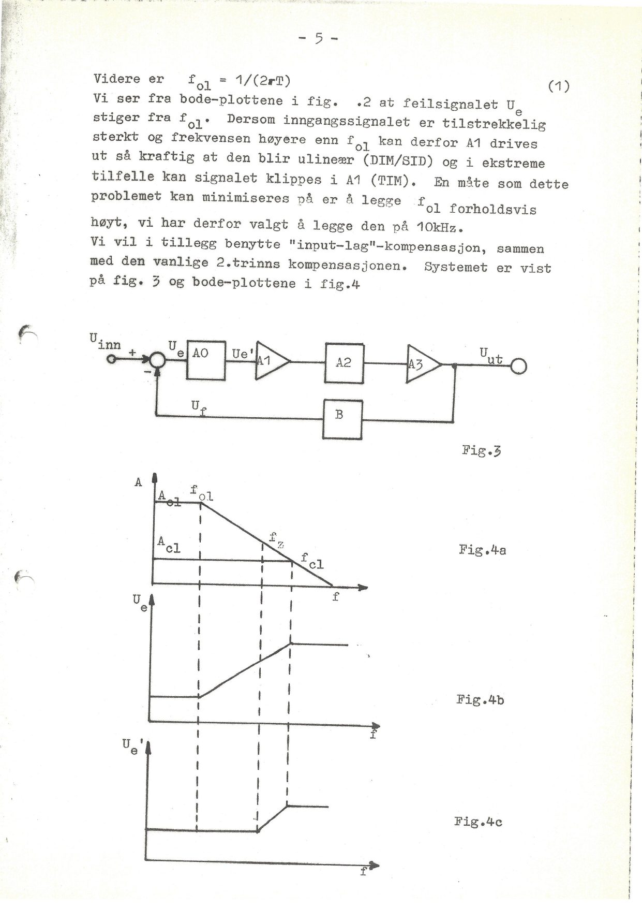

We then have that:

$$A_0 = (1+sT_z)/(1+sT) \tag{1}$$
$$A_2 = 1/(1+sT_z) \tag{2}$$

This means the input stage is not driven harder in the region between
$f_{ol}$ and $f_z$. By placing $f_z$ higher than the highest possible input
frequency, the potential for DIM/SID should be minimal.

### Clipping

In an amplifier with negative feedback, all nonlinear distortion is reduced
by a factor equal to the feedback. This also applies to clipping. That means
the amplifier's error signal, $U_e$ in fig. 1, will contain the clipped
portion of the output signal. Since it is not physically possible for the
amplifier to correct for the clipping, this means that the stage which
determines the clipping level is driven into saturation immediately. The
other stages are driven nonlinearly and, given a strong enough input signal,
into saturation or cut-off. Saturation means the transistor's current gain
is reduced toward 1. The stage driving it must then have sufficient current
reserves to be able to drive this stage out of clipping reasonably fast
(overload recovery time). The output stage should therefore not be allowed
to be driven into clipping, i.e. into saturation, since this delivers too
much current and therefore requires correspondingly high base current to
turn on. We will therefore let the drivers determine the clipping level. The
downside is that we get extra power dissipation in the output, i.e. reduced
efficiency.

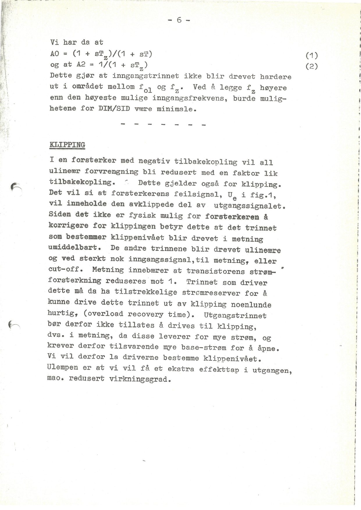

### The output stage

The output stage must be able to operate at very high frequencies. This
means the output stage must be voltage-driven, i.e. driven from a low
impedance, $Z_g \ll Z_{inn}$. This means the emitter follower gets a corner
frequency closer to $f_\alpha$ than $f_\beta$.

To get a simple assembly we want to use TO-39 cans as drivers, with an
optional cooling star. TO-39 transistors typically have $P_{c,max} = 3W$ at
$T_c = 25°C$, and a $\theta_{jc} = 60°C/W$, $T_{j,max} = 200°C$.

A standard cooling star for TO-39 typically has $\theta_{sa} = 50°C/W$.
Maximum ambient temperature is usually taken as $50°C$. We then get:

$$P_{D,max} = (T_j - T_{amb})/(\theta_{jc} + \theta_{sa}) = 1.36\text{ W} \tag{1}$$

when we assume $\theta_{cs} \ll \theta_{jc} + \theta_{sa}$

For now we assume the gain in the output stage is approximately equal to 1,
so $U_{CE}$ for the drivers must equal $U_{peak}$, i.e. 15.5V (eq. 3.3). This
gives the absolute maximum current:

$$I_{C,max} = P_{D,max}/U_{CE} = 88\text{ mA} \tag{2}$$
$$U_{CE,max} = 2U_{CE} \tag{3}$$

For linearity reasons we want the quiescent current in the stage to be
substantially larger than the maximum load current. (This is explained
further later.) This means we can treat $I_C$ as constant.

The SOAR curves for a typical TO-39 (2N2219) and eq. 3 give us
$I_{C,max} = 55$mA before second breakdown. The chosen $I_C$ should also not
be so large that the output transistors can be driven above their
$I_{C,max}$.

A standard FE-coupled stage (fig. 5) can be characterized by the fact that
the stage must double its current relative to the quiescent current, and
reduce it to near zero, to get the full voltage swing at the output. At full
drive the stage becomes very nonlinear. This can be seen by considering the
$I_C$ versus $U_{BE}$ characteristic. To get low distortion, one should
therefore

use a stage that operates, signal-wise, over a small portion of its
$I_c/U_{BE}$ characteristic in order to deliver the full voltage swing.
Stages like this are shown in fig. 6 and fig. 7.

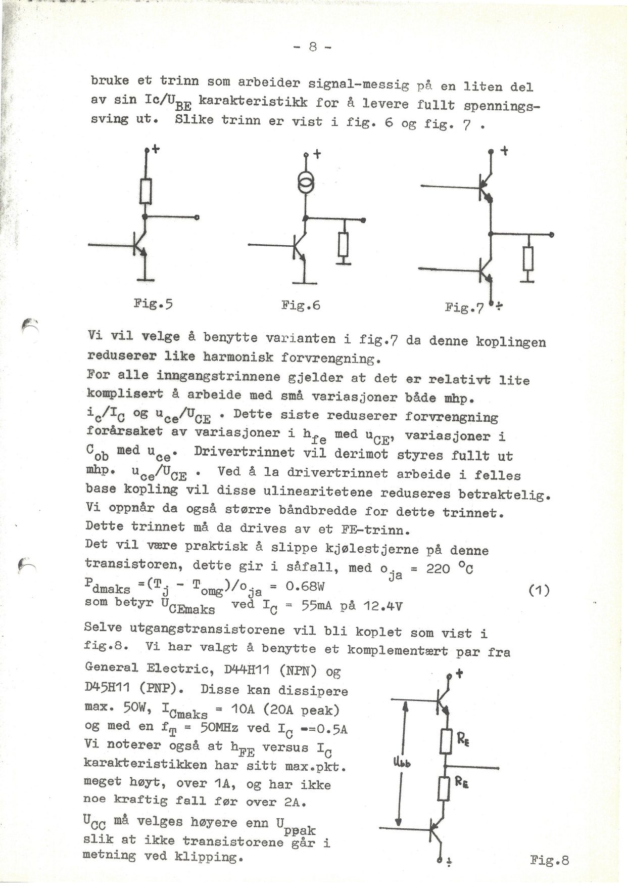

We will choose to use the variant in fig. 7, since this configuration
reduces even-harmonic distortion.

For all the input stages it holds that it is relatively uncomplicated to
work with small variations both with respect to $i_c/I_C$ and
$u_{ce}/U_{CE}$. The latter reduces distortion caused by variations in
$h_{fe}$ with $u_{CE}$, and variations in $C_{ob}$ with $u_{ce}$. The driver
stage, on the other hand, will be fully driven with respect to
$u_{ce}/U_{CE}$. By letting the driver stage operate in a common-base
configuration, these nonlinearities are considerably reduced. We also gain
greater bandwidth for this stage. This stage must then be driven by an
FE-stage.

It will be practical to omit a cooling star on this transistor; in that
case, with $\theta_{ja} = 220°C$:

$$P_{d,max} = (T_j - T_{amb})/\theta_{ja} = 0.68\text{ W} \tag{1}$$

which means $U_{CE,max}$ at $I_C = 55$mA is 12.4V

The output transistors themselves will be connected as shown in fig. 8. We
have chosen to use a complementary pair from General Electric, D44H11 (NPN)
and D45H11 (PNP). These can dissipate max. 50W, $I_{C,max} = 10A$ (20A
peak), and have an $f_T = 50$MHz at $I_C = 0.5A$. We also note that the
$h_{FE}$ versus $I_C$ characteristic has its maximum point very high, above
1A, and does not fall off sharply until above 2A.

$U_{CC}$ must be chosen higher than $U_{peak}$ so that the transistors do
not go into saturation when clipping.

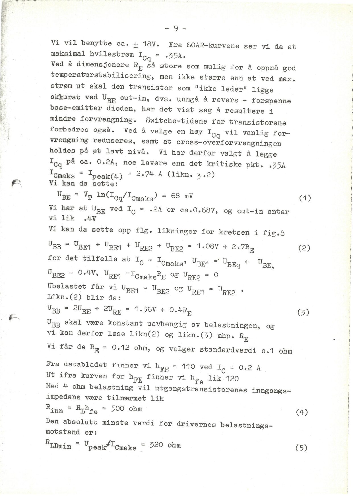

We will use approx. ±18V. From the SOAR curves we see that the maximum
quiescent current $I_{Cq} = .35$A.

By dimensioning $R_E$ as large as possible to achieve good temperature
stabilization, but not larger than that at maximum output current the
transistor that "is not conducting" sits right at $U_{BE}$ cut-in — i.e.
avoiding reverse-biasing the base-emitter diode — this has been shown to
result in less distortion. The switching times of the transistors are also
improved. Choosing a high $I_{Cq}$ reduces ordinary distortion, and also
keeps crossover distortion at a low level. We have therefore chosen to set
$I_{Cq}$ at approx. 0.2A, somewhat lower than the critical point of .35A.

$$I_{C,max} = I_{peak(4)} = 2.74\text{ A (eq. 3.2)} \tag{}$$

We can then set:

$$U_{BE} = V_T \ln(I_{Cq}/I_{C,max}) = 68\text{ mV} \tag{1}$$

We have that $U_{BE}$ at $I_C = .2A$ is approx. 0.68V, and we assume cut-in
equal to .4V

We can then set up the following equations for the circuit in fig. 8:

$$U_{BB} = U_{BE1} + U_{RE1} + U_{RE2} + U_{BE2} = 1.08\text{V} + 2.7R_E \tag{2}$$

for the case where $I_C = I_{C,max}$, $U_{BE1} = U_{BEq} + U_{BE}$,
$U_{BE2} = 0.4$V, $U_{RE1} = I_{C,max}R_E$ and $U_{RE2} = 0$

Unloaded we get $U_{BE1} = U_{BE2}$ and $U_{RE1} = U_{RE2}$. Eq. (2) then
becomes:

$$U_{BB} = 2U_{BE} + 2U_{RE} = 1.36\text{V} + 0.4R_E \tag{3}$$

$U_{BB}$ must be constant regardless of loading, so we can solve eq. (2) and
eq. (3) for $R_E$. We get $R_E = 0.12$ ohm, and choose the standard value
0.1 ohm.

From the datasheet we find $h_{FE} = 110$ at $I_C = 0.2$ A. From the curve
for $h_{FE}$ we find $h_{fe}$ equal to 120. With a 4 ohm load, the output
transistors' input impedance will be approximately equal to:

$$R_{inn} = R_L h_{fe} = 500\text{ ohm} \tag{4}$$

The absolute minimum value for the drivers' load resistance is:

$$R_{LDmin} = U_{peak}/I_{C,max} = 320\text{ ohm} \tag{5}$$

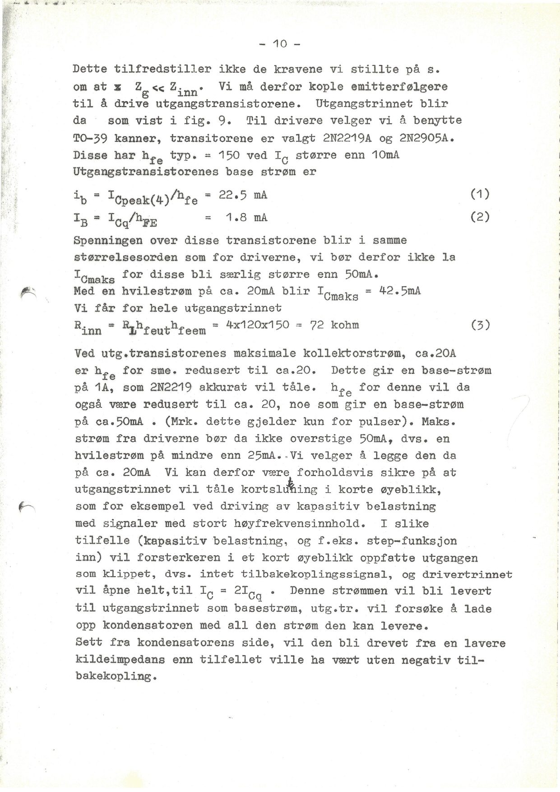

This does not satisfy the requirement we set earlier that $Z_g \ll Z_{inn}$.
We must therefore couple emitter followers to drive the output transistors.
The output stage then becomes as shown in fig. 9. For drivers we choose to
use TO-39 cans; the transistors chosen are 2N2219A and 2N2905A. These have
$h_{fe}$ typ. = 150 at $I_C$ greater than 10mA.

The output transistors' base current is:

$$i_b = I_{C,peak(4)}/h_{fe} = 22.5\text{ mA} \tag{1}$$
$$I_B = I_{Cq}/h_{FE} = 1.8\text{ mA} \tag{2}$$

The voltage across these transistors will be of the same order of magnitude
as for the drivers, so we should not let $I_{C,max}$ for these become much
larger than 50mA. With a quiescent current of approx. 20mA, $I_{C,max}$
becomes 42.5mA.

For the whole output stage we get:

$$R_{inn} = R_L h_{fe,out} h_{fe,em} = 4\times120\times150 = 72\text{ kohm} \tag{3}$$

At the output transistors' maximum collector current, approx. 20A, $h_{fe}$
for these is reduced to approx. 20. This gives a base current of 1A, which
the 2N2219 will just about tolerate. $h_{fe}$ for this one will then also be
reduced to approx. 20, which gives a base current of approx. 50mA. (Note:
this only applies to pulses.) The maximum current from the drivers should
therefore not exceed 50mA, i.e. a quiescent current of less than 25mA. We
choose to set it at approx. 20mA. We can therefore be reasonably confident
that the output stage will tolerate short-circuit for brief moments, such as
when driving a capacitive load with signals containing a lot of
high-frequency content. In such cases (capacitive load, and e.g. a step
function input) the amplifier will, for a brief moment, perceive the output
as clipped, i.e. no feedback signal, and the driver stage will open fully,
up to $I_C = 2I_{Cq}$. This current will be delivered to the output stage as
base current; the output stage will attempt to charge the capacitor with
all the current it can deliver. Seen from the capacitor's side, it will be
driven from a lower source impedance than would have been the case without
negative feedback.

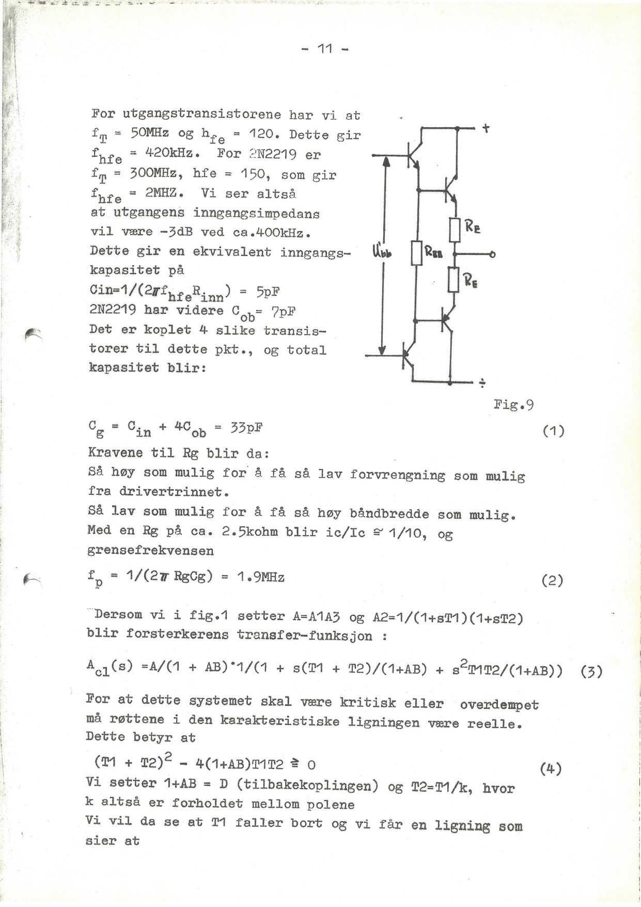

For the output transistors we have $f_T = 50$MHz and $h_{fe} = 120$. This
gives $f_{hfe} = 420$kHz. For the 2N2219, $f_T = 300$MHz, $h_{fe} = 150$,
which gives $f_{hfe} = 2$MHz. We see, then, that the output's input
impedance will be -3dB at approx. 400kHz.

This gives an equivalent input capacitance of:

$$C_{in} = 1/(2\pi f_{hfe} R_{inn}) = 5\text{ pF} \tag{}$$

The 2N2219 further has $C_{ob} = 7$pF. Four such transistors are connected
to this point, and the total capacitance becomes:

$$C_g = C_{in} + 4C_{ob} = 33\text{ pF} \tag{1}$$

The requirements on $R_g$ are then: as high as possible to get as low
distortion as possible from the driver stage. As low as possible to get as
high bandwidth as possible. With an $R_g$ of approx. 2.5kohm, $i_c/I_C
\approx 1/10$, and the corner frequency:

$$f_p = 1/(2\pi R_g C_g) = 1.9\text{ MHz} \tag{2}$$

If in fig. 1 we set $A = A_1 A_3$ and $A_2 = 1/((1+sT_1)(1+sT_2))$, the
amplifier's transfer function becomes:

$$A_{cl}(s) = \frac{A}{1+AB} \cdot \frac{1}{1 + s\frac{T_1+T_2}{1+AB} + s^2\frac{T_1 T_2}{1+AB}} \tag{3}$$

For this system to be critically damped or overdamped, the roots of the
characteristic equation must be real. This means:

$$(T_1+T_2)^2 - 4(1+AB)T_1 T_2 \gtrsim 0 \tag{4}$$

We set $1+AB = D$ (the feedback) and $T_2 = T_1/k$, where $k$ is thus the
ratio between the poles. We then see that $T_1$ drops out and we get an
equation which says that

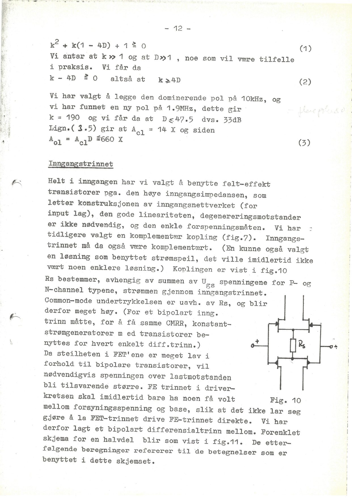

$$k^2 + k(1-4D) + 1 \gtrsim 0 \tag{1}$$

We assume $k \gg 1$ and $D \gg 1$, which will be the case in practice. We
then get:

$$k - 4D \gtrsim 0 \text{ i.e. } k \geq 4D \tag{2}$$

We have chosen to place the dominant pole at 10kHz, and we have found a new
pole at 1.9MHz; this gives $k = 190$ and we then get $D \leq 47.5$, i.e.
33dB. Eq. (11.5) gives $A_{cl} = 14X$ and since:

$$A_{ol} = A_{cl} D \leq 660\text{ X} \tag{3}$$

### The input stage

Right at the input, we have chosen to use field-effect transistors, because
of the high input impedance, which eases the design of the input network
(for input lag), the good linearity, the fact that degeneration resistors
are not necessary, and the simple biasing method. We have previously chosen
a complementary configuration (fig. 7). The input stage must then also be
complementary. (A solution using a current mirror could also have been
chosen; however, it would not have been any simpler a solution.) The
configuration is shown in fig. 10.

$R_s$ determines, depending on the sum of the $U_{gs}$ voltages for the P-
and N-channel types, the current through the input stage. The common-mode
rejection is independent of $R_s$, and is therefore very high. (For a
bipolar input stage, to get the same CMRR, constant-current generators with
transistors would have to be used for each individual differential stage.)

Since the transconductance in the FETs is very low compared to bipolar
transistors, the voltage across the load resistor will necessarily become
correspondingly larger. The FE stage in the driver circuit, however, should
only have a few volts between the supply voltage and the base, so that it
is not feasible to let the FET stage drive the FE stage directly. We have
therefore inserted a bipolar differential stage in between. A simplified
diagram for one half is shown in fig. 11. The calculations that follow refer
to the notation used in this diagram.

The resistor $R_{DD}$ prevents saturation of T2 during clipping by limiting
the maximum voltage swing at the input of T2. To get as good linearity as
possible, and a symmetrical drive around the operating point for T3/T4,
$R_E$ should be as large as possible, but not larger than that T3 is not
driven into saturation when clipping.

$R_E$ also determines the gain in the T3/T4 stage, but for large values of
$R_E$ the gain from the input of T2 to the output of T4 will be relatively
independent of $R_E$. The gain here will be approximately equal to (taking
the complementary drive into account):

$$A = \frac{U_{RC}}{2U_{RE2}} = \frac{2R_L}{R_E} = \frac{I_{C3}}{I_{C2}}\cdot\frac{R_L}{R_{E2}} \tag{1}$$

when we set $U_{RC} = R_E I_{C3}$, so A is independent of both $R_E$ and
$R_C$.

For the output transistors we have ...(continued on page 14)

To get low distortion, we then want $U_{GS} \ll U_{GSoff}$, and from eq.
(14.1) this gives a high $I_D$. From eq. (14.3) we see that this also gives
high transconductance. The drain resistor consequently also becomes low,
which gives a higher cut-off frequency at this point.

We therefore choose to drive the FETs at approx. 1/3 $I_{DSS}$, so that at
full overdrive of the input stage we just barely don't reach $I_{DSS}$. If
we assume no mismatch between the 2 transistors in each pair, all matching
harmonics will cancel.

We have chosen to use the 2N5459 (N-ch) and 2N5462 (P-ch). We have measured
$I_{DSS}$ and $U_{GS}$ at a chosen $I_D$, and calculated $U_{GSoff}$ and
$g_{fso}$ for 10 units of each type. The data is shown in table 1.

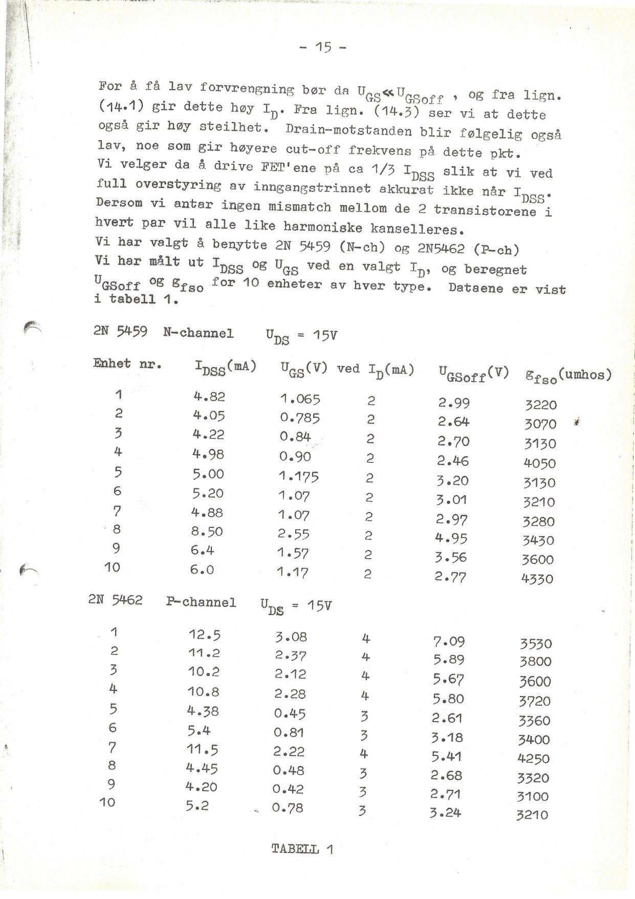

Based on the data in table 1, we choose to use:

For channel 1: N-ch. units no. 1 and 6, P-ch. units no. 6 and 10

For channel 2: N-ch. units no. 2 and 3, P-ch. units no. 5 and 8

These have $I_{DSS}$ between 4 and 5mA, and we choose to drive them at
approx. 1.5mA. $U_{gsoff} = 2.3V$, and from eq. (14.4) and (14.3) we get:

$$U_{GS} = 1.27\text{ V} \tag{}$$
$$|g_{fs}| = 1730\text{ umhos} \tag{}$$

The total open-loop gain (eq. (12.3)) is $A_{ol}=660x$. Splitting this
equally between the three stages gives 8.7x per stage.

Because of the complementary drive of the output, we here get a doubling of
the gain relative to a single loaded stage, while for the 2nd stage we have
a halving, because the stage is differential in but singly loaded.

The emitter resistor in the 3rd stage then becomes:

$$R_E = 2R_L/A = 2\times2500/8.7 = 570\text{ ohm} \tag{}$$

For this stage we have previously chosen a quiescent current of 20mA (page
10). This gives a voltage drop across $R_E$ of 11.4 V. To avoid saturation
at full drive, $U_{CE}$ for T3 must be larger than this, which conflicts
with the requirement from eq. (8.1). We would also get an unreasonably high
supply voltage. We therefore choose to place approx. 3V across this emitter
resistor:

$$R_E = 3V/20mA = 150\text{ ohm} \tag{}$$
$$A = 2\times2500/150 = 33.3\text{ X} \tag{1}$$

The voltage between T3's base and $U_{cc}$ then becomes:

$$U_B = U_{RE} + U_{BE} = 3.7\text{ V} \tag{2}$$

At full drive of the 2nd stage, this becomes:

$$U_{Bmax} = 2U_B = 7.4\text{ V} \tag{3}$$

By placing the emitter voltage of T4 10V below $U_{cc}$, we ensure 2.6 V as
$U_{CEmin}$ for T3, which is sufficient to prevent saturation.

For the FE-stage (T3) we then get the following operating point: $I_C =
20$mA, $U_{CE} = 7$V. We get:

$$P_C = 140\text{ mW} \tag{}$$

With $\theta_{ja} = 220°C$, $\theta_{jc} = 60°C$, this becomes:

$$dT_j = 31°C, \text{ and } dT_c = P_c(\theta_{ja} - \theta_{jc}) = 22.4°C \tag{4}$$

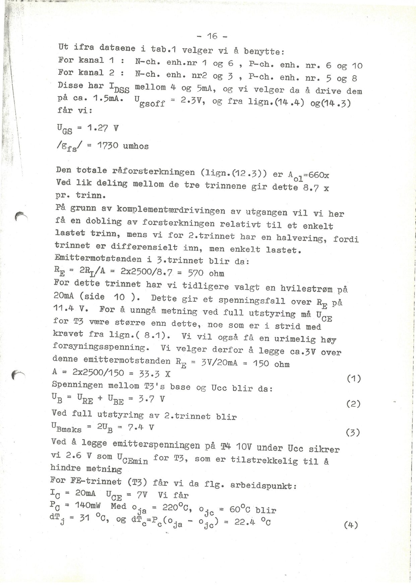

The maximum voltage swing at the output of the 1st stage is determined by
the available supply voltage, the voltage swing at the output of the 2nd
stage plus the $U_{CE}$ needed for T2 to avoid saturating this stage, and
the minimum $U_{DS}$ for the input stage. The input stage can be secured by
allowing approx. 5V between drain and ground as a minimum. Letting
$U_{CEmin} = $ approx. 2.5V, and since $U_{RC}$ max is 7.4V, $U_{Bmax} =
U_{cc} - 10V$.

The coupling of the input stage's output is shown in fig. 12. For full
drive of the stage we can set: $I_1 = I = 3$mA, $I_2 = 0$; $U_C = 5V$, $U_B
= 15V$. This gives $U_{AB} = U_{BC} = 10V$, and since $I_2=0$, $I_{AB} =
I_{BC}$ must hold, and thus $R_D = R_{DD} = R$.

$$U_{AC} = I R_D(R_D + R_{DD})/(2R_D + R_{DD}) = IR \cdot 2/3 \tag{2}$$

This gives $R = 10$kohm, i.e. $R_D = R_{DD} = 10$kohm.

The differential load for this stage then becomes:

$$R_L = 2R_D \| R_{DD} = 6.67\text{ kohm} \tag{3}$$

The differential gain is then:

$$A_1 = \tfrac{1}{2}R_L g_{fs} = 5.77\text{ X} \tag{4}$$

From eq. (16.1) we are given that $A_3 = 33.3$ X. We then get that the gain
in the 2nd stage must be:

$$A_2 = A_{ol}/(A_1 A_3) = 3.43\text{ X} \tag{5}$$

We have not yet taken into account the attenuation caused by the coupling
between stages. We will account for this later by increasing $A_2$. For now
we assume the attenuation is approximately equal to 1.

For the second stage we set (fig. 11) $R_{Et} = R_{E2} + V_T/I_{E2} \tag{6}$

The ratio between $R_C$ and $R_{Et}$ must then be $2A_2 = 6.87 \tag{7}$

$$U_{REt} = 3.7\text{V}/6.87 = 0.54 \tag{8}$$

The choice of current in the 2nd stage is influenced by the following
factors:

High current gives: high corner frequency between $R_L$ and the associated
node capacitance. Low distortion due to $h_{fe}$ nonlinearities at the
point $R_L$-next stage, due to low generator impedance for this stage.

Low current gives: low distortion due to $h_{fe}$ nonlinearity at the point
$R_D$-2nd stage, due to the low loading of this source impedance.

In this case, nonlinearity in the $i_c$ versus $u_{BE}$ characteristic is
not a problem, since the stage's drive level is locked by the output-level
requirements of the whole amplifier. Eq. (13.1) says that $I_{C2}$ is
inversely proportional to $R_{E2}$ for constant A. The nonlinearity depends
on the ratio between $r_e = V_T/I_{C2}$ and $R_{E2}$, and on the ratio
between $i_C/I_C$. The latter is constant because of the chosen efficiency
of the 3rd stage. By considering the system in fig. 11, one sees that the
efficiency of the 2nd stage equals the efficiency of the 3rd stage. The
other ratio, $r_e/R_{E2}$, also becomes constant because of the gain
requirement given in eq. (13.1).

The input impedance for the 3rd stage, with $h_{fe}$ for T3 equal to 150,
is:

$$R_{inn3} = (R_E + V_T/I_{C3})h_{fe} = 23\text{ kohm} \tag{1}$$

If we treat the $h_{fe}$ nonlinearity as equal for the 2nd and 3rd stages,
regardless of where they operate on the $h_{fe}$ versus $i_C$
characteristic, and let the $h_{fe}$ distortion contribution from each
stage be equal, we can set the degree of current drive equal for the
stages, i.e.:

$$R_D'/R_{inn2} = R_C/R_{inn3}, \quad R_D' = 2R_D \| R_{DD} \times \tfrac{1}{2} \tag{2}$$
$$R_C = 3.7\text{V}/I_{C2}, \quad R_{inn2} = R_{Et} h_{fe} \tag{3,4}$$

From eq. (17.7) we have $R_C/R_{Et} = 6.87$; inserting into (2) gives:

$$R_D'/(R_{Et}h_{fe2}) = R_{Et}\cdot6.87/R_{inn3} \tag{}$$

which gives:

$$R_{Et} = \sqrt{R_D' R_{inn3}/(6.87 h_{fe2})} \tag{}$$

Assuming $h_{fe2} = 300$, we get $R_{Et} = 193$ ohm. We then get $R_C =
6.87\times193 = 1326$ ohm, and choose the standard value $R_C = 1k2$.

With $C_{ob} = 7$pF for the 3rd stage, we get the cut-off frequency at
$f = 1/(2\pi R_C C_{ob}) = 19$MHz.

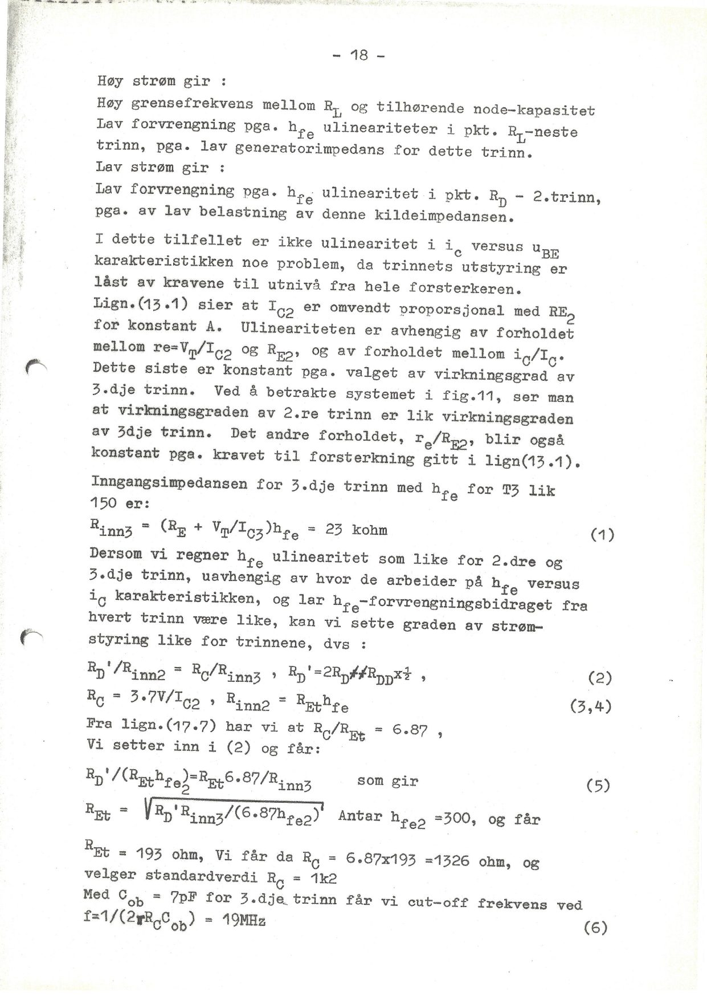

This can be neglected when analyzing the stability of the system.

We further get:

$$I_{C2} = 3.7\text{V}/R_C = 3.1\text{ mA} \tag{1}$$

This gives $r_e = 8.4$ ohm. To determine the correct value for $R_{E2}$ we
now need to calculate the attenuation in the different stage couplings.

We first set up an equivalent diagram for the output stage (fig. 13):
because of the low impedances we are working with, we can disregard the
effect of $h_{ob}$.

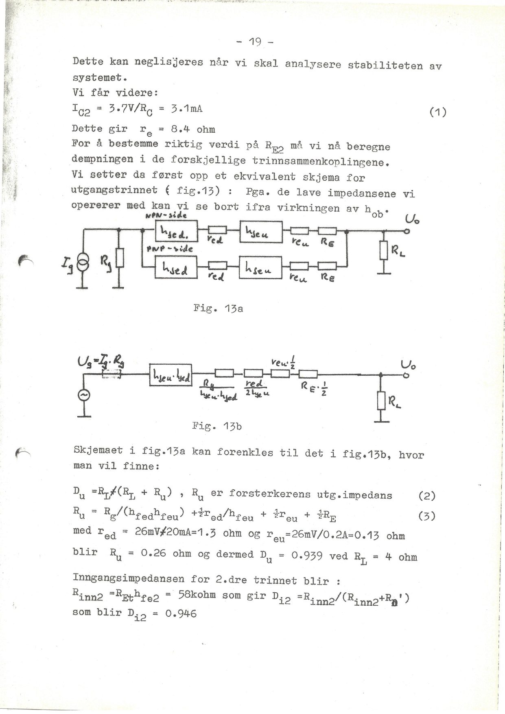

The diagram in fig. 13a can be simplified to the one in fig. 13b, where one
finds:

$$D_u = R_L/(R_L + R_u), \quad R_u \text{ is the amplifier's output impedance} \tag{2}$$
$$R_u = R_g/(h_{fed}h_{feu}) + \tfrac{1}{2}r_{ed}/h_{feu} + \tfrac{1}{2}r_{eu} + \tfrac{1}{2}R_E \tag{3}$$

with $r_{ed} = 26mV/20mA = 1.3$ ohm and $r_{eu} = 26mV/0.2A = 0.13$ ohm,
$R_u = 0.26$ ohm and thus $D_u = 0.939$ at $R_L = 4$ ohm.

The input impedance for the 2nd stage becomes:

$$R_{inn2} = R_{Et}h_{fe2} = 58\text{ kohm} \text{ which gives } D_{i2} = R_{inn2}/(R_{inn2}+R_D') \tag{}$$

which becomes $D_{i2} = 0.946$

The attenuation for the 3rd stage becomes:

$$D_{i3} = R_{inn3}/(R_{inn3}+R_C) = 0.950 \tag{1}$$

For T4 (common-base stage), the attenuation equals:

$$D_{fb} = i_C/i_E = h_{fb} = h_{fe}/(1+h_{fe}) = 0.993 \tag{2}$$

The total attenuation therefore becomes:

$$D_t = D_{i2}D_{i3}D_{fb}D_u = 0.838 \tag{3}$$

We compensate for this by increasing the gain in the 2nd stage:

$$A_{2,new} = A_{2,old}/D_t = 4.09 \tag{4}$$

and the ratio $R_C/R_{Et}$ then becomes $2A_{2,new} = 8.18$. With $R_C =
1.2$kohm, $R_{Et} = 146.7$ ohm and $R_{E2} = R_{Et} - r_e = 138.3$ ohm.

To maintain a 58kohm input impedance, we then need:

$$h_{fe2} = 58\text{kohm}/146.7\text{ ohm} = 395 \tag{5}$$

We have chosen to use the BC414 (NPN) and BC416 (PNP) in the 2nd stage, and
must therefore use B-selection to satisfy the $h_{fe}$ requirement.

In principle, a series-feedback amplifier can look like fig. 14. The gain
is then equal to:

$$A_{cl} = A_{ol}/(1+A_{ol}B) \tag{6}$$

where $B = R_s/(R_s+R_f) \tag{7}$

This network (B) should be as low-impedance as possible, to avoid problems
with any capacitances at the inverting input. We have that the max. output
swing is 15.5V, and it is practical to use 1/4W resistors. The minimum value
for $R_f + R_s$ then becomes:

$$R = (15.5)^2/0.25 = 860\text{ ohm} \tag{}$$

Eq. 6 can be rearranged to:

$$B = (A_{ol} - A_{cl})/(A_{ol}A_{cl}) \tag{8}$$

With the values we previously found for $A_{ol}$ and $A_{cl}$, $B =
72.5\times10^{-3}$. Eq. 7 can be rearranged to:

$$R_s = R_f B/(1-B) \tag{}$$

We choose $R_f = 1.3$kohm, and get $R_s = 100$ ohm. (Fig. 14, see page 20
above, shows the series feedback network.)

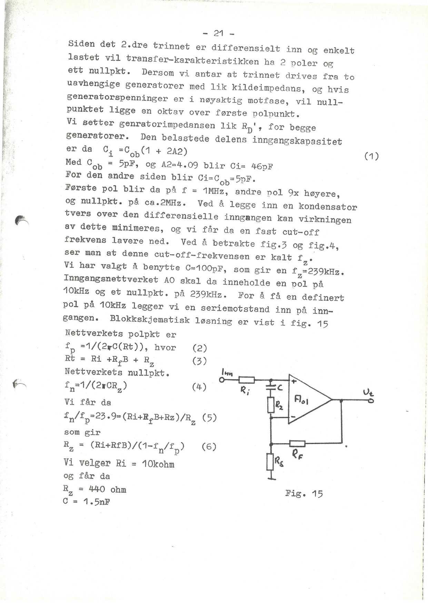

Since the 2nd stage is differential-in and singly loaded, the transfer
characteristic will have 2 poles and one zero. If we assume the stage is
driven from two independent generators with equal source impedance, and the
generator voltages are exactly out of phase, the zero will lie an octave
above the first pole.

We set the generator impedance equal to $R_D'$ for both generators. The
loaded section's input capacitance is then:

$$C_i = C_{ob}(1+2A_2) \tag{1}$$

With $C_{ob} = 5$pF and $A_2=4.09$, $C_i = 46$pF. For the other side,
$C_i = C_{ob} = 5$pF.

The first pole then falls at $f = 1$MHz, the second pole 9x higher, and the
zero at approx. 2MHz. By placing a capacitor across the differential input,
the effect of this can be minimized, giving a fixed cut-off frequency
further down. Referring to fig. 3 and fig. 4, one sees that this cut-off
frequency is called $f_z$.

We have chosen to use $C=100$pF, giving $f_z=239$kHz. The input network
$A_0$ must then contain a pole at 10kHz and a zero at 239kHz. To get a
well-defined pole at 10kHz, we insert a series resistor at the input. A
block-diagram solution is shown in fig. 15.

The network's pole is at:

$$f_p = 1/(2\pi C \cdot R_t), \quad R_t = R_i + R_f B + R_z \tag{2,3}$$

The network's zero: $f_n = 1/(2\pi C R_z) \tag{4}$

We then get $f_n/f_p = 23.9 = (R_i+R_f B+R_z)/R_z \tag{5}$

which gives $R_z = (R_i+R_f B)/(1-f_n/f_p) \tag{6}$

We choose $R_i = 10$kohm and get $R_z = 440$ ohm, $C = 1.5$nF

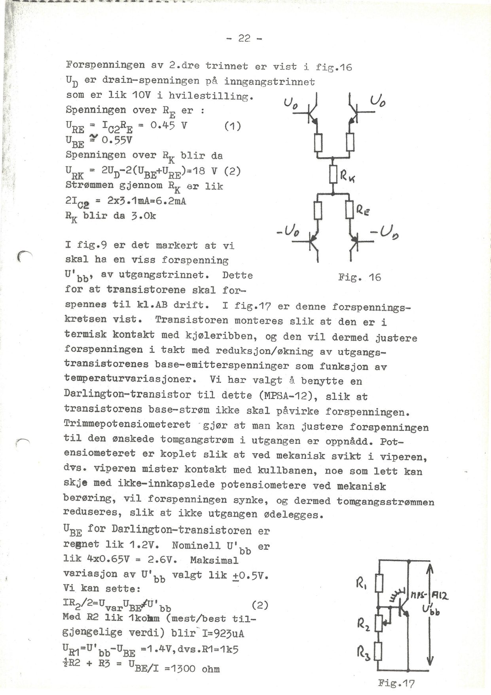

The biasing of the 2nd stage is shown in fig. 16. $U_D$ is the drain voltage
at the input stage, which is 10V at idle.

The voltage across $R_E$ is: $U_{RE} = I_{C2}R_E = 0.45$ V, $U_{BE} \approx
0.55$V

The voltage across $R_K$ then becomes: $U_{RK} = 2U_D - 2(U_{BE}+U_{RE}) =
18$V

The current through $R_K$ equals $2I_{C2} = 2\times3.1$mA$=6.2$mA. $R_K$
then becomes 3.0k.

In fig. 9 it is marked that we need a certain bias $U'_{bb}$ of the output
stage. This is so that the transistors are biased into class AB operation.
Fig. 17 shows this bias circuit. The transistor is mounted so that it is in
thermal contact with the heat sink, and will thereby adjust the bias in
step with the decrease/increase of the output transistors' base-emitter
voltages as a function of temperature variations. We have chosen to use a
Darlington transistor for this (MPSA-12), so that the transistor's base
current does not affect the bias. The trim potentiometer allows adjustment
of the bias until the desired idle current in the output is reached. The
potentiometer is connected such that if there is mechanical failure of the
wiper — i.e. the wiper loses contact with the resistive track, which can
easily happen with non-enclosed potentiometers from mechanical contact —
the bias will drop, and the idle current is thereby reduced, so that the
output is not destroyed.

$U_{BE}$ for the Darlington transistor is taken as 1.2V. The nominal
$U'_{bb}$ equals $4\times0.65V = 2.6V$. The maximum variation of $U'_{bb}$
is chosen as ±0.5V. We can set:

$$IR_2/2 = U_{var} = U_{BE} + U'_{bb} \tag{2}$$

With $R_2$ equal to 1kohm (most common/best available value), $I=923\mu A$

$$U_{R1} = U'_{bb} - U_{BE} = 1.4\text{V, i.e. } R_1=1k5 \tag{}$$
$$\tfrac{1}{2}R_2 + R_3 = U_{BE}/I = 1300\text{ ohm} \tag{}$$

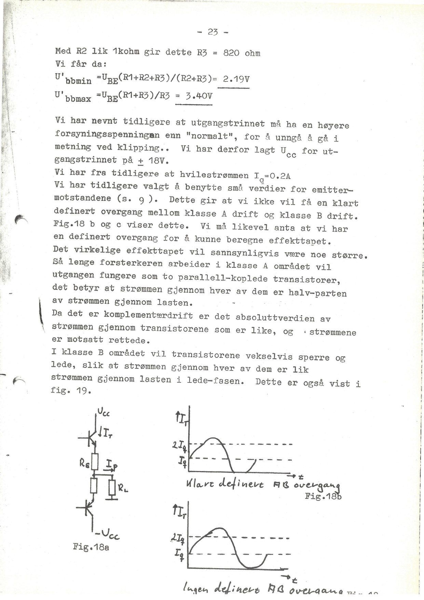

With $R_2$ equal to 1kohm, this gives $R_3 = 820$ ohm. We then get:

$$U'_{bb,min} = U_{BE}(R_1+R_2+R_3)/(R_2+R_3) = 2.19\text{V} \tag{}$$
$$U'_{bb,max} = U_{BE}(R_1+R_3)/R_3 = 3.40\text{V} \tag{}$$

We have previously mentioned that the output stage must have a higher
supply voltage than "normal", to avoid going into saturation when clipping.
We have therefore set $U_{cc}$ for the output stage at ±18V.

We have from earlier that the quiescent current $I_q=0.2$A. We have earlier
chosen to use small values for the emitter resistors (p. 9). This means we
will not get a clearly defined transition between class A operation and
class B operation. Fig. 18 b and c show this. We must nevertheless assume a
defined transition in order to calculate the power dissipation. The actual
power dissipation will likely be somewhat larger.

As long as the amplifier operates in the class A region, the output
functions as two parallel-connected transistors, meaning the current
through each of them is half of the current through the load. Since this is
complementary operation, it is the absolute value of the current through
the transistors that is equal, and the currents are oppositely directed.

In the class B region, the transistors alternately block and conduct, so
the current through each of them equals the current through the load
during the conducting phase. This is also shown in fig. 19.

We then get that as long as the amplifier operates in class A, i.e.
$I_p \leq 2I_q$, the input power is constant:

$$P_T = 2U_{cc}I_q \tag{2}$$

Dissipated power is: $P_D = P_T - P_{ut} \tag{3}$

For class AB operation, the signal current through the transistors will
look as in fig. 19, when $U_{ut}(\omega t) = U\sin(\omega t)$

We get 5 functions for the current from fig. 19:

$$I_{T1} = I_q + \tfrac{1}{2}I_p\sin\phi, \quad 0 \leq \phi < a_1 \tag{4}$$
$$I_{T2} = I_p\sin\phi, \quad a_1 \leq \phi < a_2 \tag{5}$$
$$I_{T3} = I_{T1}, \quad a_2 \leq \phi < a_3 \tag{6}$$
$$I_{T4} = 0, \quad a_3 \leq \phi < a_4 \tag{7}$$
$$I_{T5} = I_{T1}, \quad a_4 \leq \phi < 2\pi \tag{8}$$

The transition point $a_1$ is reached when $I_{T1}=2I_q$, which gives
$I_q=\tfrac{1}{2}I_p\sin\phi$, and $\sin\phi_{a1}=2I_q/I_p$.

We set $a_1=a$, and get:

$$a = \sin^{-1}(2I_q/I_p) \tag{9}$$

We then see from fig. 19 that $a_1 = a$, $a_2 = \pi-a$, $a_3=\pi+a$,
$a_4=2\pi-a$.

In other words, $a$ is an angle we can call the transition angle between
class A and class B. The input current is then:

$$I_{DC} = (1/2\pi)\left(\int_0^{2\pi} I_T(\phi)\,d\phi\right) \tag{10}$$

Substituting for $I_T(\phi)$, eq. 4-8, and solving the definite integral,
we get:

$$I_{DC} = \frac{4I_q\sin^{-1}(2I_q/I_p) + 2I_p\cos(\sin^{-1}(2I_q/I_p))}{2\pi} \tag{11}$$

The input power is now: $P_T = 2U_{cc}I_{DC} \tag{12}$

and dissipated power is: $P_D = P_T - P_{ut} \tag{3}$

We have calculated the power dissipation as a function of output power, and
curves for this are shown in fig. 20 and fig. 21, for 4 and 8 ohm loads
respectively.

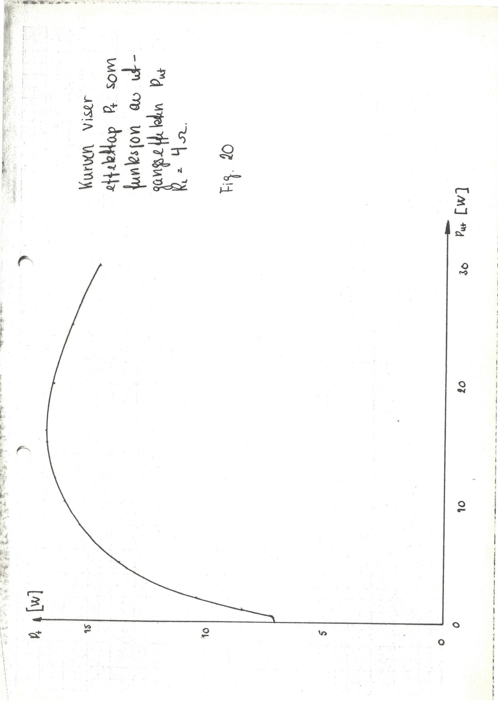

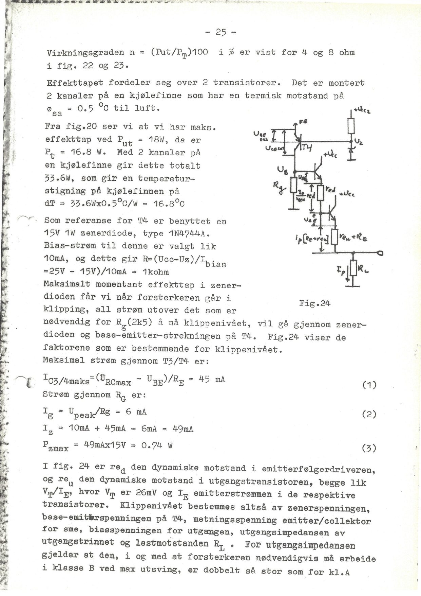

From fig. 24 we can set:

$$U_{peak} = (U_z + U_{BE4} - U_{CEsat} - U_{BEd} - U_{BEu})R_L / (R_L + R_E + \tfrac{r_{ed}}{h_{feu}} + r_{eu}) \tag{1}$$

The effect of $r_{ed}$ can be neglected; $r_{eu}$ will be reduced strongly
at the currents in question, and we are left only with the contact
resistances — the ohmic resistances — in the transistor. We take these to
be approximately equal to 0.1 ohm, the same as $r_e$ at the quiescent
current. This gives:

$$U_{peak} = 13.57\text{V for a 4 ohm load, i.e. } P_{ut} = 23\text{ W} \tag{}$$
$$U_{peak} = 13.95\text{V for an 8 ohm load, i.e. } P_{ut} = 12.2\text{ W} \tag{}$$

We have thus obtained somewhat less (20%) output power than we originally
wanted (page 3). We have carried out all measurements on the amplifier as
it stands, since the output power is nonetheless close to 15W and 30W
respectively. It is also not particularly likely that an increase in the
output voltage of 1.5 to 2V would change the specifications significantly.
To increase the output power, the zener diode that serves as the voltage
reference for T4 must be increased to approx. 17V. This is not a standard
value, so we would need to use an 18V zener instead, e.g. type 1N4746. We
would also need to increase the supply voltage by approx. 2V so that T3
cannot go into saturation. This means $R_K$ in fig. 16 must be increased by
approx. 20%, to 3.6kohm, so that the same current flows in the 2nd stage.

We have previously found that the amplifier's output impedance (page 19) is
0.26 ohm. This is calculated without feedback, and we have found that the
beta factor is $72.5\times10^{-3}$, and the open-loop gain equal to 660x,
so the feedback equals $D = 1 + A_{ol}B = 48.9$x. Fig. 25 shows an
equivalent diagram for the output with feedback.

The output impedance at low frequencies is thus $R_{cl} = R_{ut}/D = 5.3$
mohm (milliohm). Since the feedback is reduced from $f_{ol}$, i.e. 10kHz,
this means the output impedance must rise — i.e. it is inductive.

And, $L = R_{cl}/(2\pi f_{ol}) = 84$ nH.

If we load the amplifier purely capacitively, we could introduce poles into
the transfer characteristic that could make the amplifier unstable.

To reduce the likelihood of this, we have inserted a series resistor equal
to the amplifier's open-loop output impedance after the point where the
feedback is taken, i.e. in series with the load.

For an 8 ohm load this gives a further 6% reduction in output power, i.e.
to 11.5 W.

Both on the circuit diagram and on the circuit board, 2 regulators are
included, consisting of a zener diode, a resistor, and a transistor,
intended for use with an external unregulated power supply. The circuit is
marked with a dashed outline on the circuit diagram. Regulated external
power supplies were used for all measurements, so we have not used these
regulators.

The final circuit diagram is shown in fig. 26, the circuit diagram with
component values in fig. 27, the parts list in table 2, the diagram with
component numbers in fig. 28, and the diagram with operating points in
fig. 29. The component placement for the circuit board is shown in fig. 30.

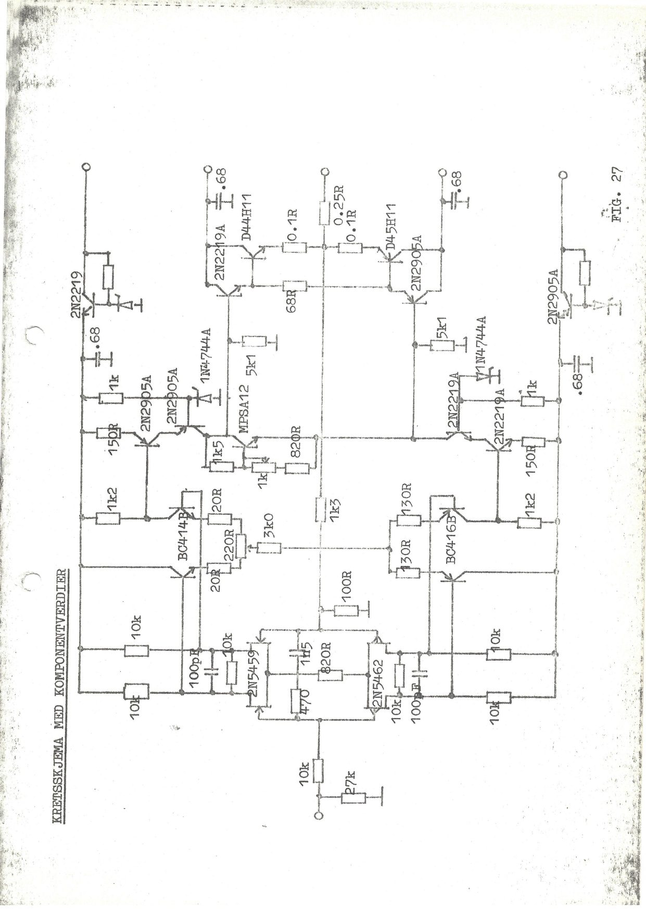

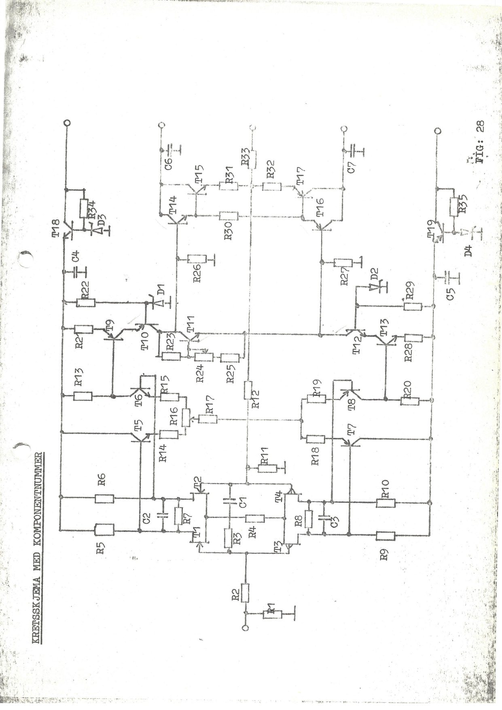

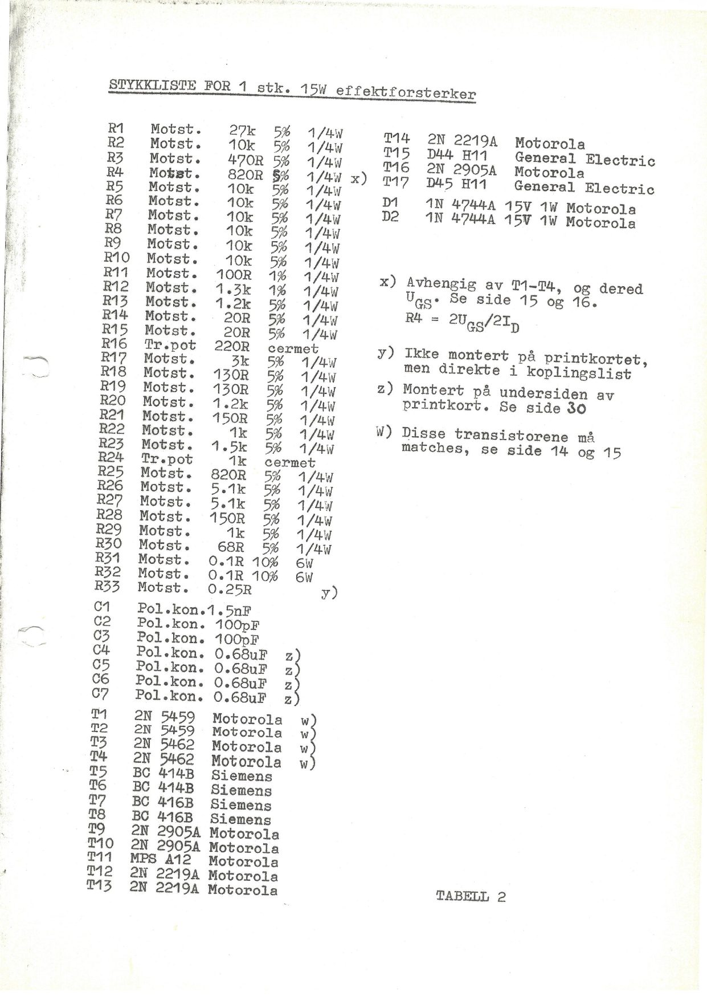

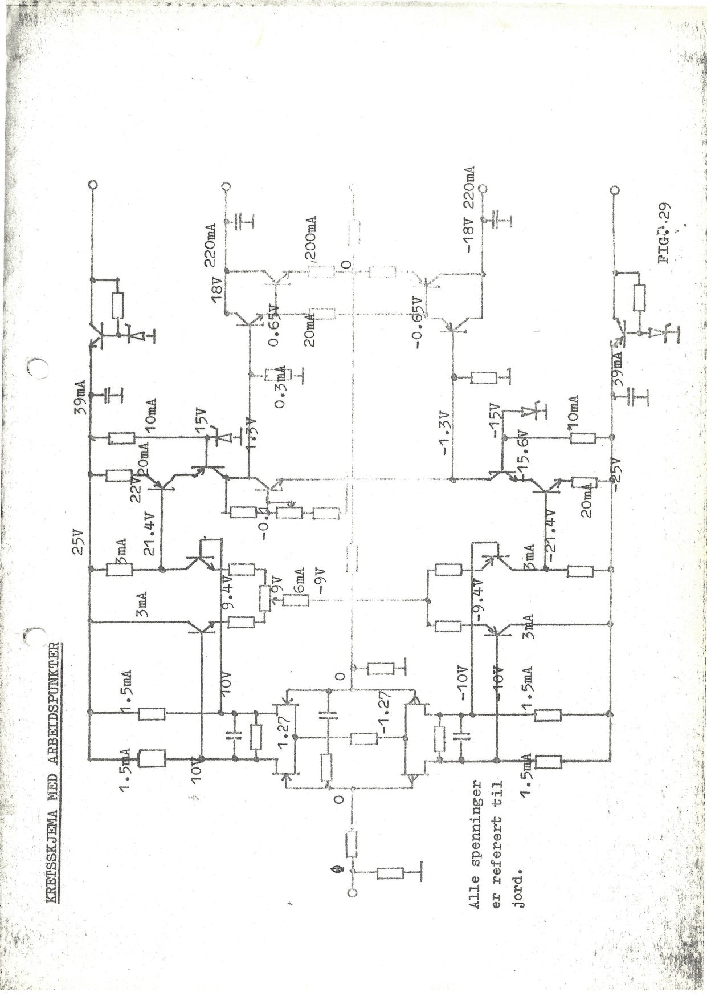

## Part III — Measurements and Conclusion

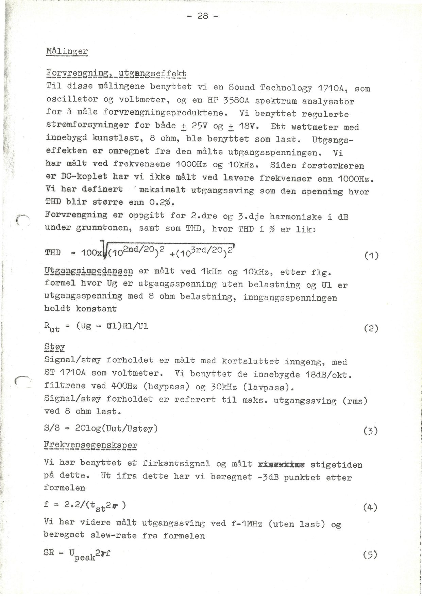

### Measurements

**Distortion, output power**

For these measurements we used a Sound Technology 1710A as oscillator and
voltmeter, and an HP 3580A spectrum analyzer to measure the distortion
products. We used regulated power supplies for both ±25V and ±18V. A
wattmeter with a built-in 8 ohm dummy load was used as the load. Output
power is converted from the measured output voltage. We measured at the
frequencies 1000Hz and 10kHz. Since the amplifier is DC-coupled, we did not
measure at frequencies lower than 1000Hz. We defined maximum output swing
as the voltage at which THD exceeds 0.2%.

Distortion is given for the 2nd and 3rd harmonics in dB below the
fundamental, as well as THD, where THD in % equals:

$$THD = 100\times\sqrt{(10^{2nd/20})^2 + (10^{3rd/20})^2} \tag{1}$$

**Output impedance** is measured at 1kHz and 10kHz, using the following
formula, where $U_g$ is the output voltage unloaded and $U_l$ is the output
voltage with an 8 ohm load, input voltage held constant:

$$R_{ut} = (U_g - U_l)R_1/U_l \tag{2}$$

**Noise**

The signal/noise ratio is measured with a shorted input, with the ST 1710A
as voltmeter. We used the built-in 18dB/oct. filters at 400Hz (high-pass)
and 30kHz (low-pass). The signal/noise ratio is referred to the maximum
output swing (rms) at an 8 ohm load.

$$S/N = 20\log(U_{ut}/U_{noise}) \tag{3}$$

**Frequency characteristics**

We used a square-wave signal and measured its rise time. From this we
calculated the -3dB point using the formula:

$$f = 2.2/(t_{rise} 2\pi) \tag{4}$$

We further measured the output swing at f=1MHz (unloaded) and calculated
the slew rate from the formula:

$$SR = U_{peak} 2\pi f \tag{5}$$

### Results

Output power, f=1kHz, THD = 0.2%, $R_L$ = 8 ohm: 11.0W

Distortion, f=1kHz, $U_{ut}$ 1 dB below clipping (11W), i.e. 8.3V out

| | |
|---|---|
| 2nd | -82 dB |
| 3rd | -90 dB |
| THD | 0.0085 % |

Measured at 3dB below max. output power, i.e. $U_{ut}$ = 6.6V (5.5W). No
distortion products above -90dB, which is the spectrum analyzer's
resolution. This gives THD less than 0.0045%. Unloaded, we find no
measurable distortion up to 9V rms out.

Distortion at f=10kHz, output voltage -3dB below max. out, i.e. at half
power:

| | |
|---|---|
| 2nd | -78 dB |
| 3rd | -80dB |
| THD | 0.016 % |

Unloaded, we find no measurable distortion up to 9V rms out.

Output impedance, 1kHz and 10kHz, $U_g$ = 6.8V $U_l$=6.57V $R_l$=8 ohm

$$R_{ut} = 0.28\text{ ohm} \tag{}$$

Noise: measured at the output as 43 µV. Signal/noise ratio ref. 9.4V out:
-106.8 dB

The rise time is independent of output level, and equals:

- Rise time: 0.65 µS
- Frequency range: 540kHz

The amplifier delivered full output swing at f=1MHz, i.e. 13.5V peak, which
gives a slew rate of: 85 V/µS

Full output power was reached at $U_{ut}$ = 9.4V rms, at which we had
$U_{inn}$ = 0.72 V rms

Gain: 13.0 x; 22.3 dB

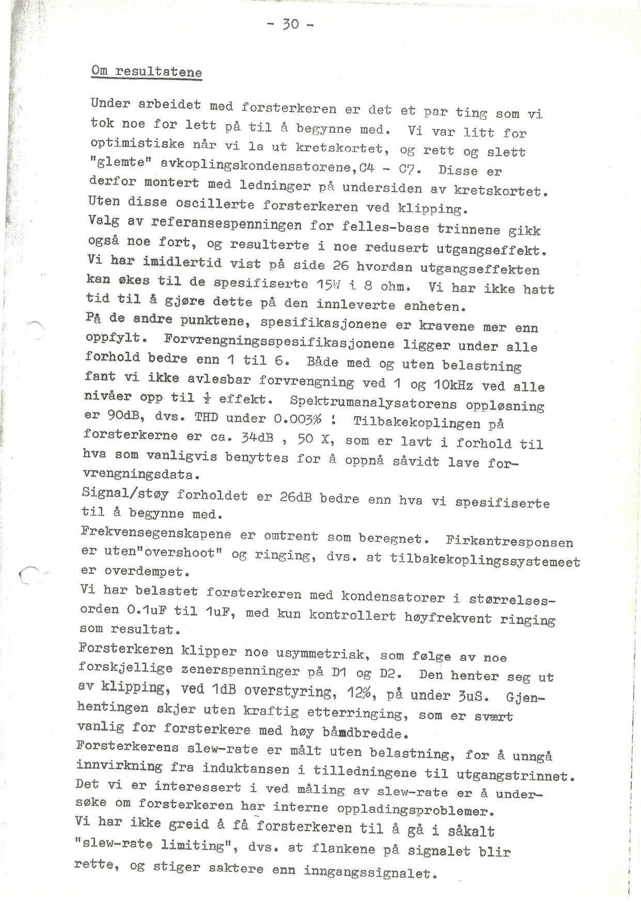

### On the results

While working on the amplifier, there are a couple of things we took a bit
too lightly at the outset. We were a little too optimistic when laying out
the circuit board, and simply "forgot" the decoupling capacitors, C4 - C7.
These are therefore mounted with wires on the underside of the circuit
board. Without these, the amplifier oscillated when clipping.

The choice of reference voltage for the common-base stages was also made
somewhat hastily, and resulted in somewhat reduced output power. We have,
however, shown on page 26 how the output power can be increased to the
specified 15W into 8 ohm. We have not had time to implement this on the
submitted unit.

On the other points, the specifications' requirements are more than met.
The distortion specifications are, in all conditions, better than 1 to 6.
Both with and without load we found no readable distortion at 1 and 10kHz
at all levels up to ½ power. The spectrum analyzer's resolution is 90dB,
i.e. THD under 0.003%! The feedback in the amplifier is approx. 34dB, 50 X,
which is low compared to what is usually used to achieve such low
distortion figures.

The signal/noise ratio is 26dB better than what we originally specified.

The frequency characteristics are approximately as calculated. The square
wave response is free of "overshoot" and ringing, i.e. the feedback system
is overdamped.

We have loaded the amplifier with capacitors in the range 0.1uF to 1uF,
with only controlled high-frequency ringing as a result.

The amplifier clips somewhat asymmetrically, as a result of somewhat
different zener voltages on D1 and D2. It recovers from clipping, at 1dB
overdrive, 12%, in under 3uS. The recovery happens without significant
ringing afterward, which is quite unusual for amplifiers with high
bandwidth.

The amplifier's slew rate was measured unloaded, to avoid the influence of
inductance in the leads to the output stage. What we are interested in when
measuring slew rate is investigating whether the amplifier has internal
charging problems. We have not managed to get the amplifier into so-called
"slew-rate limiting", i.e. where the edges of the signal become straight
and rise more slowly than the input signal.

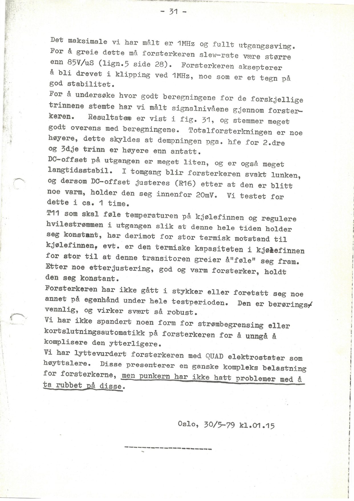

*(Page 31 concludes with measurements of the block gain for the right and
left channels, shown in fig. 31, and the report's signature:)*

**Oslo, 30/5-79, 01:15 AM**
