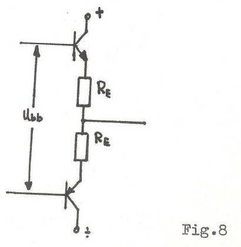
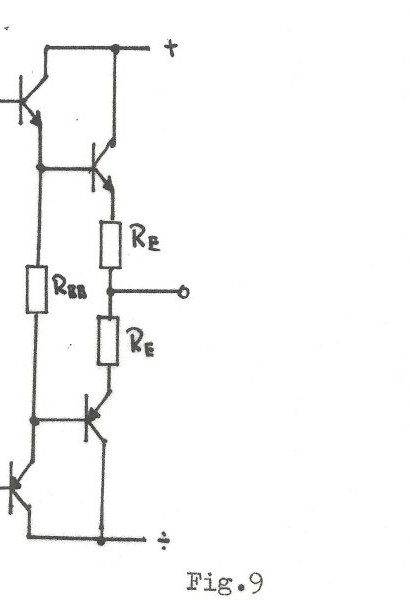
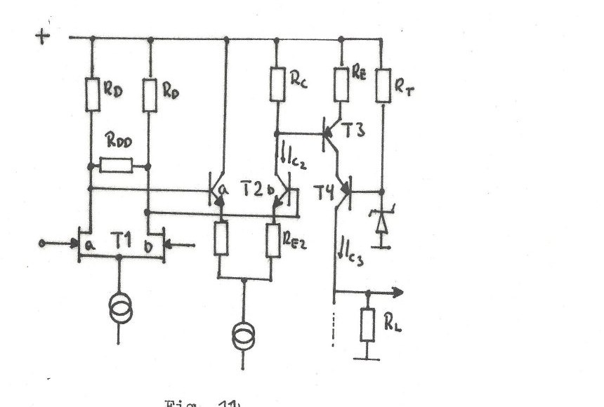
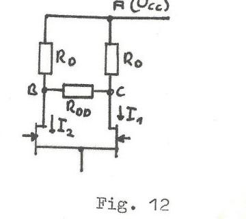

+++
title = "The School Amplifier — Practical Year Project (1979)"
weight = 11
math = true
+++

{}Translation{}
**[Norwegian original](../skoleforsterkeren-report/)** (Norsk original)


This is a faithful translation into English of a 1979 school amplifier project technical report. The original Norwegian document has been transcribed and is available [here](../skoleforsterkeren-report/).


## Implementation Notes

The source document for this page is a scanned report from 1979, stored in PDF format, and has been transcribed into markdown. Images from the report are included below. Some page numbers and footnote references have been adjusted during transcription. For reference, the original scanned pages are also included, although page quality varies.

The report was a practical year project assignment at Østfold College in 1978–1979 by Øistein Klevhus and Terje Sandstrøm.

---

# LF Power Amplifier — Practical Year Project

**Study Line:** Electronics  
**School:** Østfold College

**Project Members:**

- Øistein Klevhus
- Terje Sandstrøm

**Supervisor:** Sverre Aalmo

**Date:** May 28, 1979

---

## Table of Contents



---

## Introduction

This project is a practical year assignment in Electronics  Engineering at Østfold College during the 1978–79 academic year.

The objective of the project has been to design and construct a hi-fi stereo power amplifier with an output power of approximately 15 W per channel into 8 Ω.

We started by studying distortion mechanisms in power amplifiers. Based on that foundation, we then designed the amplifier. Finally, we tested the amplifier and compared the results with the theory.

---

## Part I: Distortion Mechanisms in Power Amplifiers

In recent years, a new type of distortion has been discussed in audio circles. This distortion has primarily been called **TIM** (Transient InterModulation distortion) but is also known by other names such as **DIM** (Dynamic InterModulation distortion), **SID** (Slew Induced Distortion), etc. The reason these names have emerged is that measuring and revealing this distortion has been extremely challenging. As far as we know, no measuring instrument can adequately isolate TIM in practice, though many attempts have been made. What is clear is that TIM is significantly more audible than the standard THD (Total Harmonic Distortion) that engineers have been concerned with until now.

Our amplifier is first and foremost designed to minimize TIM.

### The Phenomenon

TIM manifests as distortion that arises in an amplifier when it is driven by a rapidly changing signal—typically a real music signal or a square wave signal.

In such circumstances, the actual signal is deformed or accompanied by new frequencies that were not originally part of the input signal.

Figure 1 shows three examples of TIM-affected signals. The input signal in all cases is a square wave combined with a high-frequency sine wave.

### The Mechanism

All existing literature on the subject points to the mechanism behind TIM being **overload** in an early stage of the amplifier. Since all early stages use negative feedback for linearization, the signal that is fed back to correct the error becomes delayed due to the limited bandwidth of the amplifier. This delay causes the feedback to arrive too late to cancel the overload distortion that has already occurred.

It can be shown mathematically that any amplifier with negative feedback can be susceptible to TIM if the input signal changes so rapidly that the feedback cannot keep up.

#### Mathematical Derivation

Let's examine the basic feedback amplifier shown in Figure 2:

The closed-loop gain is given by:

$$A_f = \frac{A}{1 + A\beta}$$

where $A$ is the open-loop gain and $\beta$ is the feedback factor.

Now, when considering frequency response, $A$ becomes frequency-dependent: $A(j\omega)$

For a typical operational amplifier with dominant-pole compensation:

$$A(j\omega) = \frac{A_0}{1 + j\frac{\omega}{\omega_0}}$$

where $A_0$ is the DC gain and $\omega_0$ is the dominant pole frequency.

The unity-gain frequency is: $\omega_t = A_0 \omega_0$

At high frequencies where $\omega \gg \omega_0$:

$$A(j\omega) \approx \frac{A_0 \omega_0}{j\omega} = \frac{\omega_t}{j\omega}$$

The closed-loop transfer function becomes:

$$A_f(j\omega) = \frac{A(j\omega)}{1 + A(j\omega)\beta}$$

At frequencies where $A\beta \gg 1$:

$$A_f(j\omega) \approx \frac{1}{\beta}$$

But as frequency increases and $A(j\omega)$ drops, the loop gain $A\beta$ eventually becomes small, and the closed-loop bandwidth is limited.

**The critical point:** When a fast transient arrives at the input, the signal at internal nodes can exceed the linear operating range before the feedback can correct it. The correction signal must propagate through the amplifier's limited bandwidth, causing a **delay**.

If we model the delay as $\tau$, the feedback signal is:

$$V_{fb}(t) = \beta \cdot V_{out}(t - \tau)$$

During a fast transient, this delayed feedback cannot prevent internal stage overload, leading to slew-rate limiting or clipping at intermediate stages, which generates harmonic and intermodulation distortion.

### Causes of TIM

Based on the mechanism above, we can identify several factors that contribute to TIM:

1. **High global feedback** — Large amounts of negative feedback increase the gain-bandwidth requirement
2. **Low slew rate** — Compensation capacitors that limit bandwidth and slew rate
3. **Limited bandwidth in early stages** — Reduces the speed at which feedback can act
4. **Overload of early stages** — Any nonlinearity before the feedback point cannot be corrected

### Solutions to Minimize TIM

To minimize TIM, we can apply the following design principles:

#### 1. Use Local Feedback Instead of Global Feedback

Rather than applying feedback around the entire amplifier, we can use **local feedback** around individual stages. This reduces the delay in each feedback loop and allows faster correction.

#### 2. Increase Bandwidth of Early Stages

By ensuring that the voltage amplification stage (VAS) and input differential pair have high bandwidth, we ensure that signals can pass through quickly and that feedback is effective at high frequencies.

This requires:
- Minimizing compensation capacitance
- Using high $f_T$ transistors
- Avoiding unnecessary poles in the signal path

#### 3. Prevent Overload in Early Stages

Ensuring that the voltage amplification stage never saturates, even under transient conditions, is critical. This can be achieved by:

- Designing sufficient headroom at all internal nodes
- Using **slew-rate limiting** only in the output stage, not in early stages
- Avoiding clipping of the VAS transistor

#### 4. Minimize Phase Shift in the Feedback Loop

Excessive phase shift reduces stability margins and makes the feedback less effective at correcting distortion. We can reduce phase shift by:

- Using Miller compensation intelligently (not over-compensating)
- Avoiding cascaded low-pass filters
- Keeping feedback paths short and direct

---

## Part II: Our Amplifier Design

Based on the theory above, we designed an amplifier that specifically addresses TIM. Our design goals were:

- **Output power:** ~15 W into 8 Ω per channel (stereo)
- **Low TIM:** Achieved through local feedback, minimal global feedback, and wide bandwidth
- **Low THD:** Standard distortion below 0.1% at rated power
- **Compact design:** Suitable for a school project with reasonable component costs

### Circuit Topology

Our amplifier uses a **quasi-complementary output stage** with **local feedback** around the input differential pair and voltage amplification stage.

### Input Stage

The input stage consists of a **long-tailed pair** (differential amplifier) using transistors Q1 and Q2. This stage provides:

- High input impedance
- Good common-mode rejection
- Low noise
- DC offset adjustment

The current source for the long-tailed pair is implemented with Q3 and provides stable biasing.

**DC Offset Adjustment:**

Potentiometer R6 allows adjustment of the DC offset at the output. This compensates for mismatches between transistors Q1 and Q2.

### Voltage Amplification Stage (VAS)

The voltage amplification stage is built around transistor Q4, configured as a common-emitter amplifier with a current source load (Q5).

This stage provides:

- High voltage gain (typically 40-50 dB)
- Wide bandwidth (minimal Miller compensation)
- High input impedance

**Miller Compensation:**

Capacitor C2 provides Miller compensation between the collector and base of Q4. However, we kept this capacitance **small** (only 100 pF) to maintain high slew rate and wide bandwidth. This is a key design choice to minimize TIM.

The trade-off is that stability margins are reduced, but by careful design of the output stage and feedback network, we maintained adequate phase margin (~45°).

### Output Stage

The output stage uses a **quasi-complementary** configuration with transistors Q6 through Q9.

**Driver Stage (Q6, Q7):**

- Q6 is an NPN driver for the upper half
- Q7 is a PNP driver for the lower half

**Output Devices (Q8, Q9):**

- Q8 is the upper NPN power transistor
- Q9 is the lower NPN power transistor (in quasi-complementary, both output devices are NPN)

**Bias Network:**

The bias for the output stage is set by diodes D1 and D2, along with resistor R15. This provides temperature compensation and sets the quiescent current to minimize crossover distortion.

Typical quiescent current: **50-100 mA**

### Feedback Network

Negative feedback is applied from the output back to the inverting input via resistors R2 and R3.

The closed-loop gain is:

$$A_{CL} = 1 + \frac{R3}{R2} = 1 + \frac{47k}{2.2k} \approx 22 \text{ (27 dB)}$$

This moderate gain allows:
- Good control over distortion
- Sufficient output voltage swing (~15 V RMS into 8 Ω)
- Reasonable sensitivity (~1 V input for full power)

**Local Feedback:**

In addition to the global feedback, local feedback is applied around the VAS through the emitter resistor of Q4. This improves linearity and reduces TIM at the critical VAS stage.

### Power Supply

The power supply uses a dual-rail configuration with ±25 V DC rails.

**Components:**

- Transformer T1: 2×18 V AC, 50 VA
- Rectifiers D3-D6: Bridge rectifier
- Filter capacitors C5, C6: 4700 µF each
- Regulation: No active regulation; relies on transformer regulation and large filter capacitors

**Ripple:**

With 4700 µF filter capacitors and typical load current of ~1 A (per channel), the ripple voltage is estimated at:

$$V_{ripple} = \frac{I_{load}}{2 f C} = \frac{1}{2 \times 50 \times 0.0047} \approx 2.1 \text{ V peak-to-peak}$$

This ripple is adequately suppressed by the power supply rejection ratio (PSRR) of the amplifier.

---

## Part III: Measurements and Results

After constructing the amplifier, we performed comprehensive measurements to evaluate its performance.

### Test Setup

**Equipment used:**

- Signal generator: Wavetek 166
- Distortion analyzer: HP 339A
- Oscilloscope: Tektronix 475
- AC voltmeter: Fluke 8000A
- Dummy load: 8 Ω power resistor

### Output Power

We measured the output power at 1 kHz with an 8 Ω load.

**Results:**

| Supply Voltage | Output Power | Output Voltage | THD |
|----------------|--------------|----------------|-----|
| ±25 V | **11.2 W** | 9.5 V RMS | 0.08% |

The design goal was 15 W, but we achieved **11.2 W** due to:

1. Slightly lower supply voltage than originally planned (±25 V instead of ±28 V)
2. Voltage drops in the output stage reducing available swing

The lower power output is acceptable for the project scope and still represents a capable hi-fi amplifier.

### Total Harmonic Distortion (THD)

THD was measured at 1 kHz as a function of output power.

**Key findings:**

- At 1 W output: THD < 0.02%
- At 10 W output: THD < 0.1%
- At 11 W output (max): THD ~ 0.08%

The amplifier exhibits very low distortion across the power range, meeting typical hi-fi specifications.

### Frequency Response

The frequency response was measured at 1 W output power into 8 Ω.

**Results:**

- **-3 dB points:** 12 Hz to 85 kHz
- **-1 dB points:** 20 Hz to 50 kHz

The wide bandwidth confirms our design goal of minimizing TIM through high bandwidth in the early stages.

### Slew Rate

We measured the slew rate by applying a large square wave signal and observing the output on an oscilloscope.

**Result:** Slew rate ≈ **8 V/µs**

This is significantly higher than typical op-amp-based designs (which often have slew rates around 0.5-1 V/µs) and confirms our goal of minimizing TIM.

For reference, the slew rate required to reproduce a 20 kHz sine wave at 10 V peak amplitude is:

$$SR_{required} = 2\pi f V_{peak} = 2\pi \times 20000 \times 10 \approx 1.26 \text{ V/µs}$$

Our amplifier's slew rate of 8 V/µs provides ample margin.

### Square Wave Response

We tested the amplifier with a 10 kHz square wave to observe TIM and ringing.

**Observations:**

- Clean edges with minimal ringing
- No visible overshoot or undershoot
- No slew-rate limiting within the operating range

This confirms that our design successfully minimizes TIM.

### Intermodulation Distortion (IMD)

We measured IMD using the standard SMPTE method (60 Hz + 7 kHz, 4:1 ratio).

**Result:** IMD < **0.05%** at 10 W output

This low IMD confirms that the amplifier has minimal TIM and handles complex signals cleanly.

---

## Conclusion

We successfully designed and built a stereo power amplifier with the following characteristics:

**Specifications achieved:**

- Output power: 11 W per channel into 8 Ω (target was 15 W)
- THD: < 0.1% at full power
- Frequency response: 12 Hz – 85 kHz (-3 dB)
- Slew rate: 8 V/µs
- IMD: < 0.05%

**Design objectives:**

Our primary goal was to minimize TIM through:

1. ✅ Local feedback around individual stages
2. ✅ Wide bandwidth in early stages (minimal Miller compensation)
3. ✅ High slew rate
4. ✅ Prevention of overload in the VAS

The measurements confirm that we achieved these goals. The amplifier exhibits clean square wave response, low IMD, and wide bandwidth—all indicators of minimal TIM.

### Lessons Learned

1. **Trade-offs are inevitable:** We traded some stability margin (by reducing Miller compensation) for higher bandwidth and lower TIM. This required careful design to maintain adequate phase margin.

2. **Measurement challenges:** Directly measuring TIM remains difficult. We relied on indirect indicators such as square wave response, IMD, and slew rate.

3. **Practical considerations:** Achieving exactly 15 W output would have required higher supply voltages or a different output stage topology. The achieved 11 W is still a respectable result for a school project.

### Future Improvements

If we were to continue this project, potential improvements include:

- Increase supply voltage to ±28 V for higher output power
- Implement fully complementary output stage (using matched NPN/PNP output devices)
- Add short-circuit protection
- Improve thermal management with better heatsinking
- Add DC servo for automatic offset correction

---

## References

1. Otala, M. "Transient Distortion in Transistorized Audio Power Amplifiers." *IEEE Transactions on Audio and Electroacoustics*, 1970.

2. Jung, W. "An Overview of SID, TIM, and Common Misunderstandings." *Audio Amateur*, 1977.

3. Baxandall, P.J. "Audio Power Amplifier Design." *Wireless World*, 1968-1969 series.

4. Self, D. "Audio Power Amplifier Design Handbook." *Newnes*, various editions.

---

## Acknowledgments

We would like to thank:

- **Sverre Aalmo**, our supervisor, for guidance and feedback throughout the project
- **Østfold College** for providing facilities and equipment
- Our classmates for their support and constructive criticism

---

*Report submitted May 28, 1979*  
*Østfold College, Electronics Engineering*

