+++
title = "Skoleforsterkeren — Praktisk Årsarbeid (1979)"
weight = 10
math = true
+++

**Praktisk årsarbeide for Øistein Klevhus og Terje Sandstrøm, OIH 79 2TA.
LF stereo effektforsterker.**

Full transkripsjon av den originale håndskrevne/maskinskrevne rapporten fra
1979. Figurer og tabeller er gjengitt som skannede bilder; formlene under er
satt med MathJax for lesbarhet, men følger originalens notasjon.

## Innledning

### Om gjennomføringen

Oppgavens del I omfatter sidene 3 til 27, med tilhørende figurer og tabeller.
Oppgavens del III omfatter sidene 28 til 31.

Oppgavens del II, oppkopling av print, er vist i fig. 30. Selve forsterkeren
er montert på en chassisplate med felles kjølefinne for begge kanaler montert
i bakkant. Kretskortene er festet med avstandsstykker til chassisplaten. Alle
tilkoplingene til printkortet er ført ut til en klemrekke som er montert på
framsiden av chassisplaten. Strømforsyningsledningene er da felles for begge
kanalene, mens jordtilkoplingene er separate.

Under målsettingen har vi nevnt undersøkelse av betydningen av komplementær
driving av utgangstransistorene mhp. linearitet, og betydningen av
spenningsstyring av utg. transistorene er teoretisk behandlet på sidene 7 til
12, blant analysen av utgangstrinnet. Kommentarer til de samme temaene er
også spredt rundt hele rapporten. Kommentarer også spesielt på dette i del
III, om betydningen av dette for det endelige resultatet.

Arbeidet med forsterkeren, og spesielt skriving av denne rapporten har tatt
lengre tid enn vi hadde regnet med til å begynne med. Vi har derfor ikke fått
med så mange måleresultater som vi hadde ønsket. Tendensen i de målingene vi
har foretatt er imidlertid så positive at oppgavens målsettinger må anses som
innfridd.

## Del I — Teori og design

### Målsetting

Vi ønsker en utgangseffekt på 15W i 8 ohm belastning, men vil også ta hensyn
til belastning på 4 ohm.

$P_{ut} = 15W$ v/ $R_L = 8$ ohm gir:

$$I_{peak} = \sqrt{2P_{ut}/R_L} = 1.94\text{ A} \tag{1}$$

Dersom vi ser bort ifra tap i utgangen skal effekten i 4 ohm være 30W. Dette
gir:

$$I_{peak(4)} = 2.74\text{ A} \tag{2}$$

Maksimalt utgangssving blir:

$$U_{peak} = I_{peak} R_L = 15.5\text{ V} \tag{3}$$

Dette gir en rms spenning på:

$$U_{rms} = U_{peak}/\sqrt{2} = 10.95\text{ V} \tag{4}$$

Vi ønsker videre en inngangsfølsomhet tilsvarende 0 dBm, som gir
$U_{inn} = 0.775\text{ V}_{rms}$. Forsterkningen blir da:

$$A_{cl} = U_{rms}/U_{inn} = 14.13\text{ X, dvs. } 23\text{dB} \tag{5}$$

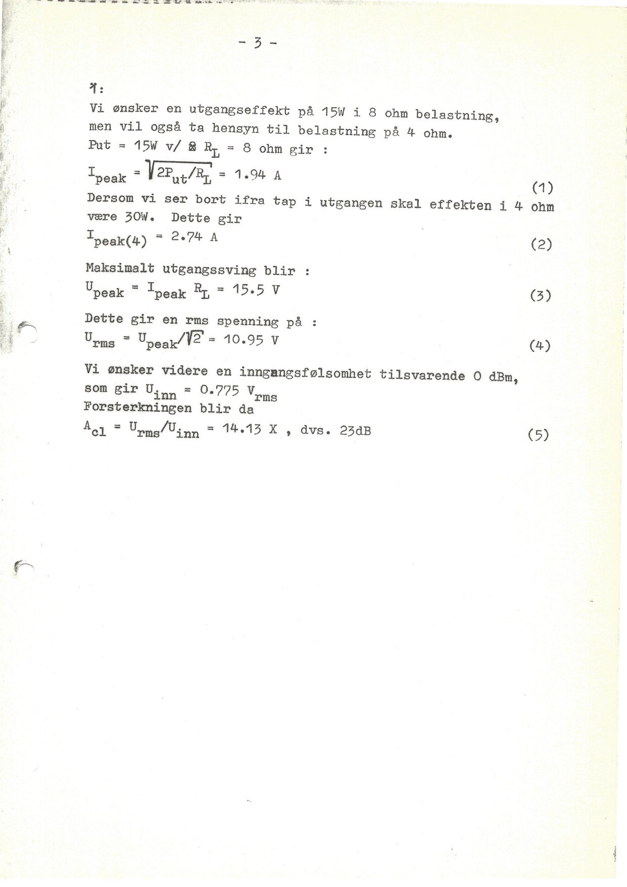

### TIM - DIM - SID

TransientInterModulasjon, Dynamisk InterModulasjon og Slewing Induced
Distortion er nær beslektede begreper, som beskriver hvordan
høyfrekvens-forvrengning kan oppstå i gitte tilfelle i tilbakekoplede
forsterkere.

I fig. 1 er det vist en generell modell for tilbakekoplede forsterkere. A1
representerer alle forsterkende trinn som ligger foran kompensasjonsnettverket
A2, som bestemmer forsterkerens dominerende råforsterknings-pol. A3
representerer alle forsterkende trinn etter kompensasjonsnettverket. B er
tilbakekoplingsnettverket, som vi i dette tilfelle regner uavhengig av
frekvensen.

$U_{inn}$ er inngangssignalet, $U_{ut}$ er utgangssignalet, $U_f$ er det
tilbakekoplede signalet, som er: $U_f = U_{ut} B \tag{1}$

$U_e$ er feilsignalet som er: $U_e = U_{inn} - U_f \tag{2}$

$U_{ut}(s) = U_e A_1 A_2 A_3$ hvor $\tag{3}$

A1 og A2 er frekvensuavhengige mens $A_2(s) = 1/(1+sT) \tag{4}$

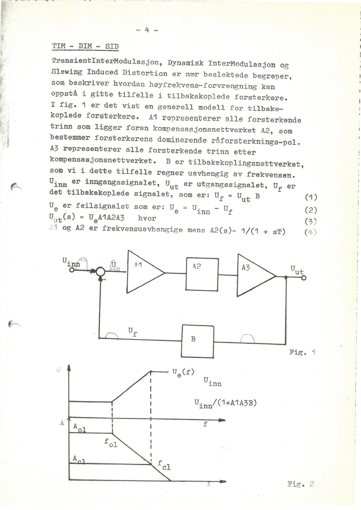

### fol og kompensasjon

Videre er $f_{ol} = 1/(2\pi T) \tag{1}$

Vi ser fra bode-plottene i fig. 2 at feilsignalet $U_e$ stiger fra $f_{ol}$.
Dersom inngangssignalet er tilstrekkelig sterkt og frekvensen høyere enn
$f_{ol}$ kan derfor A1 drives ut så kraftig at den blir ulineær (DIM/SID) og i
ekstreme tilfelle kan signalet klippes i A1 (TIM). En måte som dette
problemet kan minimiseres på er å legge $f_{ol}$ forholdsvis høyt, vi har
derfor valgt å legge den på 10kHz.

Vi vil i tillegg benytte "input-lag"-kompensasjon, sammen med den vanlige
2.trinns kompensasjonen. Systemet er vist på fig. 3 og bode-plottene i fig.4

Vi har da at:

$$A_0 = (1+sT_z)/(1+sT) \tag{1}$$
$$A_2 = 1/(1+sT_z) \tag{2}$$

Dette gjør at inngangstrinnet ikke blir drevet hardere ut i området mellom
$f_{ol}$ og $f_z$. Ved å legge $f_z$ høyere enn den høyeste mulige
inngangsfrekvens, burde mulighetene for DIM/SID være minimale.

### Klipping

I en forsterker med negativ tilbakekopling vil all ulineær forvrengning bli
redusert med en faktor lik tilbakekopling. Dette gjelder også for klipping.
Det vil si at forsterkerens feilsignal, $U_e$ i fig.1, vil inneholde den
avklippede del av utgangssignalet. Siden det ikke er fysisk mulig for
forsterkeren å korrigere for klippingen betyr dette at det trinnet som
bestemmer klippenivået blir drevet i metning umiddelbart. De andre trinnene
blir drevet ulineære og ved sterkt nok inngangssignal, til metning, eller
cut-off. Metning innebærer at transistorens strømforsterkning reduseres mot
1. Trinnet som driver dette må da ha tilstrekkelige strømreserver for å kunne
drive dette trinnet ut av klipping noenlunde hurtig, (overload recovery
time). Utgangstrinnet bør derfor ikke tillates å drives til klipping, dvs. i
metning, da disse leverer for mye strøm, og krever derfor tilsvarende mye
base-strøm for å åpne. Vi vil derfor la driverne bestemme klippenivået.
Ulempen er at vi vil få et ekstra effekttap i utgangen, mao. redusert
virkningsgrad.

### Utgangstrinnet

Utgangstrinnet må kunne arbeide ved meget høye frekvenser. Dette gir at
utg.tr. må spenningsstyres, dvs. drives fra en lav impedans,
$Z_g \ll Z_{inn}$. Dette gir at emitterfølgeren får en grensefrekvens nærmere
$f_\alpha$ enn $f_\beta$.

For å få en enkel montering ønsker vi å benytte TO-39 kanner som drivere, med
evt. kjølestjerne. TO-39 transistorer har typisk $P_{c,maks} = 3W$ ved
$T_c = 25°C$, og en $\theta_{jc} = 60°C/W$, $T_{j,maks} = 200°C$.

En standard kjølestjerne for TO-39 har typ. $\theta_{sa} = 50°C/W$. Maks.
omgivelsestemperatur regnes vanligvis til $50°C$. Vi får da at:

$$P_{D,maks} = (T_j - T_{omg})/(\theta_{jc} + \theta_{sa}) = 1.36\text{ W} \tag{1}$$

når vi antar $\theta_{cs} \ll \theta_{jc} + \theta_{sa}$

Vi regner foreløpig med at forsterkningen i utg.trinnet er tilnærmelsesvis lik
1, og vi får da at $U_{CE}$ for driverne må være lik $U_{peak}$, dvs. 15.5V
(likn. 3.3). Dette gir absolutt maksimal strøm:

$$I_{C,maks} = P_{D,maks}/U_{CE} = 88\text{ mA} \tag{2}$$
$$U_{CE,maks} = 2U_{CE} \tag{3}$$

Av linearitetshensyn vil vi ha at hvilestrømmen i trinnet skal være vesentlig
større enn maksimal laststrøm. (Dette er nærmere forklart senere). Dette gir
at vi kan regne $I_C$ lik konstant.

SOAR kurvene for en typ. TO-39 (2N2219) og likn.3 gir oss en
$I_{C,maks} = 55$mA før second breakdown. Strømmen $I_C$ som velges bør
heller ikke være så stor at utgangstransistorene kan drives over sin
$I_{C,maks}$.

Et standard FE-koplet trinn (fig. 5) kan karakteriseres ved at trinnet må
doble sin strøm i forhold til hvilestrømmen, og redusere den samme til nær
null for å få fullt spenningssving på utgangen. Ved full utstyring vil
trinnet bli veldig ulineært. Dette ser en ved å betrakte $I_C$ versus $U_{BE}$
karakteristikken. For å få lav forvrengning bør en derfor

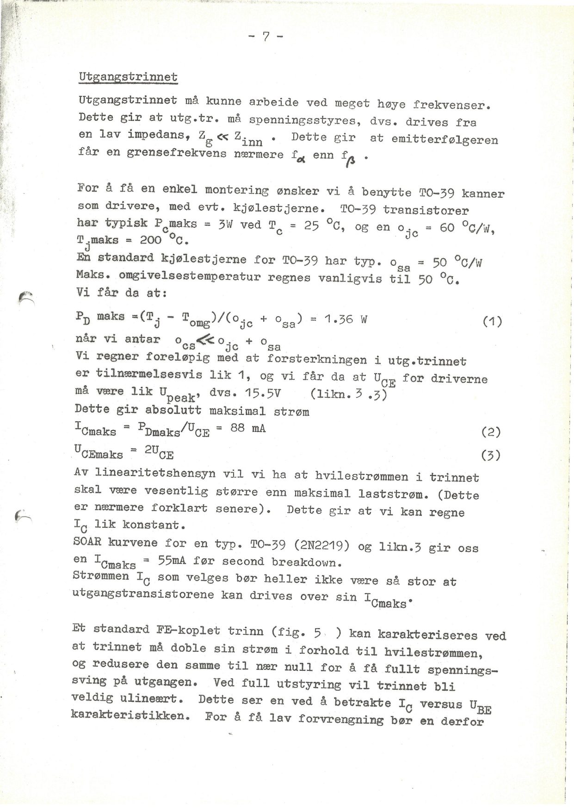

bruke et trinn som arbeider signal-messig på en liten del av sin
$I_c/U_{BE}$ karakteristikk for å levere fullt spenningssving ut. Slike trinn
er vist i fig. 6 og fig. 7.

Vi vil velge å benytte varianten i fig.7 da denne koplingen reduserer like
harmonisk forvrengning.

For alle inngangstrinnene gjelder at det er relativt lite komplisert å
arbeide med små variasjoner både mhp. $i_c/I_C$ og $u_{ce}/U_{CE}$. Dette
siste reduserer forvrengning forårsaket av variasjoner i $h_{fe}$ med
$u_{CE}$, variasjoner i $C_{ob}$ med $u_{ce}$. Drivertrinnet vil derimot
styres fullt ut mhp. $u_{ce}/U_{CE}$. Ved å la drivertrinnet arbeide i felles
base kopling vil disse ulineariteten reduseres betraktelig. Vi oppnår da også
større båndbredde for dette trinnet. Dette trinnet må da drives av et
FE-trinn.

Det vil være praktisk å slippe kjølestjerne på denne transistoren, dette gir
i såfall, med $\theta_{ja} = 220°C$:

$$P_{d,maks} = (T_j - T_{omg})/\theta_{ja} = 0.68\text{ W} \tag{1}$$

som betyr $U_{CE,maks}$ ved $I_C = 55$mA på 12.4V

Selve utgangstransistorene vil bli koplet som vist i fig.8. Vi har valgt å
benytte et komplementært par fra General Electric, D44H11 (NPN) og D45H11
(PNP). Disse kan dissipere max. 50W, $I_{C,maks} = 10A$ (20A peak) og med en
$f_T = 50$MHz ved $I_C = 0.5A$. Vi noterer også at $h_{FE}$ versus $I_C$
karakteristikken har sitt max.pkt. meget høyt, over 1A, og har ikke noe
kraftig fall før over 2A.

$U_{CC}$ må velges høyere enn $U_{peak}$ slik at ikke transistorene går i
metning ved klipping.

Vi vil benytte ca. ±18V. Fra SOAR-kurvene ser vi da at maksimal hvilestrøm
$I_{Cq} = .35$A.

Ved å dimensjonere $R_E$ så store som mulig for å oppnå god
temperaturstabilisering, men ikke større enn at ved max. strøm ut skal den
transistor som "ikke leder" ligge akkurat ved $U_{BE}$ cut-in, dvs. unngå å
revers-forspenne base-emitter dioden, har det vist seg å resultere i mindre
forvrengning. Switche-tidene for transistorene forbedres også. Ved å velge en
høy $I_{Cq}$ vil vanlig forvrengning reduseres, samt at
cross-over-forvrengningen holdes på et lavt nivå. Vi har derfor valgt å legge
$I_{Cq}$ på ca. 0.2A, noe lavere enn det kritiske pkt. .35A

$$I_{C,maks} = I_{peak(4)} = 2.74\text{ A (likn. 3.2)} \tag{}$$

Vi kan da sette:

$$U_{BE} = V_T \ln(I_{Cq}/I_{C,maks}) = 68\text{ mV} \tag{1}$$

Vi har at $U_{BE}$ ved $I_C = .2A$ er ca. 0.68V, og cut-in antar vi lik .4V

Vi kan da sette opp flg. likninger for kretsen i fig.8:

$$U_{BB} = U_{BE1} + U_{RE1} + U_{RE2} + U_{BE2} = 1.08\text{V} + 2.7R_E \tag{2}$$

for det tilfelle at $I_C = I_{C,maks}$, $U_{BE1} = U_{BEq} + U_{BE}$,
$U_{BE2} = 0.4$V, $U_{RE1} = I_{C,maks}R_E$ og $U_{RE2} = 0$

Ubelastet får vi $U_{BE1} = U_{BE2}$ og $U_{RE1} = U_{RE2}$. Likn.(2) blir da:

$$U_{BB} = 2U_{BE} + 2U_{RE} = 1.36\text{V} + 0.4R_E \tag{3}$$

$U_{BB}$ skal være konstant uavhengig av belastningen, og vi kan derfor løse
likn(2) og likn.(3) mhp. $R_E$. Vi får da $R_E = 0.12$ ohm, og velger
standardverdi 0.1 ohm.

Fra databladet finner vi $h_{FE} = 110$ ved $I_C = 0.2$ A. Ut ifra kurven for
$h_{FE}$ finner vi $h_{fe}$ lik 120. Med 4 ohm belastning vil
utgangstransistorenes inngangsimpedans være tilnærmet lik:

$$R_{inn} = R_L h_{fe} = 500\text{ ohm} \tag{4}$$

Den absolutt minste verdi for drivernes belastningsmotstand er:

$$R_{LDmin} = U_{peak}/I_{C,maks} = 320\text{ ohm} \tag{5}$$

Dette tilfredstiller ikke de kravene vi stillte på s. om at
$Z_g \ll Z_{inn}$. Vi må derfor kople emitterfølgere til å drive
utgangstransistorene. Utgangstrinnet blir da som vist i fig. 9. Til drivere
velger vi å benytte TO-39 kanner, transitorene er valgt 2N2219A og 2N2905A.
Disse har $h_{fe}$ typ. = 150 ved $I_C$ større enn 10mA.

Utgangstransistorenes basestrøm er:

$$i_b = I_{C,peak(4)}/h_{fe} = 22.5\text{ mA} \tag{1}$$
$$I_B = I_{Cq}/h_{FE} = 1.8\text{ mA} \tag{2}$$

Spenningen over disse transistorene blir i samme størrelsesorden som for
driverne, vi bør derfor ikke la $I_{C,maks}$ for disse bli særlig større enn
50mA. Med en hvilestrøm på ca. 20mA blir $I_{C,maks} = 42.5$mA.

Vi får for hele utgangstrinnet:

$$R_{inn} = R_L h_{fe,ut} h_{fe,em} = 4\times120\times150 = 72\text{ kohm} \tag{3}$$

Ved utg.transistorenes maksimale kollektorstrøm, ca.20A er $h_{fe}$ for sme.
redusert til ca.20. Dette gir en basestrøm på 1A, som 2N2219 akkurat vil
tåle. $h_{fe}$ for denne vil da også være redusert til ca. 20, noe som gir
en base-strøm på ca.50mA. (Mrk. dette gjelder kun for pulser). Maks. strøm
fra driverne bør da ikke overstige 50mA, dvs. en hvilestrøm på mindre enn
25mA. Vi velger å legge den da på ca. 20mA. Vi kan derfor være forholdsvis
sikre på at utgangstrinnet vil tåle kortslutning i korte øyeblikk, som for
eksempel ved driving av kapasitiv belastning med signaler med stort
høyfrekvensinnhold. I slike tilfelle (kapasitiv belastning, og f.eks.
step-funksjon inn) vil forsterkeren i et kort øyeblikk oppfatte utgangen som
klippet, dvs. intet tilbakekoplingssignal, og drivertrinnet vil åpne
helt,til $I_C = 2I_{Cq}$. Denne strømmen vil bli levert til utgangstrinnet som
basestrøm, utg.tr. vil forsøke å lade opp kondensatoren med all den strøm den
kan levere. Sett fra kondensatorens side, vil den bli drevet fra en lavere
kildeimpedans enn tilfellet ville ha vært uten negativ tilbakekopling.

For utgangstransistorene har vi at $f_T = 50$MHz og $h_{fe} = 120$. Dette gir
$f_{hfe} = 420$kHz. For 2N2219 er $f_T = 300$MHz, $h_{fe} = 150$, som gir
$f_{hfe} = 2$MHz. Vi ser altså at utgangens inngangsimpedans vil være -3dB
ved ca.400kHz.

Dette gir en ekvivalent inngangskapasitet på:

$$C_{in} = 1/(2\pi f_{hfe} R_{inn}) = 5\text{ pF} \tag{}$$

2N2219 har videre $C_{ob} = 7$pF. Det er koplet 4 slike transistorer til dette
pkt., og total kapasitet blir:

$$C_g = C_{in} + 4C_{ob} = 33\text{ pF} \tag{1}$$

Kravene til $R_g$ blir da: så høy som mulig for å få så lav forvrengning som
mulig fra drivertrinnet. Så lav som mulig for å få så høy båndbredde som
mulig. Med en $R_g$ på ca. 2.5kohm blir $i_c/I_C \approx 1/10$, og
grensefrekvensen:

$$f_p = 1/(2\pi R_g C_g) = 1.9\text{ MHz} \tag{2}$$

Dersom vi i fig.1 setter $A = A_1 A_3$ og $A_2 = 1/((1+sT_1)(1+sT_2))$ blir
forsterkerens transfer-funksjon:

$$A_{cl}(s) = \frac{A}{1+AB} \cdot \frac{1}{1 + s\frac{T_1+T_2}{1+AB} + s^2\frac{T_1 T_2}{1+AB}} \tag{3}$$

For at dette systemet skal være kritisk eller overdempet må røttene i den
karakteristiske ligningen være reelle. Dette betyr at:

$$(T_1+T_2)^2 - 4(1+AB)T_1 T_2 \gtrsim 0 \tag{4}$$

Vi setter $1+AB = D$ (tilbakekoplingen) og $T_2 = T_1/k$, hvor $k$ altså er
forholdet mellom polene. Vi vil da se at $T_1$ faller bort og vi får en
ligning som sier at

$$k^2 + k(1-4D) + 1 \gtrsim 0 \tag{1}$$

Vi antar at $k \gg 1$ og at $D \gg 1$, noe som vil være tilfelle i praksis. Vi
får da:

$$k - 4D \gtrsim 0 \text{ altså at } k \geq 4D \tag{2}$$

Vi har valgt å legge den dominerende pol på 10kHz, og vi har funnet en ny pol
på 1.9MHz, dette gir $k = 190$ og vi får da at $D \leq 47.5$ dvs. 33dB.
Likn.(11.5) gir at $A_{cl} = 14X$ og siden:

$$A_{ol} = A_{cl} D \leq 660\text{ X} \tag{3}$$

### Inngangstrinnet

Helt i inngangen har vi valgt å benytte felt-effekt transistorer pga. den
høye inngangsimpedansen, som letter konstruksjonen av inngangsnettverket (for
input lag), den gode lineariteten, degenereringsmotstander er ikke
nødvendig, og den enkle forspenningsmåten. Vi har tidligere valgt en
komplementær kopling (fig.7). Inngangstrinnet må da også være komplementært.
(En kunne også valgt en løsning som benyttet strømspeil, det ville imidlertid
ikke vært noen enklere løsning.) Koplingen er vist i fig.10

$R_s$ bestemmer, avhengig av summen av $U_{gs}$ spenningene for P- og
N-channel typene, strømmen gjennom inngangstrinnet. Common-mode
undertrykkelsen er uavh. av $R_s$, og blir derfor meget høy. (For et
bipolart inng. trinn måtte, for å få samme CMRR, konstant-strømgeneratorer
med transistorer benyttes for hvert enkelt diff.trinn.)

Da steilheten i FET'ene er meget lav i forhold til bipolare transistorer, vil
nødvendigvis spenningen over lastmotstanden bli tilsvarende større. FE
trinnet i driverkretsen skal imidlertid bare ha noen få volt mellom
forsyningsspenning og base, slik at det ikke lar seg gjøre å la FET-trinnet
drive FE-trinnet direkte. Vi har derfor lagt et bipolart differensialtrinn
mellom. Forenklet skjema for en halvdel blir som vist i fig.11. De
etterfølgende beregninger refererer til de betegnelser som er benyttet i
dette skjemaet.

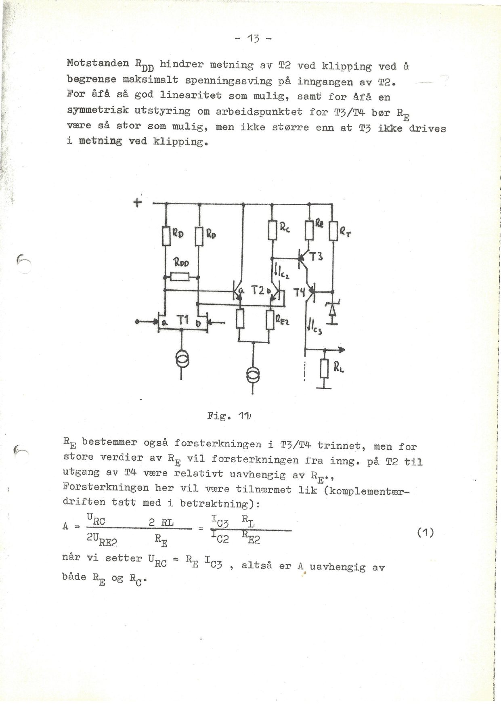

Motstanden $R_{DD}$ hindrer metning av T2 ved klipping ved å begrense
maksimalt spenningssving på inngangen av T2. For å få så god linearitet som
mulig, samt for å få en symmetrisk utstyring om arbeidspunktet for T3/T4 bør
$R_E$ være så stor som mulig, men ikke større enn at T3 ikke drives i metning
ved klipping.

$R_E$ bestemmer også forsterkningen i T3/T4 trinnet, men for store verdier av
$R_E$ vil forsterkningen fra inng. på T2 til utgang av T4 være relativt
uavhengig av $R_E$. Forsterkningen her vil være tilnærmet lik
(komplementærdriften tatt med i betraktning):

$$A = \frac{U_{RC}}{2U_{RE2}} = \frac{2R_L}{R_E} = \frac{I_{C3}}{I_{C2}}\cdot\frac{R_L}{R_{E2}} \tag{1}$$

når vi setter $U_{RC} = R_E I_{C3}$, altså er A uavhengig av både $R_E$ og
$R_C$.

For utgangstransistorene har vi ...(fortsetter side 14)

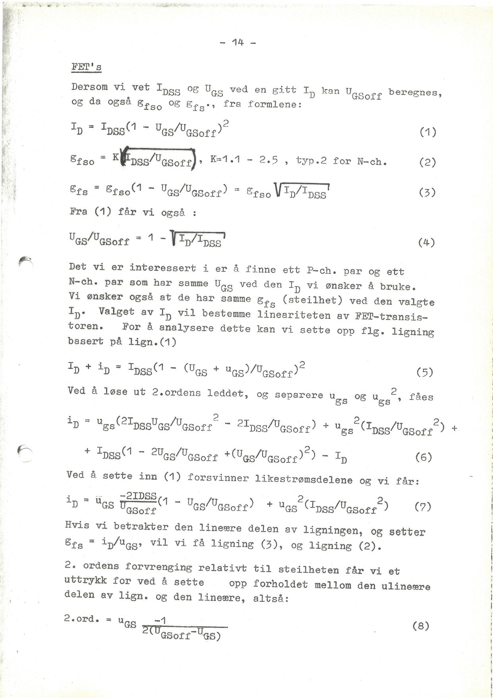

For å få lav forvrengning bør da $U_{GS} \ll U_{GSoff}$, og fra lign. (14.1)
gir dette høy $I_D$. Fra lign. (14.3) ser vi at dette også gir høy steilhet.
Drain-motstanden blir følgelig også lav, noe som gir høyere cut-off frekvens
på dette pkt.

Vi velger da å drive FET'ene på ca 1/3 $I_{DSS}$ slik at vi ved full
overstyring av inngangstrinnet akkurat ikke når $I_{DSS}$. Dersom vi antar
ingen mismatch mellom de 2 transistorene i hvert par vil alle like harmoniske
kanselleres.

Vi har valgt å benytte 2N5459 (N-ch) og 2N5462 (P-ch). Vi har målt ut
$I_{DSS}$ og $U_{GS}$ ved en valgt $I_D$, og beregnet $U_{GSoff}$ og
$g_{fso}$ for 10 enheter av hver type. Dataene er vist i tabell 1.

Ut ifra dataene i tab.1 velger vi å benytte:

For kanal 1: N-ch. enh.nr 1 og 6, P-ch. enh. nr. 6 og 10

For kanal 2: N-ch. enh. nr 2 og 3, P-ch. enh. nr. 5 og 8

Disse har $I_{DSS}$ mellom 4 og 5mA, og vi velger da å drive dem på ca.
1.5mA. $U_{gsoff} = 2.3V$, og fra lign.(14.4) og(14.3) får vi:

$$U_{GS} = 1.27\text{ V} \tag{}$$
$$|g_{fs}| = 1730\text{ umhos} \tag{}$$

Den totale råforsterkningen (lign.(12.3)) er $A_{ol}=660x$. Ved lik deling
mellom de tre trinnene gir dette 8.7 x pr. trinn.

På grunn av komplementærdrivingen av utgangen vil vi her få en dobling av
forsterkningen relativt til et enkelt lastet trinn, mens vi for 2.trinnet har
en halvering, fordi trinnet er differensielt inn, men enkelt lastet.

Emittermotstanden i 3.trinnet blir da:

$$R_E = 2R_L/A = 2\times2500/8.7 = 570\text{ ohm} \tag{}$$

For dette trinnet har vi tidligere valgt en hvilestrøm på 20mA (side 10).
Dette gir et spenningsfall over $R_E$ på 11.4 V. For å unngå metning ved full
utstyring må $U_{CE}$ for T3 være større enn dette, noe som er i strid med
kravet fra lign.(8.1). Vi vil også få en urimelig høy forsyningsspenning. Vi
velger derfor å legge ca.3V over denne emittermotstanden:

$$R_E = 3V/20mA = 150\text{ ohm} \tag{}$$
$$A = 2\times2500/150 = 33.3\text{ X} \tag{1}$$

Spenningen mellom T3's base og $U_{cc}$ blir da:

$$U_B = U_{RE} + U_{BE} = 3.7\text{ V} \tag{2}$$

Ved full utstyring av 2.trinnet blir:

$$U_{Bmaks} = 2U_B = 7.4\text{ V} \tag{3}$$

Ved å legge emitterspenningen på T4 10V under $U_{cc}$ sikrer vi 2.6 V som
$U_{CEmin}$ for T3, som er tilstrekkelig til å hindre metning.

For FE-trinnet (T3) får vi da flg. arbeidspunkt: $I_C = 20$mA $U_{CE} = 7$V.
Vi får:

$$P_C = 140\text{ mW} \tag{}$$

Med $\theta_{ja} = 220°C$, $\theta_{jc} = 60°C$ blir:

$$dT_j = 31°C, \text{ og } dT_c = P_c(\theta_{ja} - \theta_{jc}) = 22.4°C \tag{4}$$

Maksimalt spenningsutsving på utgangen av 1.trinn er bestemt av tilgjengelig
forsyningsspenning, spenningssving på utgang av 2.trinn pluss nødvendig
$U_{CE}$ for T2 for å unngå metning av dette trinnet, og minimum $U_{DS}$ for
inngangstrinnet. Inngangstrinnet kan sikres ved å tillate ca. 5V mellom drain
og jord som minimum. Ved å la $U_{CEmin} = $ ca.2.5V, og siden $U_{RC}$ maks
er 7.4V, blir $U_{Bmaks} = U_{cc} - 10V$.

Koplingen av inngangstrinnets utgang er vist i fig. 12. For full utstyring av
trinnet kan vi sette: $I_1 = I = 3$mA, $I_2 = 0$; $U_C = 5V$, $U_B = 15V$.
Dette gir at $U_{AB} = U_{BC} = 10V$, og siden $I_2=0$ må $I_{AB} = I_{BC}$,
og dermed må $R_D = R_{DD} = R$.

$$U_{AC} = I R_D(R_D + R_{DD})/(2R_D + R_{DD}) = IR \cdot 2/3 \tag{2}$$

Dette gir $R = 10$kohm, altså $R_D = R_{DD} = 10$kohm.

Differensiell last for dette trinnet blir da:

$$R_L = 2R_D \| R_{DD} = 6.67\text{ kohm} \tag{3}$$

Differensiell forsterkning er da:

$$A_1 = \tfrac{1}{2}R_L g_{fs} = 5.77\text{ X} \tag{4}$$

Fra lign.(16.1) har vi gitt at $A_3 = 33.3$ X. Vi får da at forsterkningen i
2.trinnet skal være:

$$A_2 = A_{ol}/(A_1 A_3) = 3.43\text{ X} \tag{5}$$

Vi har nå ikke tatt hensyn til dempning som skyldes kopling mellom trinnene.
Dette vil vi senere ta hensyn til ved å øke $A_2$. Vi antar foreløpig at
dempningen er tilnærmelsesvis lik 1.

For andre trinnet setter vi (fig.11) $R_{Et} = R_{E2} + V_T/I_{E2} \tag{6}$

Forholdet mellom $R_C$ og $R_{Et}$ må da være $2A_2 = 6.87 \tag{7}$

$$U_{REt} = 3.7\text{V}/6.87 = 0.54 \tag{8}$$

Valg av strømmen i 2.dre trinn påvirkes av flg. faktorer:

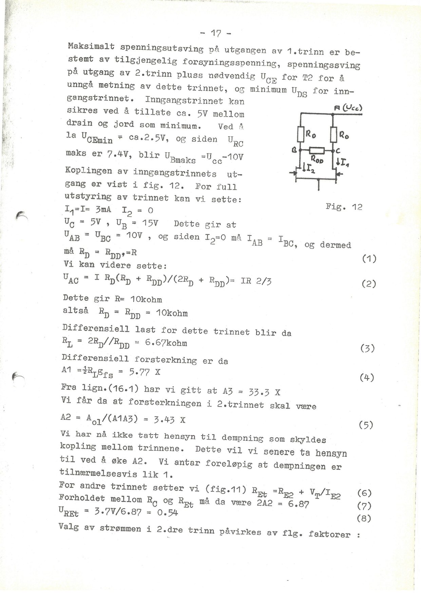

Høy strøm gir: Høy grensefrekvens mellom $R_L$ og tilhørende node-kapasitet.
Lav forvrengning pga. $h_{fe}$ ulineariteter i pkt. $R_L$-neste trinn, pga.
lav generatorimpedans for dette trinn.

Lav strøm gir: Lav forvrengning pga. $h_{fe}$ ulinearitet i pkt. $R_D$-2.trinn,
pga. av lav belastning av denne kildeimpedansen.

I dette tilfellet er ikke ulinearitet i $i_c$ versus $u_{BE}$ karakteristikken
noe problem, da trinnets utstyring er låst av kravene til utnivå fra hele
forsterkeren. Lign.(13.1) sier at $I_{C2}$ er omvendt proporsjonal med
$R_{E2}$ for konstant A. Ulineariteten er avhengig av forholdet mellom
$r_e = V_T/I_{C2}$ og $R_{E2}$, og av forholdet mellom $i_C/I_C$. Dette siste
er konstant pga. valget av virkningsgrad av 3.dje trinn. Ved å betrakte
systemet i fig.11, ser man at virkningsgraden av 2.re trinn er lik
virkningsgraden av 3dje trinn. Det andre forholdet, $r_e/R_{E2}$, blir også
konstant pga. kravet til forsterkning gitt i lign(13.1).

Inngangsimpedansen for 3.dje trinn med $h_{fe}$ for T3 lik 150 er:

$$R_{inn3} = (R_E + V_T/I_{C3})h_{fe} = 23\text{ kohm} \tag{1}$$

Dersom vi regner $h_{fe}$ ulinearitet som like for 2.dre og 3.dje trinn,
uavhengig av hvor de arbeider på $h_{fe}$ versus $i_C$ karakteristikken, og
lar $h_{fe}$-forvrengningsbidraget fra hvert trinn være like, kan vi sette
graden av strømstyring like for trinnene, dvs:

$$R_D'/R_{inn2} = R_C/R_{inn3}, \quad R_D' = 2R_D \| R_{DD} \times \tfrac{1}{2} \tag{2}$$
$$R_C = 3.7\text{V}/I_{C2}, \quad R_{inn2} = R_{Et} h_{fe} \tag{3,4}$$

Fra lign.(17.7) har vi at $R_C/R_{Et} = 6.87$, vi setter inn i (2) og får:

$$R_D'/(R_{Et}h_{fe2}) = R_{Et}\cdot6.87/R_{inn3} \tag{}$$

som gir:

$$R_{Et} = \sqrt{R_D' R_{inn3}/(6.87 h_{fe2})} \tag{}$$

Antar $h_{fe2} = 300$, og får $R_{Et} = 193$ ohm. Vi får da
$R_C = 6.87\times193 = 1326$ ohm, og velger standardverdi $R_C = 1k2$.

Med $C_{ob} = 7$pF for 3.dje trinn får vi cut-off frekvens ved
$f = 1/(2\pi R_C C_{ob}) = 19$MHz.

Dette kan neglisjeres når vi skal analysere stabiliteten av systemet.

Vi får videre:

$$I_{C2} = 3.7\text{V}/R_C = 3.1\text{ mA} \tag{1}$$

Dette gir $r_e = 8.4$ ohm. For å bestemme riktig verdi på $R_{E2}$ må vi nå
beregne dempningen i de forskjellige trinnsammenkoplingene.

Vi setter da først opp et ekvivalent skjema for utgangstrinnet (fig.13): Pga.
de lave impedansene vi opererer med kan vi se bort ifra virkningen av
$h_{ob}$.

Skjemaet i fig.13a kan forenkles til det i fig.13b, hvor man vil finne:

$$D_u = R_L/(R_L + R_u), \quad R_u \text{ er forsterkerens utg.impedans} \tag{2}$$
$$R_u = R_g/(h_{fed}h_{feu}) + \tfrac{1}{2}r_{ed}/h_{feu} + \tfrac{1}{2}r_{eu} + \tfrac{1}{2}R_E \tag{3}$$

med $r_{ed} = 26mV/20mA = 1.3$ ohm og $r_{eu} = 26mV/0.2A = 0.13$ ohm blir
$R_u = 0.26$ ohm og dermed $D_u = 0.939$ ved $R_L = 4$ ohm.

Inngangsimpedansen for 2.dre trinnet blir:

$$R_{inn2} = R_{Et}h_{fe2} = 58\text{ kohm} \text{ som gir } D_{i2} = R_{inn2}/(R_{inn2}+R_D') \tag{}$$

som blir $D_{i2} = 0.946$

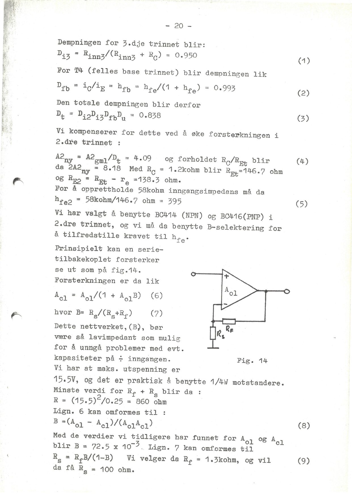

Dempningen for 3.dje trinnet blir:

$$D_{i3} = R_{inn3}/(R_{inn3}+R_C) = 0.950 \tag{1}$$

For T4 (felles base trinn) blir dempningen lik:

$$D_{fb} = i_C/i_E = h_{fb} = h_{fe}/(1+h_{fe}) = 0.993 \tag{2}$$

Den totale dempningen blir derfor:

$$D_t = D_{i2}D_{i3}D_{fb}D_u = 0.838 \tag{3}$$

Vi kompenserer for dette ved å øke forsterkningen i 2.dre trinn:

$$A_{2,ny} = A_{2,gml}/D_t = 4.09 \tag{4}$$

og forholdet $R_C/R_{Et}$ blir da $2A_{2,ny} = 8.18$. Med $R_C = 1.2$kohm
blir $R_{Et} = 146.7$ ohm og $R_{E2} = R_{Et} - r_e = 138.3$ ohm.

For å opprettholde 58kohm inngangsimpedans må da:

$$h_{fe2} = 58\text{kohm}/146.7\text{ ohm} = 395 \tag{5}$$

Vi har valgt å benytte BC414 (NPN) og BC416(PNP) i 2.dre trinnet, og vi må da
benytte B-selektering for å tilfredstille kravet til $h_{fe}$.

Prinsipielt kan en serie-tilbakekoplet forsterker se ut som på fig.14.
Forsterkningen er da lik:

$$A_{cl} = A_{ol}/(1+A_{ol}B) \tag{6}$$

hvor $B = R_s/(R_s+R_f) \tag{7}$

Dette nettverket, (B), bør være så lavimpedant som mulig for å unngå
problemer med evt. kapasiteter på ÷ inngangen. Vi har at maks. utspenning er
15.5V, og det er praktisk å benytte 1/4W motstandere. Minste verdi for
$R_f + R_s$ blir da:

$$R = (15.5)^2/0.25 = 860\text{ ohm} \tag{}$$

Lign. 6 kan omformes til:

$$B = (A_{ol} - A_{cl})/(A_{ol}A_{cl}) \tag{8}$$

Med de verdier vi tidligere har funnet for $A_{ol}$ og $A_{cl}$ blir
$B = 72.5\times10^{-3}$. Lign. 7 kan omformes til:

$$R_s = R_f B/(1-B) \tag{}$$

Vi velger da $R_f = 1.3$kohm, og vil da få $R_s = 100$ ohm. (Fig. 14, se
side 20 over, viser det seriekoplede tilbakekoplingsnettverket.)

Siden det 2.dre trinnet er differensielt inn og enkelt lastet vil
transfer-karakteristikken ha 2 poler og ett nullpkt. Dersom vi antar at
trinnet drives fra to uavhengige generatorer med lik kildeimpedans, og hvis
generatorspenninger er i nøyaktig motfase, vil nullpunktet ligge en oktav
over første polpunkt.

Vi setter generatorimpedansen lik $R_D'$, for begge generatorer. Den
belastede delens inngangskapasitet er da:

$$C_i = C_{ob}(1+2A_2) \tag{1}$$

Med $C_{ob} = 5$pF, og $A_2=4.09$ blir $C_i = 46$pF. For den andre siden blir
$C_i = C_{ob} = 5$pF.

Første pol blir da på $f = 1$MHz, andre pol 9x høyere, og nullpkt. på ca.2MHz.
Ved å legge inn en kondensator tvers over den differensielle inngangen kan
virkningen av dette minimeres, og vi får da en fast cut-off frekvens lavere
ned. Ved å betrakte fig.3 og fig.4, ser man at denne cut-off-frekvensen er
kalt $f_z$.

Vi har valgt å benytte $C=100$pF, som gir en $f_z=239$kHz. Inngangsnettverket
$A_0$ skal da inneholde en pol på 10kHz og et nullpkt. på 239kHz. For å få en
definert pol på 10kHz legger vi en seriemotstand inn på inngangen.
Blokkskjematisk løsning er vist i fig. 15.

Nettverkets polpkt er:

$$f_p = 1/(2\pi C \cdot R_t), \quad R_t = R_i + R_f B + R_z \tag{2,3}$$

Nettverkets nullpkt: $f_n = 1/(2\pi C R_z) \tag{4}$

Vi får da $f_n/f_p = 23.9 = (R_i+R_f B+R_z)/R_z \tag{5}$

som gir $R_z = (R_i+R_f B)/(1-f_n/f_p) \tag{6}$

Vi velger $R_i = 10$kohm og får da $R_z = 440$ ohm, $C = 1.5$nF

Forspenningen av 2.dre trinnet er vist i fig.16. $U_D$ er drain-spenningen på
inngangstrinnet som er lik 10V i hvilestilling.

Spenningen over $R_E$ er: $U_{RE} = I_{C2}R_E = 0.45$ V, $U_{BE} \approx 0.55$V

Spenningen over $R_K$ blir da: $U_{RK} = 2U_D - 2(U_{BE}+U_{RE}) = 18$V

Strømmen gjennom $R_K$ er lik $2I_{C2} = 2\times3.1$mA$=6.2$mA. $R_K$ blir da
3.0k.

I fig.9 er det markert at vi skal ha en viss forspenning $U'_{bb}$, av
utgangstrinnet. Dette for at transistorene skal forspennes til kl.AB drift. I
fig.17 er denne forspenningskretsen vist. Transistoren monteres slik at den
er i termisk kontakt med kjøleribben, og den vil dermed justere forspenningen
i takt med reduksjon/økning av utgangstransistorenes base-emitterspenninger
som funksjon av temperaturvariasjoner. Vi har valgt å benytte en
Darlington-transistor til dette (MPSA-12), slik at transistorens base-strøm
ikke skal påvirke forspenningen. Trimmepotensiometeret gjør at man kan
justere forspenningen til den ønskede tomgangstrøm i utgangen er oppnådd.
Potensiometeret er koplet slik at ved mekanisk svikt i viperen, dvs. viperen
mister kontakt med kullbanen, noe som lett kan skje med ikke-innkapslede
potensiometere ved mekanisk berøring, vil forspenningen synke, og dermed
tomgangsstrømmen reduseres, slik at ikke utgangen ødelegges.

$U_{BE}$ for Darlington-transistoren er regnet lik 1.2V. Nominell $U'_{bb}$
er lik $4\times0.65V = 2.6V$. Maksimal variasjon av $U'_{bb}$ valgt lik
±0.5V. Vi kan sette:

$$IR_2/2 = U_{var} = U_{BE} + U'_{bb} \tag{2}$$

Med $R_2$ lik 1kohm (mest/best tilgjengelige verdi) blir $I=923\mu A$

$$U_{R1} = U'_{bb} - U_{BE} = 1.4\text{V, dvs. } R_1=1k5 \tag{}$$
$$\tfrac{1}{2}R_2 + R_3 = U_{BE}/I = 1300\text{ ohm} \tag{}$$

Med $R_2$ lik 1kohm gir dette $R_3 = 820$ ohm. Vi får da:

$$U'_{bb,min} = U_{BE}(R_1+R_2+R_3)/(R_2+R_3) = 2.19\text{V} \tag{}$$
$$U'_{bb,max} = U_{BE}(R_1+R_3)/R_3 = 3.40\text{V} \tag{}$$

Vi har nevnt tidligere at utgangstrinnet må ha en høyere
forsyningsspenning enn "normalt", for å unngå å gå i metning ved klipping. Vi
har derfor lagt $U_{cc}$ for utgangstrinnet på ±18V.

Vi har fra tidligere at hvilestrømmen $I_q=0.2$A. Vi har tidligere valgt å
benytte små verdier for emittermotstandene (s. 9). Dette gir at vi ikke vil
få en klart definert overgang mellom klasse A drift og klasse B drift.
Fig.18 b og c viser dette. Vi må likevel anta at vi har en definert overgang
for å kunne beregne effekttapet. Det virkelige effekttapet vil sannsynligvis
være noe større.

Så lenge forsterkeren arbeider i klasse A området vil utgangen fungere som to
parallell-koplede transistorer, det betyr at strømmen gjennom hver av dem er
halv-parten av strømmen gjennom lasten. Da det er komplementærdrift er det
absoluttverdien av strømmen gjennom transistorene som er like, og strømmene
er motsatt rettede.

I klasse B området vil transistorene vekselvis sperre og lede, slik at
strømmen gjennom hver av dem er lik strømmen gjennom lasten i lede-fasen.
Dette er også vist i fig. 19.

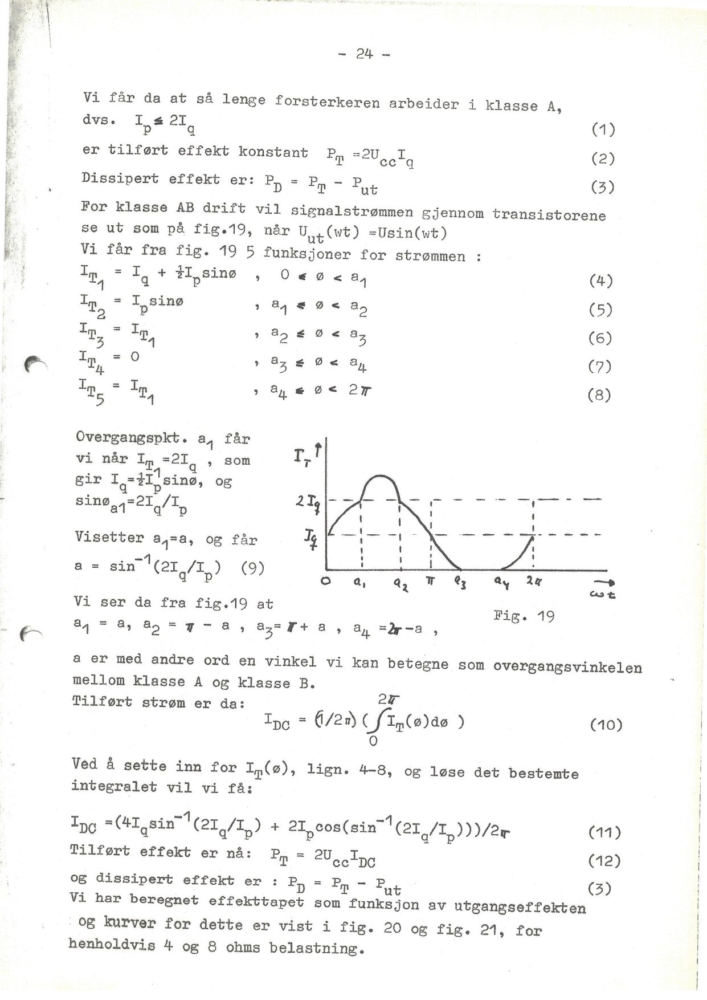

Vi får da at så lenge forsterkeren arbeider i klasse A, dvs. $I_p \leq 2I_q$
er tilført effekt konstant:

$$P_T = 2U_{cc}I_q \tag{2}$$

Dissipert effekt er: $P_D = P_T - P_{ut} \tag{3}$

For klasse AB drift vil signalstrømmen gjennom transistorene se ut som på
fig.19, når $U_{ut}(\omega t) = U\sin(\omega t)$

Vi får fra fig.19 5 funksjoner for strømmen:

$$I_{T1} = I_q + \tfrac{1}{2}I_p\sin\phi, \quad 0 \leq \phi < a_1 \tag{4}$$
$$I_{T2} = I_p\sin\phi, \quad a_1 \leq \phi < a_2 \tag{5}$$
$$I_{T3} = I_{T1}, \quad a_2 \leq \phi < a_3 \tag{6}$$
$$I_{T4} = 0, \quad a_3 \leq \phi < a_4 \tag{7}$$
$$I_{T5} = I_{T1}, \quad a_4 \leq \phi < 2\pi \tag{8}$$

Overgangspkt. $a_1$ får vi når $I_{T1}=2I_q$, som gir $I_q=\tfrac{1}{2}I_p\sin\phi$,
og $\sin\phi_{a1}=2I_q/I_p$.

Vi setter $a_1=a$, og får:

$$a = \sin^{-1}(2I_q/I_p) \tag{9}$$

Vi ser da fra fig.19 at $a_1 = a$, $a_2 = \pi-a$, $a_3=\pi+a$, $a_4=2\pi-a$.

$a$ er med andre ord en vinkel vi kan betegne som overgangsvinkelen mellom
klasse A og klasse B. Tilført strøm er da:

$$I_{DC} = (1/2\pi)\left(\int_0^{2\pi} I_T(\phi)\,d\phi\right) \tag{10}$$

Ved å sette inn for $I_T(\phi)$, lign. 4-8, og løse det bestemte integralet
vil vi få:

$$I_{DC} = \frac{4I_q\sin^{-1}(2I_q/I_p) + 2I_p\cos(\sin^{-1}(2I_q/I_p))}{2\pi} \tag{11}$$

Tilført effekt er nå: $P_T = 2U_{cc}I_{DC} \tag{12}$

og dissipert effekt er: $P_D = P_T - P_{ut} \tag{3}$

Vi har beregnet effekttapet som funksjon av utgangseffekten og kurver for
dette er vist i fig. 20 og fig. 21, for henholdsvis 4 og 8 ohms belastning.

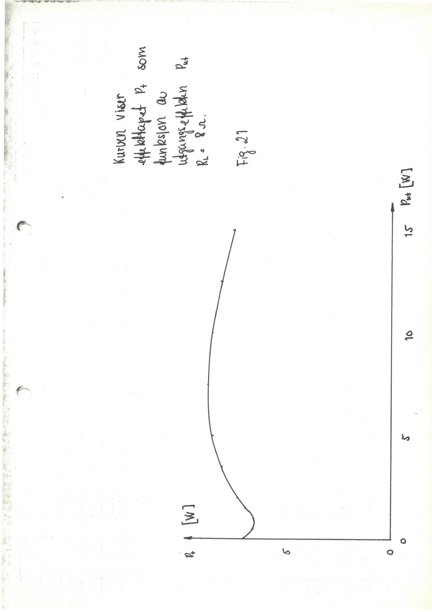

Fra fig. 24 kan vi sette:

$$U_{peak} = (U_z + U_{BE4} - U_{CEsat} - U_{BEd} - U_{BEu})R_L / (R_L + R_E + \tfrac{r_{ed}}{h_{feu}} + r_{eu}) \tag{1}$$

Virkningen av $r_{ed}$ kan neglisjeres, $r_{eu}$ vil reduseres sterkt ved de
strømmene det er snakk om, og vi vil kun sitte igjen med kontaktmotstandene,
de ohmske motstandene, i transistoren, vi lar disse være tilnærmet lik 0.1
ohm, det samme som $r_e$ ved hvilestrømmen. Dette gir:

$$U_{peak} = 13.57\text{V for 4 ohm last, dvs. } P_{ut} = 23\text{ W} \tag{}$$
$$U_{peak} = 13.95\text{V for 8 ohm last, dvs. } P_{ut} = 12.2\text{ W} \tag{}$$

Vi har altså fått noe mindre (20%) utgangseffekt enn hva vi hadde ønsket
opprinnelig (side 3). Vi har utført alle målinger på forsterkeren som den
er, da utgangseffekten likevel er så nær 15W resp.30W. Det er heller ikke
særlig sannsynlig at en økning i utgangsspenningen med 1.5 til 2V vil
forandre spesifikasjonene noe av betydning. For å øke utgangseffekten må
zenerdioden som er spenningsreferanse for T4 økes til ca. 17V. Dette er ikke
standardverdi, så vi må i tilfelle benytte en 18V zener, f.eks. type
1N4746. Vi må også øke forsyningsspenningen med ca 2V for at ikke T3 skal
kunne gå i metning. Dette gir at $R_K$ i fig. 16 må økes med ca. 20%, til
3.6kohm, for at det skal gå samme strøm i 2.dre trinnet.

Vi har tidligere funnet at utgangsimpedansen av forsterkeren (side 19) er på
0.26 ohm. Dette er beregnet uten tilbakekopling, og vi har funnet at
beta-faktoren er på $72.5\times10^{-3}$, og råforsterkningen lik 660x, altså
er tilbakekoplingen lik $D = 1 + A_{ol}B = 48.9$x. I fig. 25 er et
ekvivalentskjema for utgangen med tilbakekopling vist.

Utgangsimpedansen ved lave frekvenser er altså lik $R_{cl} = R_{ut}/D = 5.3$
mohm (milli-ohm). I og med at tilbakekoplingen reduseres fra $f_{ol}$ lik
10kHz, gir dette at utgangsimpedansen må stige, altså er den induktiv.

Og, $L = R_{cl}/(2\pi f_{ol}) = 84$ nH.

Dersom vi belaster forsterkeren rent kapasitivt vil vi kunne introdusere
poler i transfer-karakteristikken som kan gjøre forsterkeren ustabil.

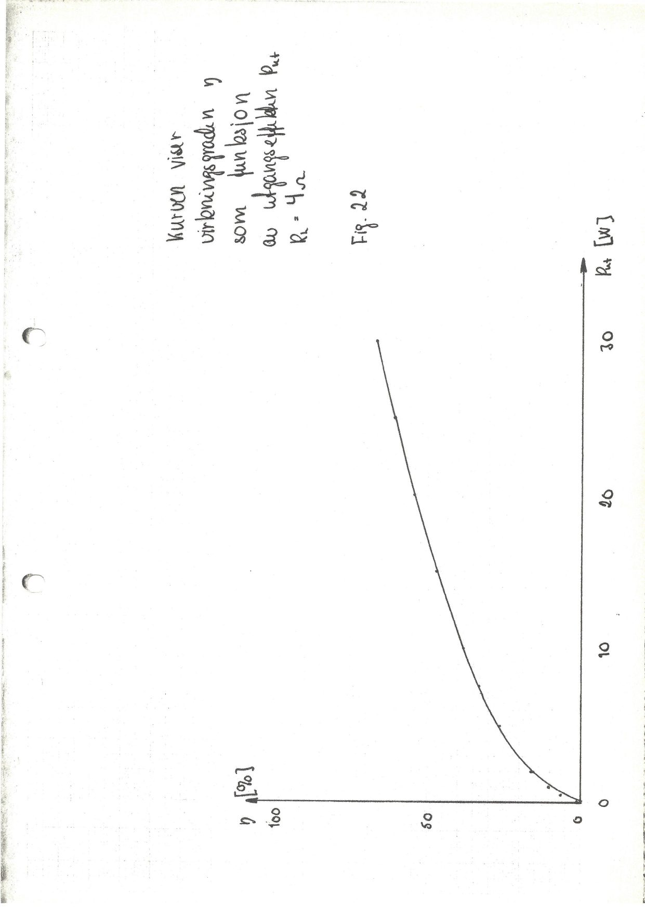

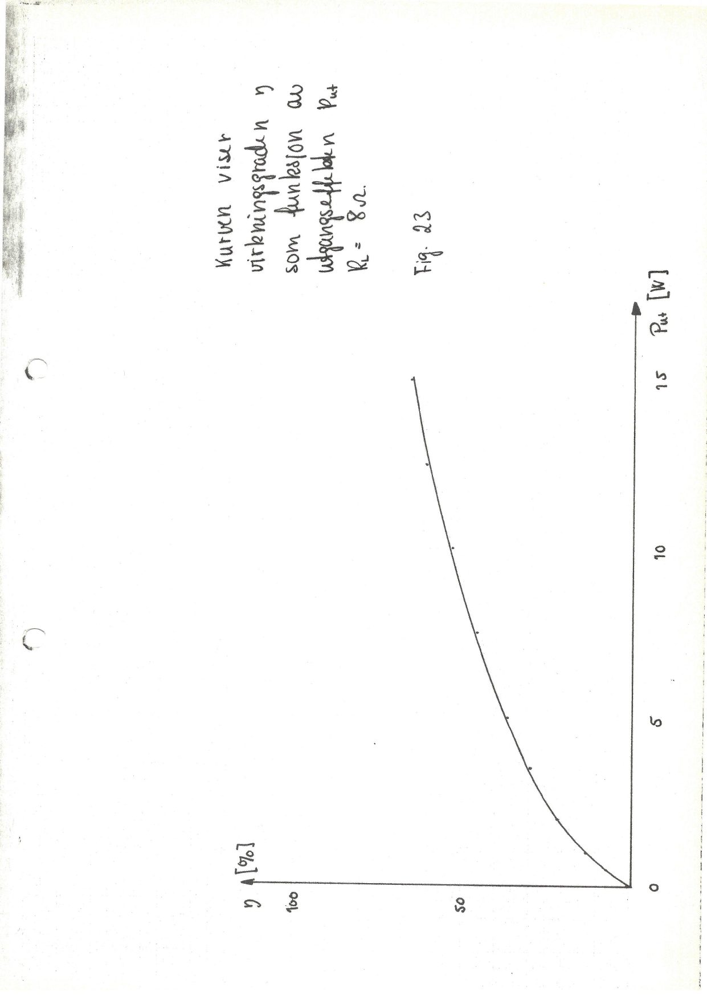

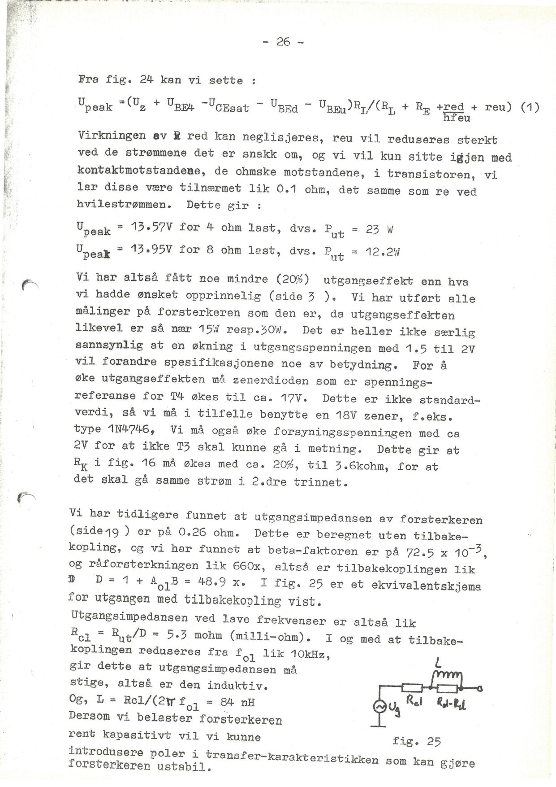

For å redusere mulighetene for dette, har vi lagt inn en seriemotstand lik
forsterkerens open-loop utgangsimpedans etter pkt. hvor tilbakekoplingen er
hentet, og altså i serie med lasten.

For 8 ohm last gir dette ytterligere 6% reduksjon i utgangseffekten, altså
til 11.5 W.

Både på kretsskjemaet og på printkortet er det satt inn 2 regulatorer,
bestående av en zenerdiode, motstand og transistor, som er tenkt benyttet ved
bruk av utvendig uregulert strømforsyning. Kretsen er markert med stiplet
omkrets på kretsskjemaet. Under alle målingene er det benyttet regulerte
strømforsyninger utvendig, og vi har derfor ikke benyttet disse nevnte
regulatorene.

Det endelige kretsskjemaet er vist i fig. 26, kretsskjemaet med
komponentverdier i fig. 27, stykkliste i tabell 2, skjema med komponentnummer
i fig. 28, skjema med arbeidspunkter i fig. 29. Komponentplassering for
printkortet er vist i fig. 30.

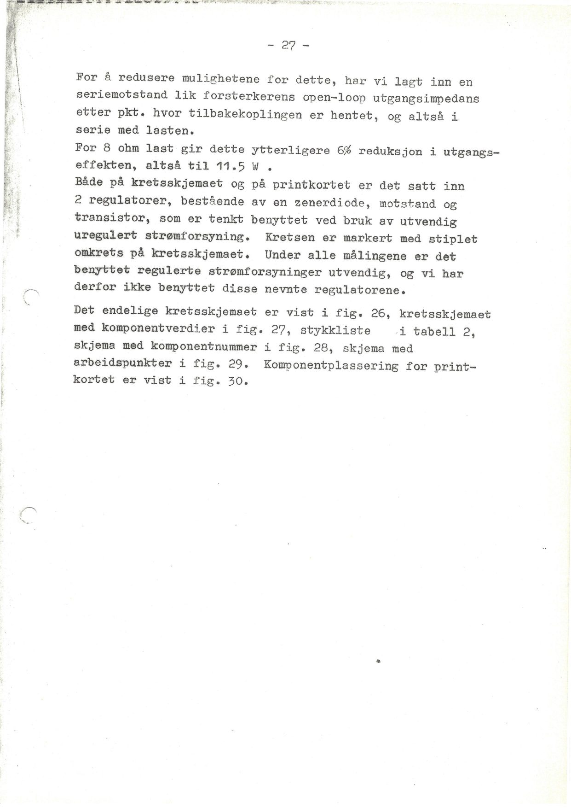

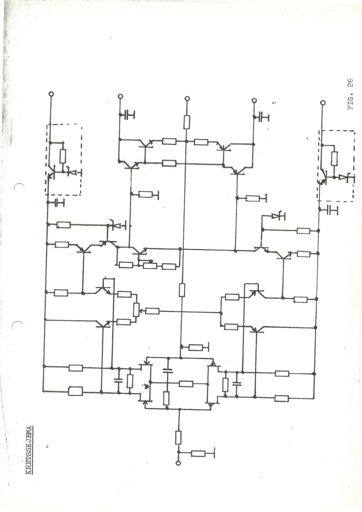

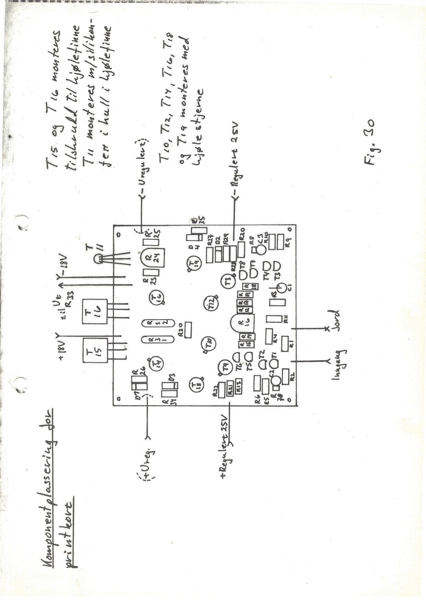

## Del III — Målinger og konklusjon

### Målinger

**Forvrengning, utgangseffekt**

Til disse målingene benyttet vi en Sound Technology 1710A, som oscillator og
voltmeter, og en HP 3580A spektrum analysator for å måle
forvrengningsproduktene. Vi benyttet regulerte strømforsyninger for både
±25V og ±18V. Ett wattmeter med innebygd kunstlast, 8 ohm, ble benyttet som
last. Utgangseffekten er omregnet fra den målte utgangsspenningen. Vi har
målt ved frekvensene 1000Hz og 10kHz. Siden forsterkeren er DC-koplet har vi
ikke målt ved lavere frekvenser enn 1000Hz. Vi har definert maksimalt
utgangssving som den spenning hvor THD blir større enn 0.2%.

Forvrengning er oppgitt for 2.dre og 3.dje harmoniske i dB under grunntonen,
samt som THD, hvor THD i % er lik:

$$THD = 100\times\sqrt{(10^{2nd/20})^2 + (10^{3rd/20})^2} \tag{1}$$

**Utgangsimpedansen** er målt ved 1kHz og 10kHz, etter flg. formel hvor $U_g$
er utgangsspenning uten belastning og $U_l$ er utgangsspenning med 8 ohm
belastning, inngangsspenningen holdt konstant:

$$R_{ut} = (U_g - U_l)R_1/U_l \tag{2}$$

**Støy**

Signal/støy forholdet er målt med kortsluttet inngang, med ST 1710A som
voltmeter. Vi benyttet de innebygde 18dB/okt. filtrene ved 400Hz (høypass) og
30kHz (lavpass). Signal/støy forholdet er referert til maks. utgangssving
(rms) ved 8 ohm last.

$$S/S = 20\log(U_{ut}/U_{støy}) \tag{3}$$

**Frekvensegenskaper**

Vi har benyttet et firkantsignal og målt stigetiden på dette. Ut ifra dette
har vi beregnet -3dB punktet etter formelen:

$$f = 2.2/(t_{st} 2\pi) \tag{4}$$

Vi har videre målt utgangssving ved f=1MHz (uten last) og beregnet slew-rate
fra formelen:

$$SR = U_{peak} 2\pi f \tag{5}$$

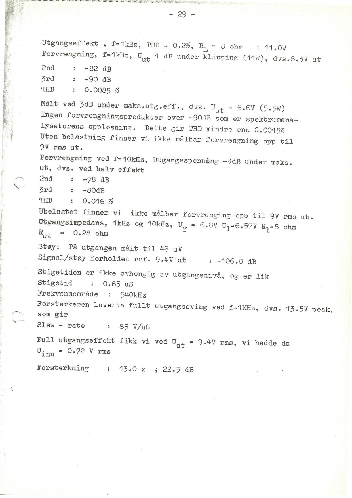

### Resultater

Utgangseffekt, f=1kHz, THD = 0.2%, $R_L$ = 8 ohm: 11.0W

Forvrengning, f=1kHz, $U_{ut}$ 1 dB under klipping (11W), dvs.8.3V ut

| | |
|---|---|
| 2nd | -82 dB |
| 3rd | -90 dB |
| THD | 0.0085 % |

Målt ved 3dB under maks.utg.eff., dvs. $U_{ut}$ = 6.6V (5.5W). Ingen
forvrengningsprodukter over -90dB som er spektrumanalysatorens oppløsning.
Dette gir THD mindre enn 0.0045%. Uten belastning finner vi ikke målbar
forvrengning opp til 9V rms ut.

Forvrengning ved f=10kHz, Utgangsspenning -3dB under maks. ut, dvs. ved halv
effekt:

| | |
|---|---|
| 2nd | -78 dB |
| 3rd | -80dB |
| THD | 0.016 % |

Ubelastet finner vi ikke målbar forvrenging opp til 9V rms ut.

Utgangsimpedans, 1kHz og 10kHz, $U_g$ = 6.8V $U_l$=6.57V $R_l$=8 ohm

$$R_{ut} = 0.28\text{ ohm} \tag{}$$

Støy: På utgangen målt til 43 µV. Signal/støy forholdet ref. 9.4V ut:
-106.8 dB

Stigetiden er ikke avhengig av utgangsnivå, og er lik:

- Stigetid: 0.65 µS
- Frekvensområde: 540kHz

Forsterkeren leverte fullt utgangssving ved f=1MHz, dvs. 13.5V peak, som gir
slew-rate: 85 V/µS

Full utgangseffekt fikk vi ved $U_{ut}$ = 9.4V rms, vi hadde da
$U_{inn}$ = 0.72 V rms

Forsterkning: 13.0 x; 22.3 dB

### Om resultatene

Under arbeidet med forsterkeren er det et par ting som vi tok noe for lett
på til å begynne med. Vi var litt for optimistiske når vi la ut kretskortet,
og rett og slett "glemte" avkoplingskondensatorene, C4 - C7. Disse er derfor
montert med ledninger på undersiden av kretskortet. Uten disse oscillerte
forsterkeren ved klipping.

Valg av referansespenningen for felles-base trinnene gikk også noe fort, og
resulterte i noe redusert utgangseffekt. Vi har imidlertid vist på side 26
hvordan utgangseffekten kan økes til de spesifiserte 15W i 8 ohm. Vi har
ikke hatt tid til å gjøre dette på den innleverte enheten.

På de andre punktene, spesifikasjonene er kravene mer enn oppfylt.
Forvrengningsspesifikasjonene ligger under alle forhold bedre enn 1 til 6.
Både med og uten belastning fant vi ikke avlesbar forvrengning ved 1 og 10kHz
ved alle nivåer opp til ½ effekt. Spektrumanalysatorens oppløsning er 90dB,
dvs. THD under 0.003%! Tilbakekoplingen på forsterkerne er ca. 34dB, 50 X,
som er lavt i forhold til hva som vanligvis benyttes for å oppnå såvidt lave
forvrengningsdata.

Signal/støy forholdet er 26dB bedre enn hva vi spesifiserte til å begynne
med.

Frekvensegenskapene er omtrent som beregnet. Firkantresponsen er
uten"overshoot" og ringing, dvs. at tilbakekoplingssystemeet er overdempet.

Vi har belastet forsterkeren med kondensatorer i størrelsesorden 0.1uF til
1uF, med kun kontrollert høyfrekvent ringing som resultat.

Forsterkeren klipper noe usymmetrisk, som følge av noe forskjellige
zenerspenninger på D1 og D2. Den henter seg ut av klipping, ved 1dB
overstyring, 12%, på under 3uS. Gjenhentingen skjer uten kraftig
etterringing, som er svært vanlig for forsterkere med høy båndbredde.

Forsterkerens slew-rate er målt uten belastning, for å unngå innvirkning fra
induktansen i tilledningene til utgangstrinnet. Det vi er interessert i ved
måling av slew-rate er å undersøke om forsterkeren har interne
oppladingsproblemer. Vi har ikke greid å få forsterkeren til å gå i såkalt
"slew-rate limiting", dvs. at flankene på signalet blir rette, og stiger
saktere enn inngangssignalet.

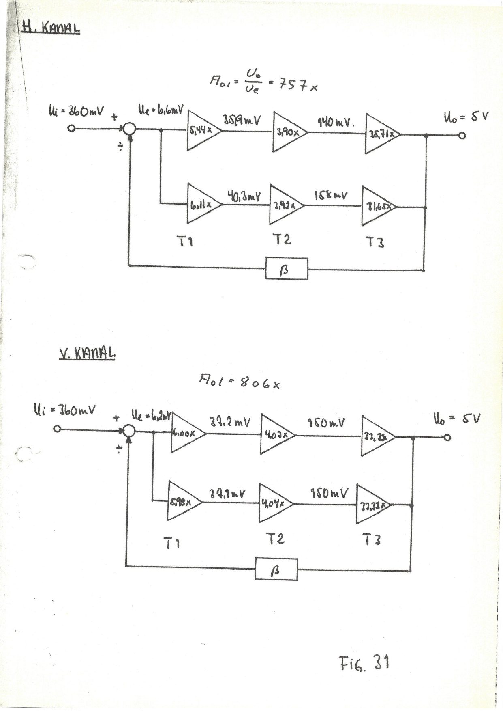

*(Side 31 avsluttes med målinger av blokkforsterkningen for høyre og venstre
kanal, gjengitt i fig. 31, og rapportens signatur:)*

**Oslo, 30/5-79 kl.01.15**
