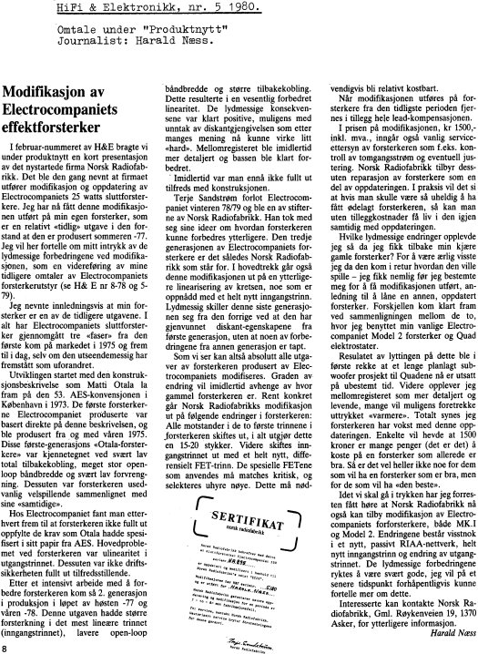

+++
title = "Norsk Radiofabrikk"
weight = 60
+++

# Norsk Radiofabrikk — The Norwegian Radio Manufacturing Company

The company was founded in 1979 by Espen Evensberget, Paal Rasmussen and
myself. More info on this will follow later, but for now, see what the press
said at the time below.

The company also put out its own press release, "Tre Faser i en Utvikling"
("Three Phases in a Development"), about the story of the Otala power
amplifier including the NRF modifications, written in 1979 — that document
hasn't survived, or hasn't been found again yet.

## Press coverage, 1980/81

**Danish High Fidelity no. 2, 1981**

**Hi-Fi & Elektronikk no. 2, 1980**

**Hi-Fi & Elektronikk no. 5, 1980**

**Musikkavisen PULS no. 2, 1980**

**Musikkavisen PULS no. 4, 1980**

