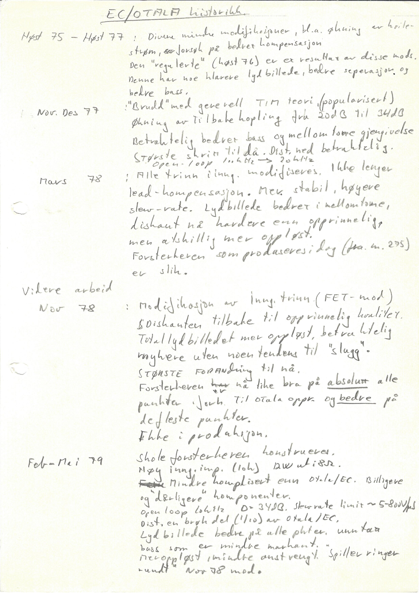

+++
title = "The Evolution of the Otala/EC Amplifier — Handwritten Notes"
weight = 20
+++

## EC/Otala historikk

I have found an older handwritten page about what was changed when, which can be useful to see the evolution of the amplifer, probably written around 1980.  It is course, very *honest* some places, but we can live with that.  And I see it is my own handwriting. The image of the note is in Norwegian, but the extracted text is in English.

## English Translation

### Autumn 75 – Autumn 77

Various minor modifications, among them increased idle
current, attempts at improved compensation.
The "regulated" version (Autumn 76) is a result of these mods.
This one has a somewhat clearer sound image, better separation and
better bass.

### Nov. Dec. 77

"Break" with the general TIM theory (popularized).
Increase of feedback from 20 dB to 34 dB.
Considerably better bass and midrange reproduction.
Biggest step so far. Distortion down considerably.
Open loop 100 kHz → 20 kHz.

### March 78

All stages, incl. input, modified. No longer
lead compensation. More stable, higher
slew rate. Sound image better in the midrange.
Treble now harder than originally,
but considerably more resolved.
The amplifier being produced today (from no. 295)
is like this.

## Further Work

### Nov. 78

Modification of input stage (FET mod).
Treble back to original quality.
Overall sound image more resolved, considerably
softer without any tendency toward "slagging."
Biggest change so far.
The amplifier is now just as good in absolutely every
respect, compared with the original Otala version, and better in
most respects.
Not in production.

### Feb.–May 79

The school amplifier designed.
High input impedance (10 kΩ), 12 W output into 8 Ω.
Less complicated than Otala/EC. Cheaper
and poorer components.
Open-loop bandwidth 20 kHz, feedback 34 dB. Slew-rate limit ~5–800 V/µs.
Distortion a fraction (1/10) of Otala/EC.
Sound image better in every respect, except
bass which is less pronounced,
more resolved, less strained. Runs rings
around the Nov. 78 mod.

## Norwegian Transcribing

### Høst 75 – Høst 77

Diverse mindre modifikasjoner, bl.a. økning av hvile-
strøm, forsøk på bedret kompensasjon.
Den "regulerte" (høst 76) er et resultat av disse mods.
Denne har noe klarere lydbilde, bedre seperasjon og
bedre bass.

### Nov. Des 77

"Brudd" med generell TIM teori (popularisert)
Økning av tilbakekopling fra 20 dB til 34 dB.
Betraktelig bedre bass og mellomtone gjengivelse.
Største skritt til da. Distortion ned betraktelig.
Open loop 100 kHz → 20 kHz.

### Mars 78

Alle trinn inng. modifiseres. Ikke lenger
lead-kompensasjon. Mer stabil, høyere
slew-rate. Lydbildet bedre i mellomtone.
Diskant nå hardere enn opprinnelig,
men adskillig mer oppløst.
Forsterkeren som produseres i dag (fra nr. 295)
er slik.

## Videre arbeid

### Nov 78

Modifikasjon av inng. trinn (FET-mod).
Diskanten tilbake til opprinnelig kvalitet.
Total lydbildet mer oppløst, betraktelig
mykere uten noen tendens til «slagg».
Største forandring til nå.
Forsterkeren er nå like bra på absolutt alle
punkter, i forhold til Otala opprinnelig og bedre på
de fleste punkter.
Ikke i produksjon.

### Feb–Mai 79

Skoleforsterkeren konstrueres.
Høy inng. imp. (10 kOhm) 12W ut i 8 Ω.
Mindre komplisert enn Otala/EC. Billigere
og dårligere komponenter.
Open loop båndbredde 20 kHz, feedback 34 dB.  Slew-rate limit ~5–800 V/µs.
Distortion en brøkdel (1/10) av Otala/EC.
Lydbilde bedre på alle punkter, unntatt
bass som er mindre markant,
mer oppløst, mindre anstrengt. Spiller ringer
rundt nov 78 mod.
