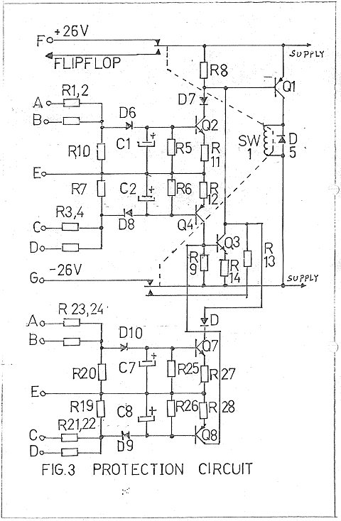
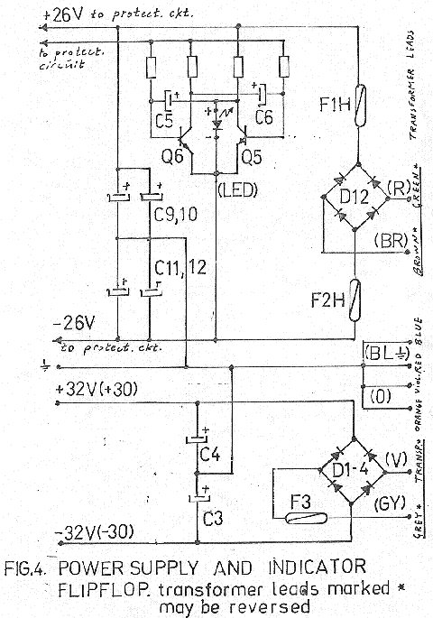

+++
title = "Protection Networks"
weight = 30
+++

**Protection networks, power supplies, and other stuff not so interesting, but
still needed.**

You've read the section on how this came about? If not,
[go back and do so](../otala-story#amplifier-blow-up)! Otherwise, take a look
at the world's first protection network that did not affect the sound AT ALL.
Yes — it is the first one!

The design is very simple: passive sensing of current, then triggering a relay
which removes the supply voltage from the output stage. As you probably know,
the EC design uses one power supply for the voltage-amplifying stages and one
for the power output, where all the large currents go. This separation made
this protection scheme work. If not, big bangs would be heard ...

The power supply also needed some care.

However, we did not make it difficult. The major point here was the use of
small capacitors instead of the sluggish big ones everybody else used at that
time. We understood that small capacitors in parallel were a better choice
than single big ones.

The cabling was another issue — more on that later.
