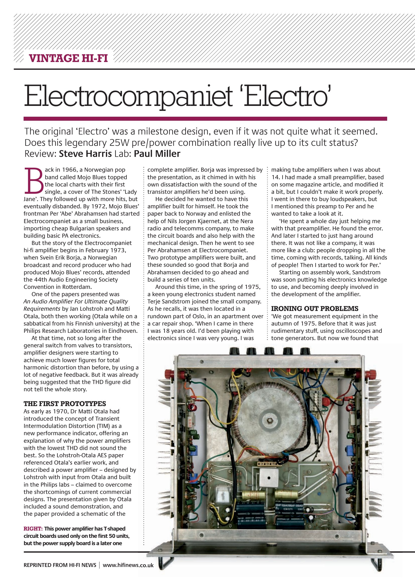
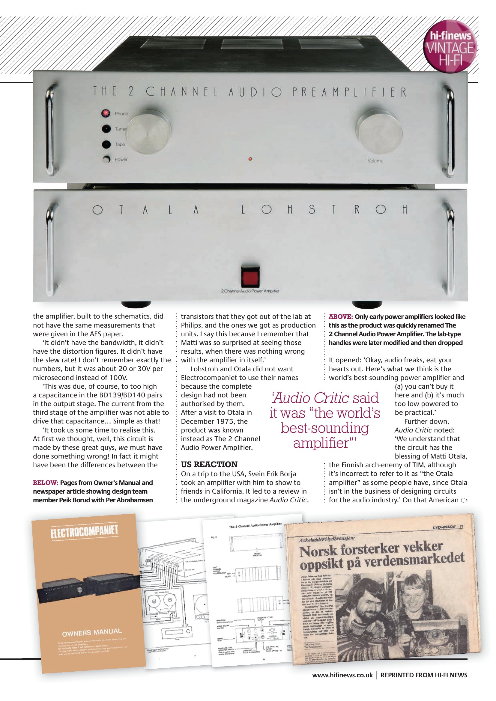
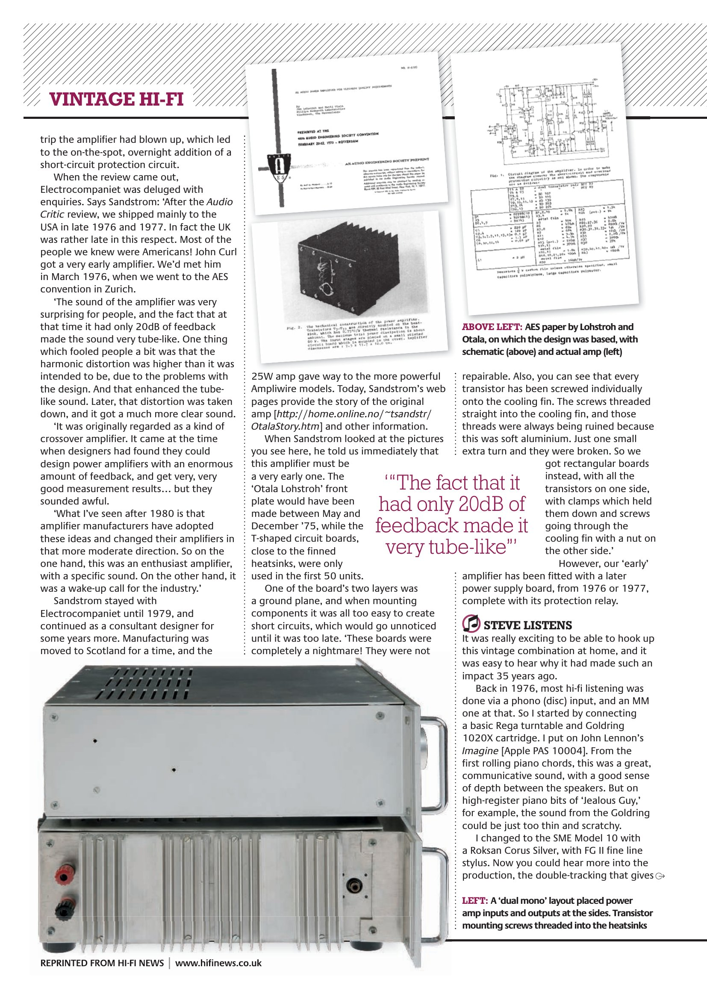
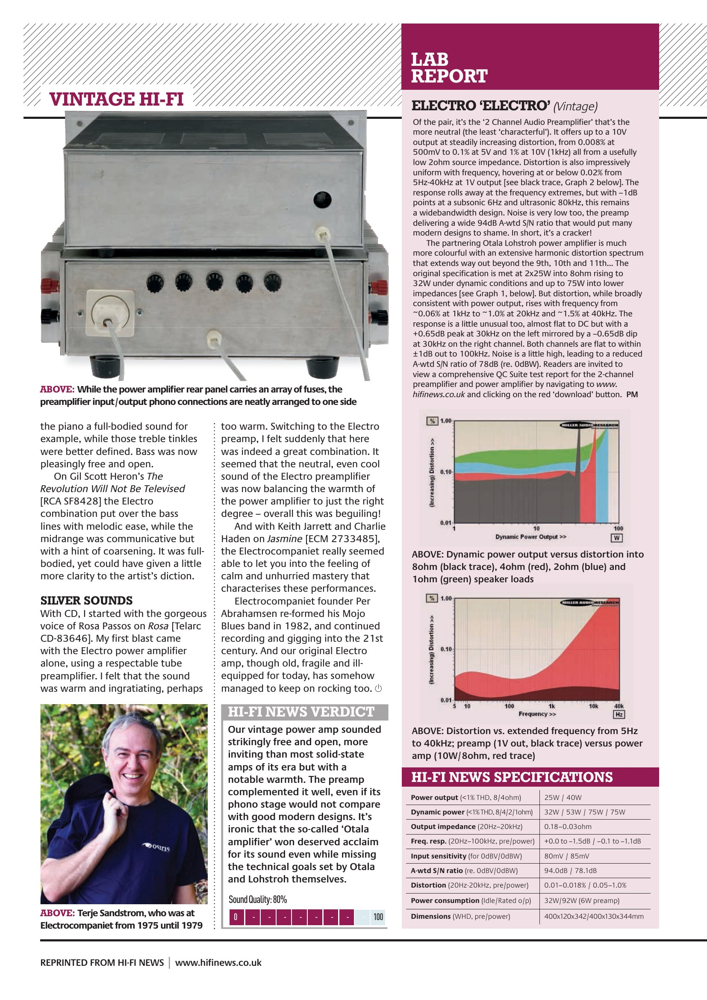

+++
title = "Hi-Fi News: \"Electrocompaniet 'Electro'\" (2012)"
weight = 20
+++

"Electrocompaniet 'Electro'" — a Vintage Hi-Fi retrospective review and lab
report on the original 25W "Otala" pre/power combination, published in
*Hi-Fi News*, January 2012. Review by Steve Harris, lab report by Paul
Miller, including an interview with Terje Sandstrøm about the amplifier's
early history and the Audio Critic review — see
[the Otala story](/history/otala-story/) for the same events from the
designer's side.

