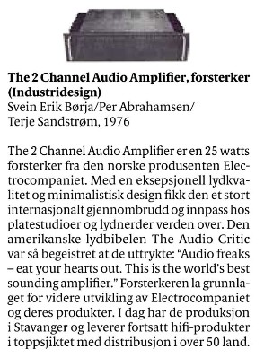

+++
title = "Early Electrocompaniet — Press & Links"
type = "chapter"
weight = 10
+++

Press coverage of the early Electrocompaniet "Otala" amplifier.  

## Articles

These are copies of magazine articles, as they have not been found online.
In some cases you can download issues, and links to that are in each underlying page.

- [The Audio Critic (1976/1977)](audio-critic-1976/)  Issue Downloads exists
- [High Fidelity: Norsk idealisme bag ny forstaerkerserie (1978)](norsk-idealisme-bag-ny-forstaerkerserie)
- [The Absolute Sound, Issue 16, 1979](absolute-sound-issue16-1979)
- [Hi-Fi News: "Electrocompaniet 'Electro'" (January 2012)](hifi-news-2012-vintage-ec/)

## Links

Links to articles, including blog posts, and some interesting other related audio stuff

- [Prof.Dr. Sverre Holms](https://www.mn.uio.no/fysikk/personer/vit/sverre/) [article about loudspeaker cables (Norwegian)](https://kollokvium.wordpress.com/2013/08/12/magiske-hoyttalerkabler/) with his reference to Electrocompaniet, and his link onwards to the HiFi News article below.
    For those interested in some more loudspeaker cable analysis by Sverre Holm, [here is part 2](https://kollokvium.wordpress.com/2013/08/19/magiske-hoyttalerkabler-del-2/) and a [lecture note](https://www.mn.uio.no/fysikk/personer/vit/sverre/forelesingsnotater/2014-magiskekabler.pdf).
- [Hifi News, Dec 2011: Electrocompaniet 'Electro' Vintage](https://www.hifinews.com/content/electrocompaniet-electro-vintage)
- [Lyd og Bilde Tech reviews, Classic, 2024](https://www.lbtechreviews.com/news/hi-fi/electrocompaniet-2-channel-audio-power-amplifier)  Electrocompaniet 2 Channel Audio Power Amplifier

## The best of Norwegian Design

*The links here require a subscription for Aftenposten, A-Magasinet is a part of Aftenposten.  The article is in Norwegian.*

The Norwegian "A-Magasinet" had an [article March 3rd 2017](https://e-avis.aftenposten.no/p/a-magasinet/2017-03-03/r/17/32-33/991/736368-4150414d-133c63f)about the 100 best Norwegian designs, judged by a brioad expert jury, with designs ranging from 1920 to 2014, nearly 100 years, and among them ["The 2 Channel Audio Amplifier](https://e-avis.aftenposten.no/p/a-magasinet/2017-03-03/r/17/32-33/991/736368-4150414d-133c63f).

