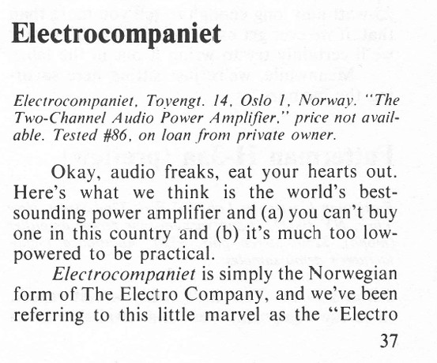
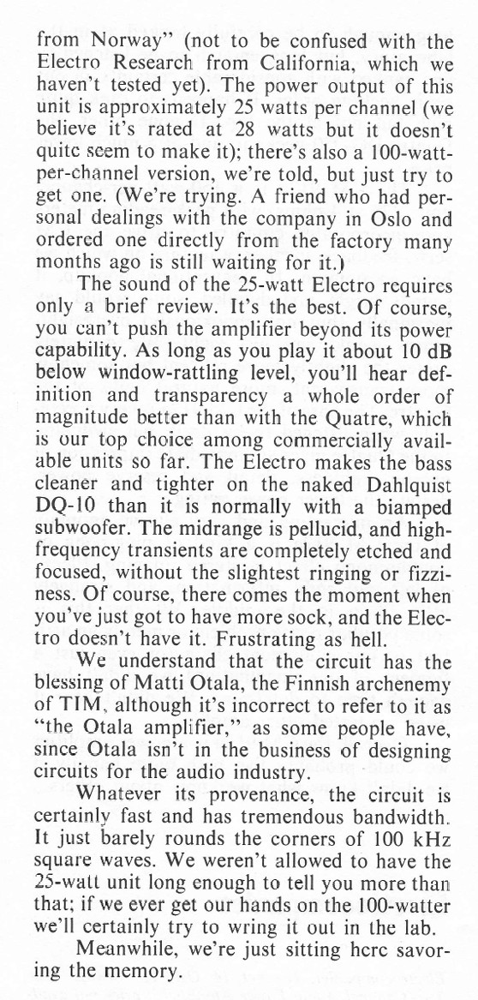
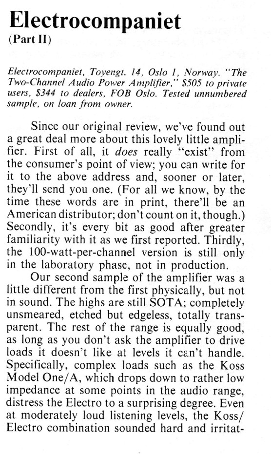
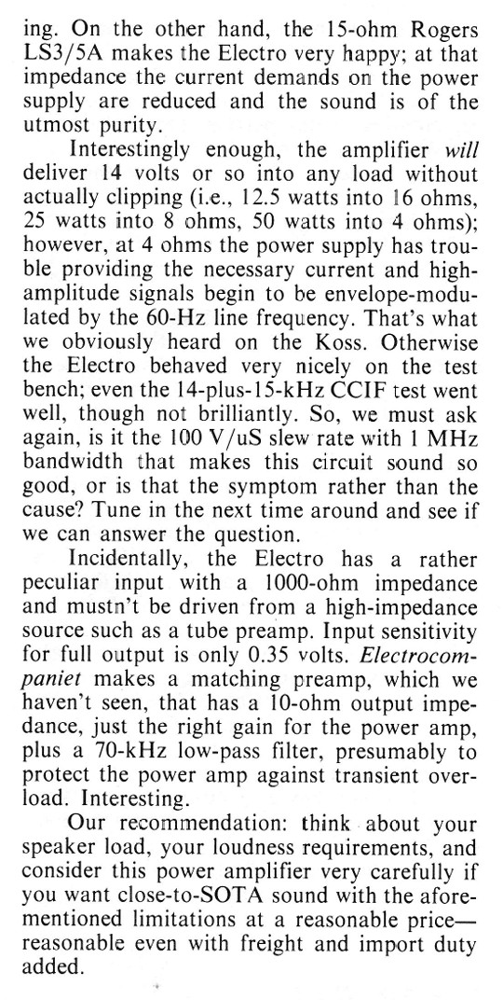

+++
title = "The Audio Critic (1976-77)"
weight = 10
+++

The [Audio Critic](/history/otala-story/) tests, including the **"Okey, audio freaks, eat your hearts out. Here's what we think is the world's best-sounding power amplifier"**, which triggered the international fame of the amplifier and company. This was the real start!

If you want, you can download the older issues of [The Audio Critic here](https://www.biline.ca/audio_critic/audio_critic_down.htm), and below I state in which year and edition.

Download the [Volume 1, Number 2, and see page 37-38](https://www.biline.ca/audio_critic/mags/The_Audio_Critic_V1-2.pdf).

The follow up test from [Volume 1 Number 4, 1977 and see page 44-45](https://www.biline.ca/audio_critic/mags/The_Audio_Critic_V1-4.pdf)

