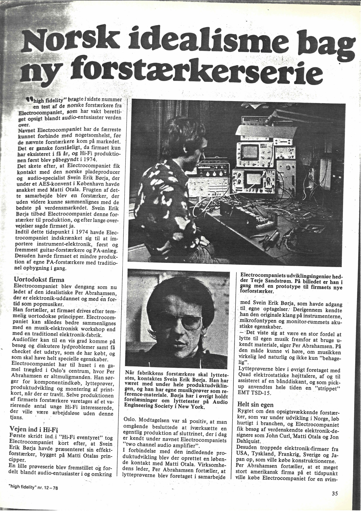
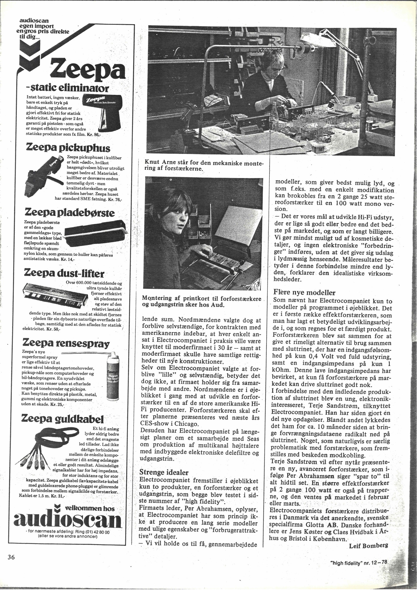

+++
title = "\"Norsk idealisme bag ny forstærkerserie\" (1978)"
weight = 15
+++

"Norsk idealisme bag ny forstærkerserie" ("Norwegian idealism behind new
amplifier series") — a profile of Electrocompaniet in the Danish magazine
*high fidelity*, issue 12, 1978, pages 35-36. Covers the company's origins,
Per Abrahamsen, Svein Erik Børja's introduction to Matti Otala's work, and
the early production process, with Terje Sandstrøm (then the company's
udviklingsingeniør — development engineer) pictured working on a prototype.
By Leif Bomberg.

