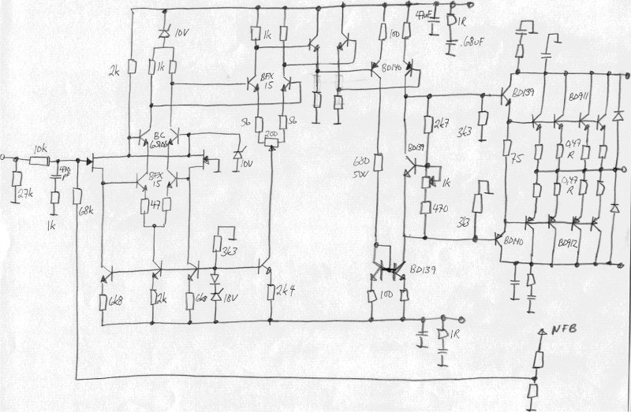

+++
title = "Evolution of the Schematics"
weight = 10
+++

*Also see the [later schematics](../real-ec-schematics)*

The first design was taken directly from the paper by Otala and Lohstroh, AES
1973. To it was added a power supply only. The PCB layout and the mechanical
design were done at EC.

[Original Otala — first-series schematics](../original-1973-schematics)

Only 10 amplifiers were made using these schematics. None exist today.

The next series was done after early 1976, and incorporated the first changes
to the frequency compensation. The changes were made to improve the frequency
response and slew rate of the amplifier.

Referring to the schematics above, the fixes were done on the first- and
second-stage lead network (the RC's between the emitters of the differential
pairs); the lag networks on the collector sides were removed, and the input
lag network was redimensioned.

After a breakdown of the first amplifier brought to the US, a non-intrusive
(sound-wise) [protection network](/history/protection-networks) was added to
the amplifiers.

Several intermediate steps are missing, but at the end the design looked like
what's shown in the next schematics, which applies for amplifiers with serial
numbers above 100 — these were heavily EC-modified. See the
[History](/history/) section.

[The real Electrocompaniet schematics, serial numbers approx. 100 and up](../real-ec-schematics)

Note the reduced values of all input-stage resistors, indicating the increased
quiescent current in these stages.

From serial no. 275, the Great Change was applied to the amplifiers.

This was the last of the EC designs, but in my own company I did two new
modifications: one known only as the NRF Mod., the other known as "The
Special Version". The modifications were only further improvements, naturally
following on from the EC time. See the [NRF modifications](../nrf-modifications)
page.

The "Special Version" schematic is shown here:

Note the heavily reduced values of the output-stage emitter resistors — down
to 0.33 ohm from 1 ohm! This reduces the AB nonlinearity, as described in my
1982 AES paper.

Note also the changed input stage, with a JFET differential pair as a source
follower. It was found that the bipolar input stage added distortion caused by
its nonlinear input base current acting on the input resistors. (Which again
shows: when we reduced the input resistors from 6k8 to 2k2, we heard a sound
improvement and believed it was caused by improved frequency-response behavior
above 20kHz — it may have been the 10dB distortion reduction that we heard!)
To reduce this distortion further, the JFET pair was added. Further, a cascode
pair was added to eliminate the Miller effect and the nonlinear voltage
modulation of the critical first stage.

The gain distribution was also changed — the 3rd stage gain was increased by
raising the load resistors from 2k2 to 3k3. More gain was needed to increase
the overall feedback to 40dB. It was found that increasing this particular
point (3rd stage) was the less critical of the options. However, we got
slightly more relative modulation effect on the 3rd stage than we wished for.

All in all, approximately 100 amplifiers were modified, and an additional 50
Special Versions were made.

By the end of the '80s and the beginning of the '90s, I tried a few more
changes to the amplifier design, which never made it beyond the lab bench.
Only one amp exists with these modifications. They included emitter followers
added before the 3rd stage, to reduce the modulation effect mentioned above.

Also see some of the later [calculations](../calculations) made on this
amplifier.

What about some thoughts on the "[Perfect 25W](/audio-design/the-perfect-25w-amplifier/)"
amplifier? Or the perfect [preamplifier](/audio-design/later-designs/#preamplifier-of-1982),
which was realized, but ...

Anything you find missing, or any comments, are appreciated — reach out via
[the about page](/about/).
