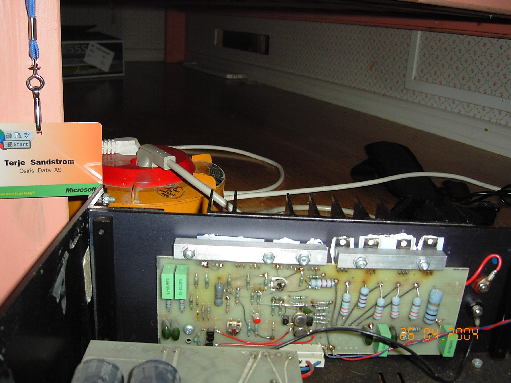
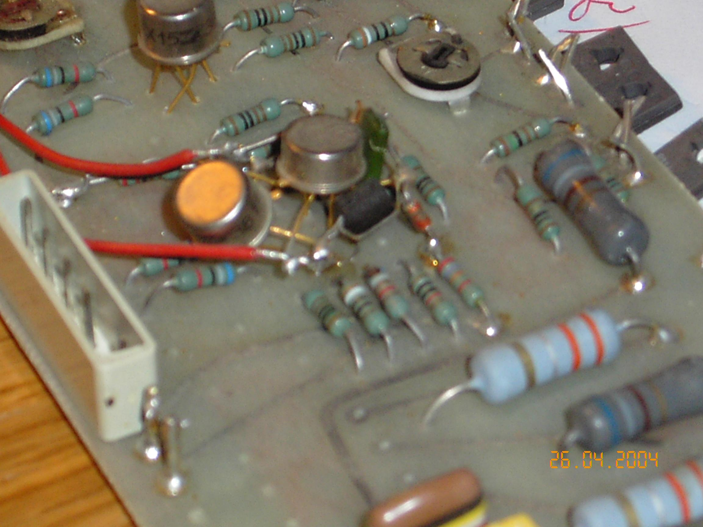
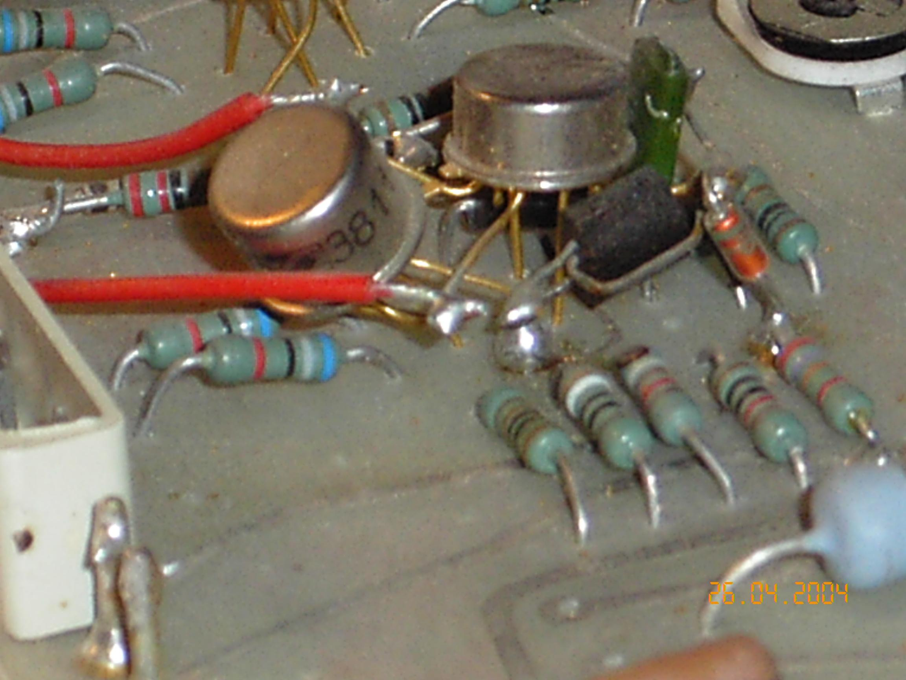
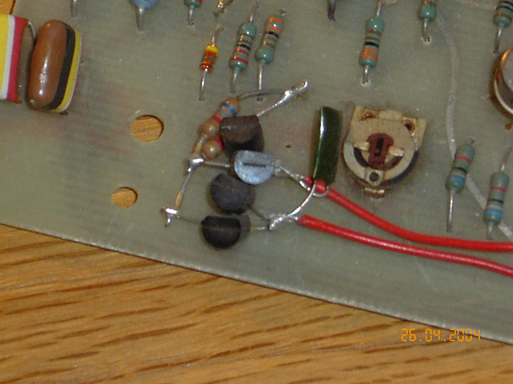

+++
title = "The NRF Modifications"
weight = 80
+++

After I left Electrocompaniet in 1979, I tried to start up a new audio company
in Asker together with two good friends, Paal Rasmussen and Espen Evensberget.
We called the company "[Norsk Radiofabrikk](/history/norsk-radiofabrikk)" (in
English, the Norwegian Radio Manufacturing Company). We wanted it to sound
old-fashioned, and really had a lot of good fun with this. However, our own
original designs never made it into reality. In 1980, or thereabouts, we
started to modify EC amplifiers. We modified between 50 and 100 amplifiers,
and a somewhat lesser number of preamplifiers. The sound improvement was very
good — not too surprising, since I knew these amplifiers in and out. Later we
did some 50 amplifiers from the ground up, called the Special Version — the
modification taken to its logical end. The components for these amplifiers
came partially from Electrocompaniet. I don't think Per liked it, but I also
don't think he really minded — if he had, he wouldn't have sold us components,
like cabinets and so on.

I have had some trouble locating all the schematics and component lists —
don't really know where I have (mis)placed them. However, I have redrawn the
schematic for the modified amplifier below. **Please be aware that the
schematic is not to be used for commercial purposes without my permission.
All private use is encouraged.**

Components with red values are changed, components with blue values are new,
otherwise equal to original values. Please get in touch regarding proper
frequency compensation of this amplifier.

I've also included some pictures of the modified circuits below, so that you
can see for yourself how we did the practical part of the modifications. Note
that none of the traces were cut on the circuit board — all new components
were wire-mounted ("bird's nests"). Not the prettiest thing, but it sure
works.

The modification significantly reduces the distortion of the amplifier,
bringing much more clarity to the midrange, a tighter bass, and a smoother,
less harsh top.

*(A later note also mentioned a further schematic variant that popped up —
apparently a later version that also never made it into reality, with
component values and general setup equal to the modified ones described
here, but with an extra double pair of output transistors and emitter
followers added before the third stage. That particular schematic image
itself hasn't survived.)*

## Modification photos

*(Captions translated from the original Norwegian file names.)*

