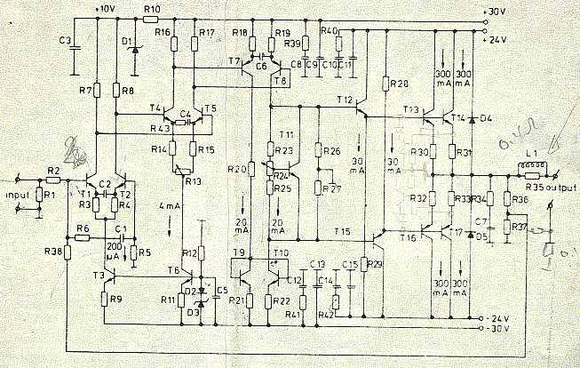
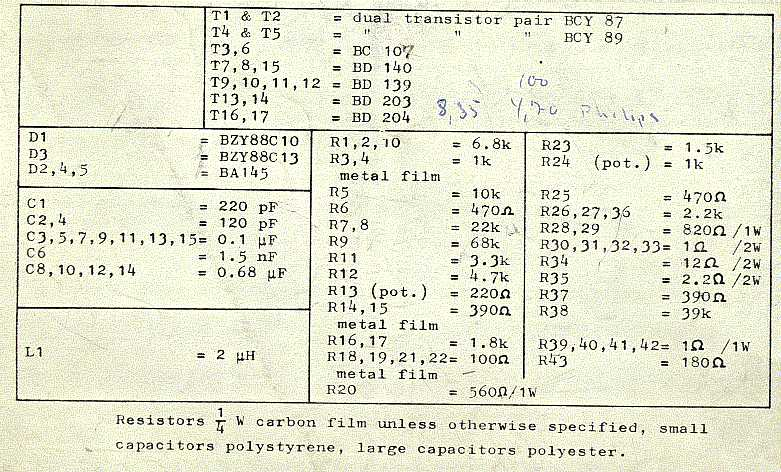
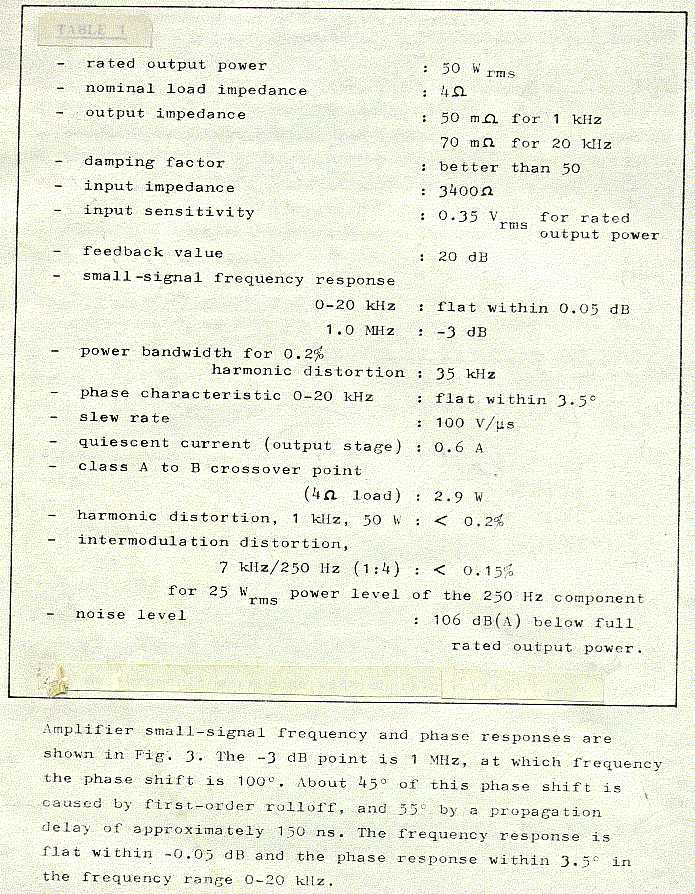

+++
title = "Original 1973 Otala Schematics"
weight = 20
+++

Note the hand-drawing on the schematic. First attempts at traditional current
limiting can be seen — this was soon discarded. Note also the extra resistors
near the output: the loudspeaker was to be coupled between the output
terminal and the small 0.1 ohm resistor to ground. This was a later idea
(I don't remember when it was introduced) which would give some current
feedback in addition to the traditional voltage feedback. The effect would be
to make the loudspeaker "invisible" to the amplifier.

Note that you can see the prices on the transistors here: NOK 4.70 in qty 100
for BD203/204. Cheap transistors!

