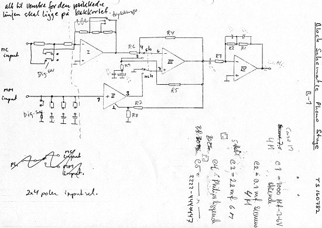
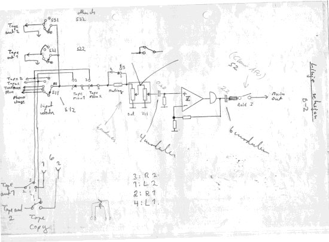
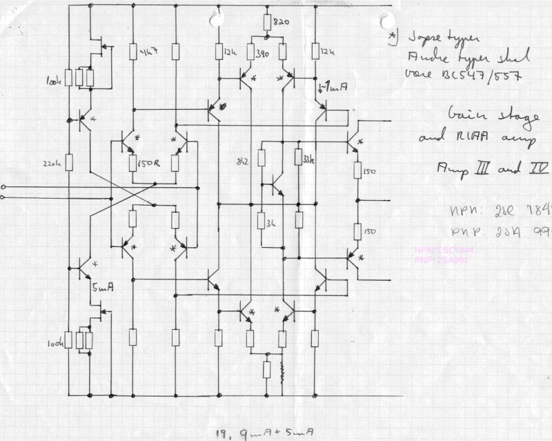

+++
title = "1982 Preamplifier Schematics"
weight = 40
+++

This is the phono stage, handling both MM (Moving Magnet) and MC (Moving Coil)
pickups. The design uses active RIAA compensation, which was untraditional for
the EC design — up to this time it used passive high-pass and active
low-boost. The gain stages are designed to handle the active feedback, and
note **(!!!!!)**, the active RIAA compensation used *shunt feedback*. A tough
job to calculate, but when that was done, it worked wonders!

The line-stage section is more traditional, with a normal series-feedback
line stage. Note the extra buffer on the output.

For both block schematics above, note the roman numbers inside the
amplifiers, denoting the particular gain block used.

This drawing shows gain blocks 3 and 4. Note the completely symmetrical
design. The other gain stages also used an ingenious method of utilizing all
the current from the last differential stage. Also note the current
generators — ever seen something like that? Well, it works!

*Details on compensation and other design choices will be described further
in a later write-up. Don't try to build the gain stage as shown above without
that context — smoke will arise. Be patient.*
