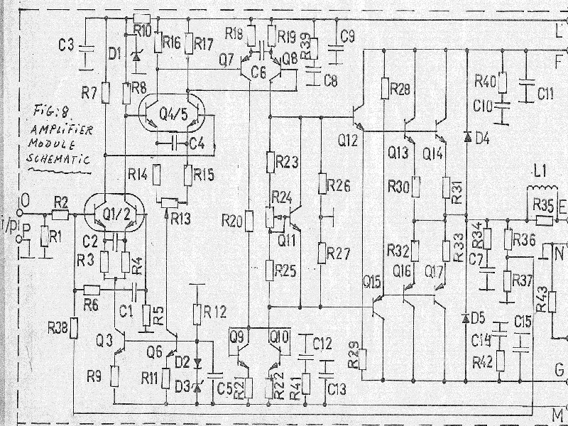
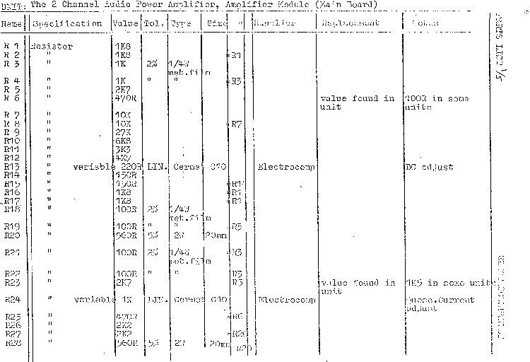
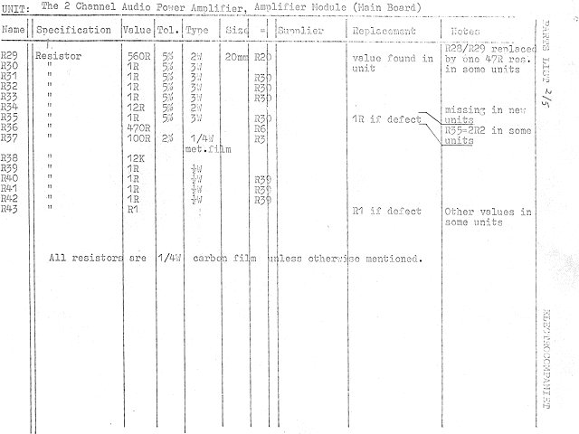
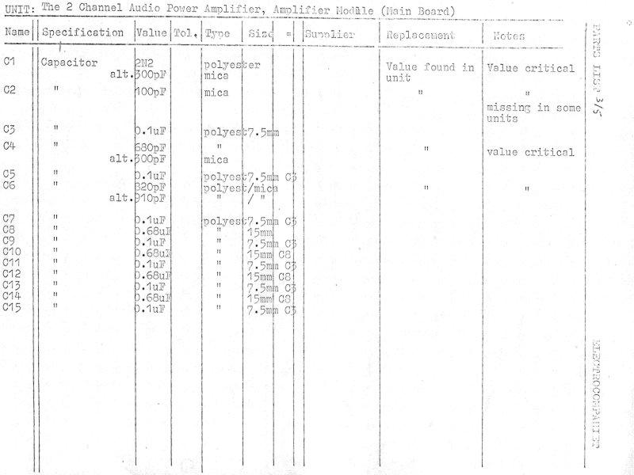
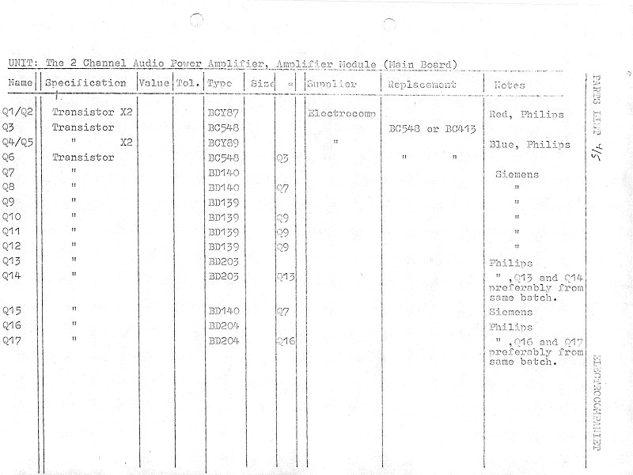
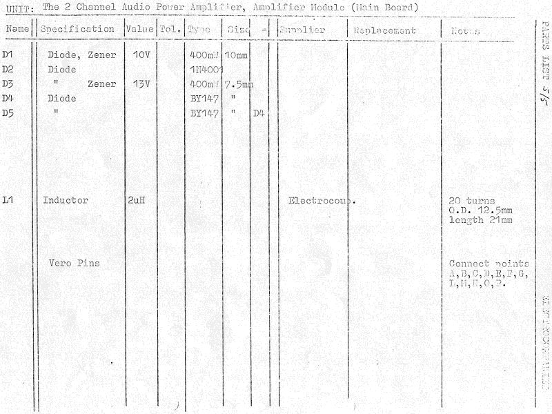
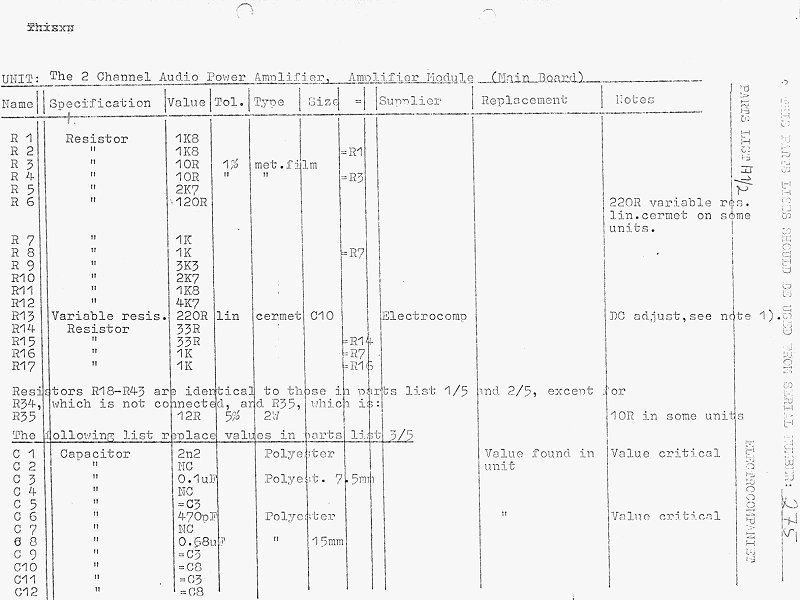
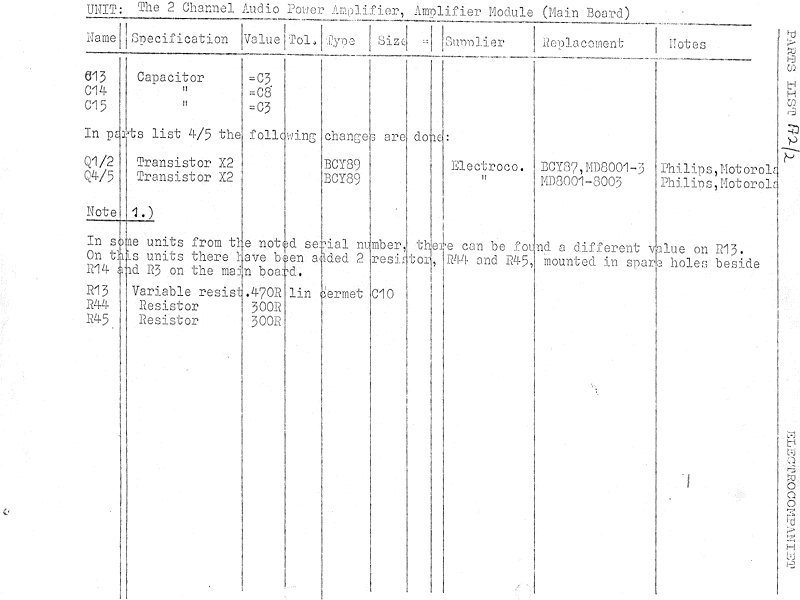

+++
title = "The Real Electrocompaniet Schematics"
weight = 30
+++

The schematics of the real EC 25W amplifiers, shown below, are taken from a
service manual, with full acceptance from Per Abrahamsen of Electrocompaniet.
He approved of, and even supported, the idea of making these schematics
public through this site, in order to cover the history of Electrocompaniet.

Note that the schematic layout is very close to the original, except for the
changes to the compensation networks (look at the emitters on the
differential voltage-amplification pairs). The major changes can be found by
looking at the component lists below, which apply for amplifiers with serial
numbers below 275. The component list for serial numbers above 275 is covered
in an addendum [further down](#above-275). You'll need both lists,
cross-checked, to get the full picture.

(This scan is a bit rough — a better one may come later.)

### Above 275 {#above-275}

Component lists for serial numbers above 275, the Great Change:

So — this covers it. No further change was done to these amplifiers by
Electrocompaniet. Well, not quite true — I did some further modifications
after I left Electrocompaniet; see the [NRF modifications](../nrf-modifications)
page.

I'm not quite sure how many amplifiers were made, but by mid-'77 we had
reached serial no. 275, which took 2 years to reach. From then I believe
approx. 50 units were manufactured each month, until approx. 1981-82, when
Electrocompaniet introduced the Ampliwire series, which replaced the 25W
amplifier. This means there could be some 2000 amplifiers around. Perhaps Per
knows more.

See also [more information on transformers, wiring, mechanical assembly and
troubleshooting](../transformers-wiring-mechanical).
