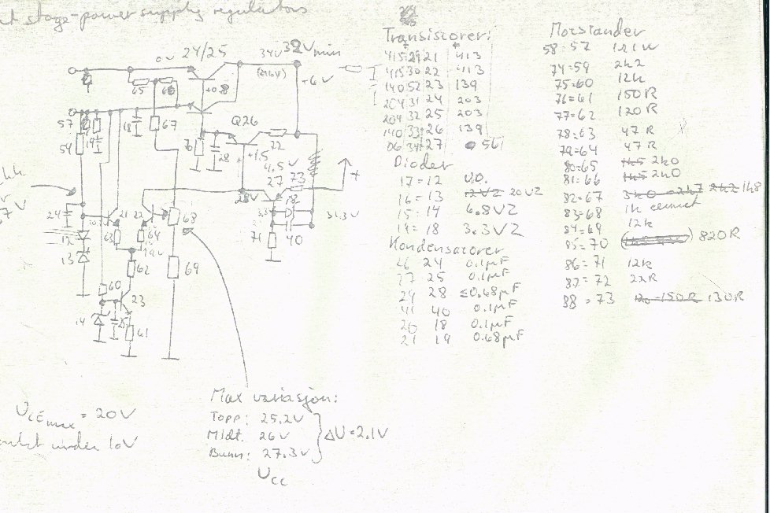

+++
title = "The Regulated 25W Power Amplifier"
weight = 100
+++

We noted early on that the power supply had a significant effect on the
sound. We decided to implement regulated power supplies for the amplifier.
I'm not quite sure when we did this, but it might have been sometime in '76,
possibly '77. We did it straightforward — no switching, no nonsense, only
linear regulators. Hot? Yes, indeed!

I've had some trouble locating the schematics for the regulators, but I
believe I've found them. It's possible that the ones shown here are
preliminary schematics — the design never made it into production, so I'm not
quite sure if any other version ever existed.

Only a couple of these amplifiers were ever made, and one of them was
returned to me for service a couple of years ago. Sadly, it was by then
beyond repair.

The amplifier has two sets of supplies, one for the pre-stages and one for
the output stages, so two sets of regulators were needed.

Note the Q27 emitter — it should be coupled to the unregulated pre-stage power
supply. Q27 acts as a current generator and needs some voltage headroom. Note
also that there are no current limiters, so if the regulated output was
shorted to ground, blue smoke was the result!

The transistors are listed with only numbers: 139/140/203/204 are BD, and 413
is BC. All BD transistors were heatsinked — in fact, they were mounted onto
the bottom plate of the amplifier!
