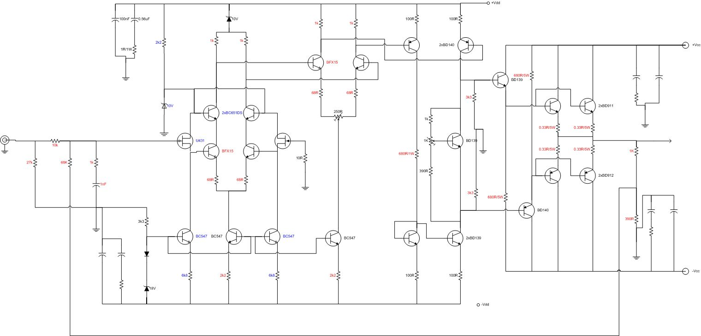
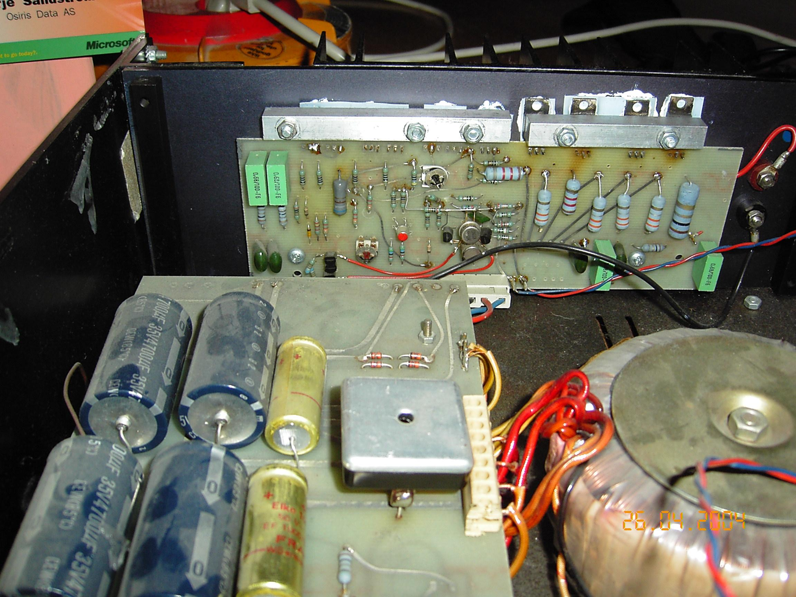
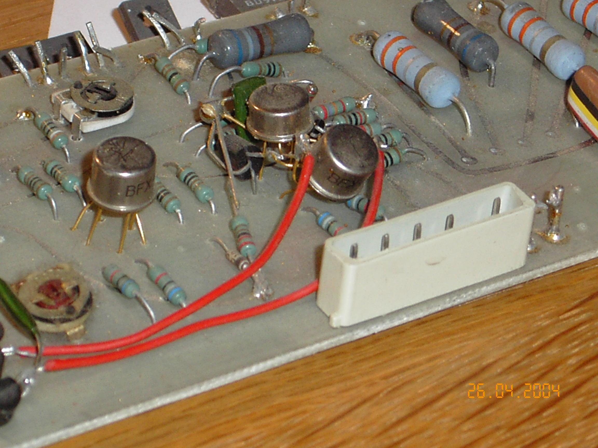
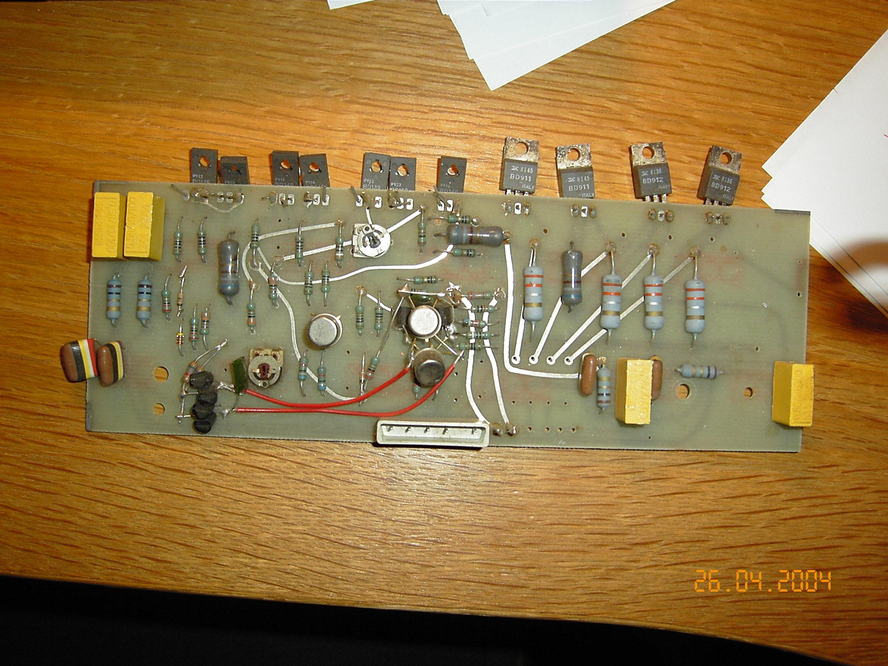

+++
title = "The NRF Modifications"
weight = 100
+++

After I left Electrocompaniet in 1979, I tried to start up a new audio company
in Asker together with two good friends, Paal Rasmussen and Espen Evensberget.
We called the company "[Norsk Radiofabrikk](/history/norsk-radiofabrikk)" (in
English, the Norwegian Radio Manufacturing Company). We wanted it to sound
old-fashioned, and really had a lot of good fun with this. However, our own
original designs never made it into reality. In 1980, or thereabouts, we
started to modify EC amplifiers. We modified between 50 and 100 amplifiers,
and a somewhat lesser number of preamplifiers. The sound improvement was very
good — not too surprising, since I knew these amplifiers in and out. Later we
did some 50 amplifiers from the ground up, called the Special Version — the
modification taken to its logical end. The components for these amplifiers
came partially from Electrocompaniet. I don't think Per liked it, but I also
don't think he really minded — if he had, he wouldn't have sold us components,
like cabinets and so on.

I have had some trouble locating all the schematics and component lists —
don't really know where I have (mis)placed them. However, I have redrawn the
schematic for the modified amplifier below. **Please be aware that the
schematic is not to be used for commercial purposes without my permission.
All private use is encouraged.**

Components with red values are changed, components with blue values are new,
otherwise equal to original values. Please get in touch regarding proper
frequency compensation of this amplifier.

I've also included some pictures of the modified circuits below, so that you
can see for yourself how we did the practical part of the modifications. Note
that none of the traces were cut on the circuit board — all new components
were wire-mounted ("bird's nests"). Not the prettiest thing, but it sure
works.

The modification significantly reduces the distortion of the amplifier,
bringing much more clarity to the midrange, a tighter bass, and a smoother,
less harsh top.

*(A later note also mentioned a further schematic variant that popped up —
apparently a later version that also never made it into reality, with
component values and general setup equal to the modified ones described
here, but with an extra double pair of output transistors and emitter
followers added before the third stage. That particular schematic image
itself hasn't survived.)*

## The Special Version

Later we did some 50 amplifiers from the ground up, called the Special
Version — the NRF modification taken to its logical end.

Note the heavily reduced values of the output-stage emitter resistors — down
to 0.33 ohm from 1 ohm! This reduces the AB nonlinearity, as described in my
1982 AES paper.

Note also the changed input stage, with a JFET differential pair as a source
follower. It was found that the bipolar input stage added distortion caused by
its nonlinear input base current acting on the input resistors. (Which again
shows: when we reduced the input resistors from 6k8 to 2k2, we heard a sound
improvement and believed it was caused by improved frequency-response behavior
above 20kHz — it may have been the 10dB distortion reduction that we heard!)
To reduce this distortion further, the JFET pair was added. Further, a cascode
pair was added to eliminate the Miller effect and the nonlinear voltage
modulation of the critical first stage.

The gain distribution was also changed — the 3rd stage gain was increased by
raising the load resistors from 2k2 to 3k3. More gain was needed to increase
the overall feedback to 40dB. It was found that increasing this particular
point (3rd stage) was the less critical of the options. However, we got
slightly more relative modulation effect on the 3rd stage than we wished for.

All in all, approximately 100 amplifiers were modified, and an additional 50
Special Versions were made.

By the end of the '80s and the beginning of the '90s, I tried a few more
changes to the amplifier design, which never made it beyond the lab bench.
Only one amp exists with these modifications. They included emitter followers
added before the 3rd stage, to reduce the modulation effect mentioned above.

## Modification photos

*(Captions translated from the original Norwegian file names.)*

