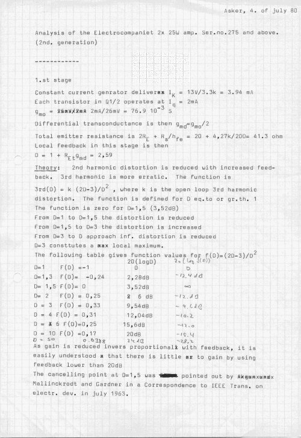

+++
title = "Calculations on the 25W Amp"
weight = 30
+++

The following image is the first of an analysis done on the 25W amplifier.
The date, 4 July 1980, indicates that this was done after I left EC (which
was in '79, at least on a full-time basis — after a short break in '80 or so,
I returned on a consultancy basis to do more work for them until sometime in
1982).

I will upload the whole analysis. For those technically inclined, it should
be interesting — lots of similar analysis was also done earlier. I got the
feeling that many people believed we were only some kind of non-serious
hippies. Well, in a way we were outside the establishment, but we did our
mathematics! Also note the point made at the end of the note, saying that
feedback below 20dB is no good idea when it comes to distortion.

