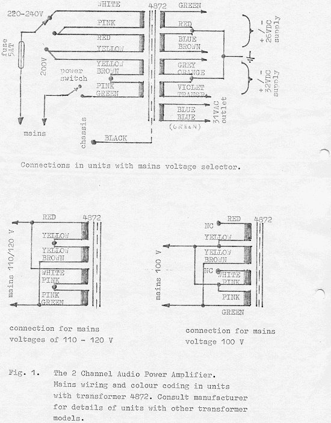
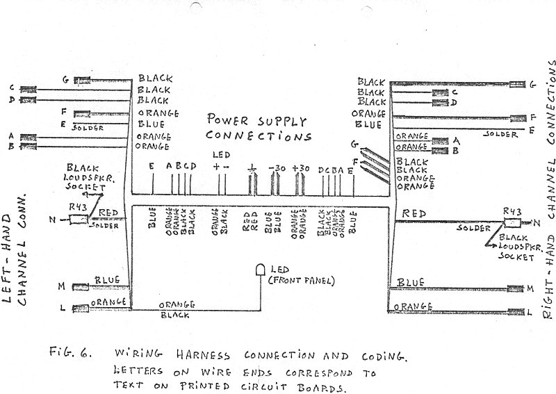
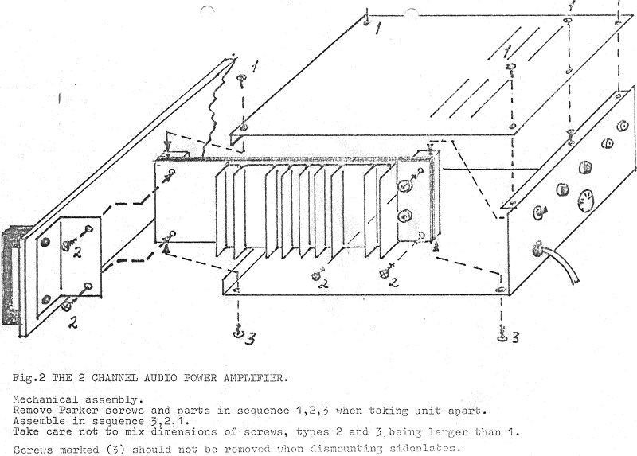

+++
title = "Transformers, Wiring & Mechanical Assembly"
weight = 40
+++

This page is intended to help you if you're going to service your amplifier.
Electrocompaniet still services their old amplifiers, and I still service
those I modified between 1979 and 1983 — however, the process may be slow (too
much other stuff to do), so if you're good with a soldering iron and have some
instruments to help you along, this page together with the schematics may be
what you need.

The transformers were also special:

And the wiring harness:

We thought we ought to have those exploded mechanical-assembly-view drawings,
like the Japanese manufacturers did. What do you think about this?

Then onto the [troubleshooting pages](../troubleshooting-the-amplifier).
