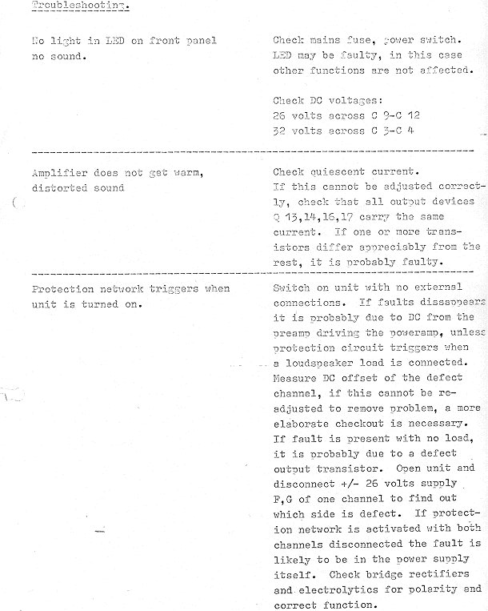
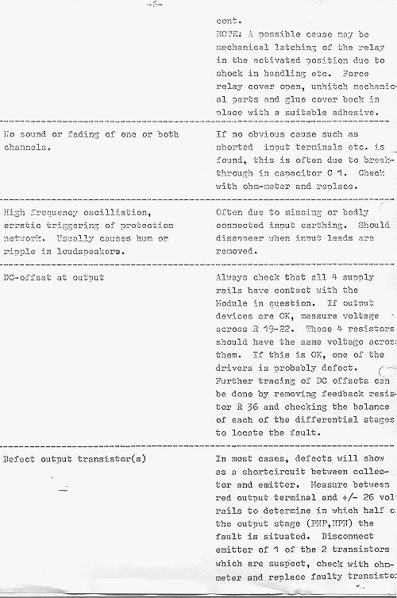
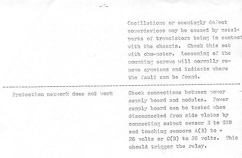

+++
title = "Troubleshooting Your Amplifier"
weight = 50
+++

This page contains info on troubleshooting the power amplifier. For some info
on the preamplifier, see
[Troubleshooting the Preamplifier](../troubleshooting-the-preamplifier).

The following are excerpts from the original service manual of the EC 25W
amplifier.

If you have specific problems, get in touch via [the about page](/about/), and
if I know the answer I'll follow up — and the case will also be added here.
Also see more drawings on the
[transformers, wiring & mechanical assembly](../transformers-wiring-mechanical)
page.
