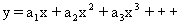
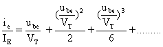
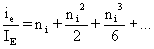

+++
title = "A Theory of Single Stages"
weight = 10
+++

## The general idea

When you design something, you're moving your ideas and abstract thoughts
into the real world. Using electronic components, they will never act
exactly equal to your ideas. So the best approach is to approximate their
behavior, and make them work as close to your ideas as possible. Further, if
you choose your models skillfully, you will get a behavior from the device
which very closely mimics what you're after.

Therefore, the sequence is: Model ⇒ Design ⇒ Measurement ⇒ Listening — and you
circle this sequence until you're happy :-)

The walkthrough below is rather detailed, to show the general outline of the
procedure. The other derivations are less rigorous.

## A model for a single stage

We model a single stage as a voltage-controlled current source. In our ideal
world this means we want an active device working as a transconductance
device. A transistor (and also a tube) is very close to this ideal. But one
has to further improve the circuitry around the active device, in order to
make it behave as closely as possible to this ideal.

What this means is that a perfect transistor, and thus a perfect stage, will
have infinite input impedance, no reverse coupling from output to input,
infinite output impedance, and a finite and constant (with respect to both
the signal and the environment) transfer conductance.

Real transistors are not quite as good as this, but we can improve on the
transistor in order to make it behave more like this ideal. Doing this will
normally make the stage perform better in all respects, but keep in mind that
all rules will turn back on you at a certain stage. There is no such thing as
a free lunch.

If such a stage is voltage-driven, we will reduce the nonlinearity from all
"leakages" back to the input, be it input impedance or reverse coupling. The
dominating nonlinearity will then be the transconductance, which is easy to
control.

A transistor in a common-emitter coupling is the starting point. It has, in
principle, the behavior described above. The following rules exist:

**Linear behavior:**

Transfer conductance, given by:

`gm = Ie/Vt`

`Ie` is the emitter DC current and `Vt` is the voltage equivalent of
temperature, normally equal to 25 mV — the exact formula is `kT/q`, where `k`
is Boltzmann's constant, `q` is the charge of an electron, and `T` is the
absolute temperature in Kelvin.

The inverse of the transconductance is called the dynamic resistance, called
`re`.

Current amplification: `Hfe = Ic/Ib`, derived for a particular current
`hfe = ic/ib`, which applies for small-signal currents around a quiescent
point `Ic`.

Input impedance: `rin = hfe*re`

The dominating nonlinear mechanism lies in the transconductance. Since this
is a single stage (not a differential stage) it will generate a smooth series
of harmonics (if stimulated with a pure sinusoid).

If the input signal is given as `x` (where `x` can be e.g. `sin(wt)`), then
the output `y` will be:

And `x` is a relative parameter which must always obey `|x| < 1` in order for
the series to converge. If `|x| < 1` then it follows that `|y| < 1`. The
output current is `ie` and the output parameter is then `ie/Ie`. The input
signal generating a current of `ie` is `uin`, from the formula
`ie = uin*gm`. It then follows from the transconductance formula that the
input parameter we seek is `uin/Vt`.

So, given the input `x`, defined as `uin/Vt`, and the output `y`, defined as
`ie/Ie` — what do these things mean?

If `uin/Vt` exceeds 1, then the varying part of the current exceeds the
quiescent current `Ie`, and the stage is clipping. When the stage is
clipping, our formula breaks down. If we want to find the distortion when the
stage is clipping, we'll have to resort to Fourier analysis.

To make this into a practical case: assume a transistor running at a current
of 1mA. The `gm` is then 1/25 siemens (the inverse of ohm, the unit for
transconductance, although "mhos" — ohm reversed — is also used). An input
signal of 1 mV will then generate an output current of 1/25 mA = 40 µA. But
now note: this is the first-order approximation. As can be seen from the
series expansion above, we also have second- and third-order components. The
first-order coefficient should be pretty close to `gm`, but what are the
other two coefficients?

The real equation relating input voltage to output current is
`Ie = Is*exp((Ube/Vt)-1)`, called the Ebers-Moll equation. `Is` is the
"leakage" current, but don't bother about it — we'll soon enough get rid of
it. We are interested in finding the equation for the behavior around the
quiescent point. We do this by adding small deviations `ie` and `ube` to the
equation above. Resolving this, we get the much simpler equation:
`ie/Ie = exp(ube/Vt)-1`, and its inverse: `ube/Vt = ln(1+ie/Ie)`. These
equations are called the signal equations, and will be used to get the
coefficients for the series expansion above. We'll first make a series
expansion of the first equation, and we get:

## The efficiency parameter

We now introduce the efficiency parameter `ni`. The point of introducing this
parameter is to generate simpler formulas for calculating the distortion, and
to gain a better understanding of how the distortion and other transistor
parameters are coupled.

The parameter is defined as:

`ni = ie/Ie`

For a bipolar stage without local feedback, as the stage discussed above,
`ni` is equivalent to `ube/Vt`, where we only consider the linear part of the
series expansion. The equation above can then be written as:

The second-order distortion is defined as the second-order term divided by
the first-order term, and the third-order distortion in the same manner:

`2nd = ni/2`

`3rd = ni²/6`

If the input signal is a sinusoid, then the following equations hold (ask via
[the about page](/about/) if you'd like the proof), where `2ndh` is the
second-order harmonic distortion, and `3rdh` is the third-order harmonic
distortion:

`2ndh = 2nd/2`

`3rdh = 3rd/4`

Putting it together:

**`2ndh = ni/4`**

**`3rdh = ni²/24`**

...and remember, `ni = uin/Vt`.

## FET stages

It is interesting to do the same exercise for FET transistors. The result is
a simpler series, with only first- and second-order components. By inserting
the efficiency parameter, one gets the following equation for the FET's
second-harmonic distortion:

**`2ndh = ni/8`**

Half the amount of the bipolar transistor. Some people have argued that the
FET is a much more linear device than the bipolar. This equation shows that
to be only a partial truth — there is only a 6dB improvement.

## Local feedback

It is well known that local series current feedback (read: inserting an
emitter resistor) reduces the distortion. The feedback factor can be written
as:

`D = 1 + gm*Re = 1 + (Ie*Re)/Vt`

and the resulting efficiency/distortion equations are then:

`2nd = ni/(2*D)`

and

`3rd = ni²/(3*D)`

or for the harmonic distortion:

`2ndh = ni/(4*D)`

`3rdh = ni²/(12*D)`

Note that the efficiency parameter `ni` is still defined as `ie/Ie`, but the
input version is now `ni = uin/Vth`, where `Vth = Vt*D`.

## Differential stages

There is a similar set of equations for the differential pair.

If the stage is completely in balance (which of course rarely happens), all
second-order components will be cancelled.

The no-feedback solution will have a basic transconductance of
`gm = Ie/(2Vt)`, which gives `ni = uin/2Vt`.

The corresponding distortion is then equal to the single stage, except for a
mismatch parameter `m` and a common-mode signal factor `c`:

`3rd = ni²/3`

and

`2nd = (m+c)*ni/2`

If the current source feeding the emitters has infinite output impedance, `c`
approaches 0. The formula for `c` is `c = ik/(2ie)`. More information on this
is in my AES paper (not yet ported to this site). There used to be an ActiveX
Single Stage Calculator here as well — it's retired along with the rest of
the site's old ActiveX controls.

## Summary

| Stage type                | 2nd harmonic     | 3rd harmonic       |
|----------------------------|------------------|---------------------|
| Bipolar single stage        | `ni/(4*D)`       | `ni²/(12*D)`        |
| FET single stage            | `ni/(8*D)`       | Ideally zero         |
| Bipolar differential stage  | `(m+c)*ni/(4*D)` | `ni²/(12*D)`         |
