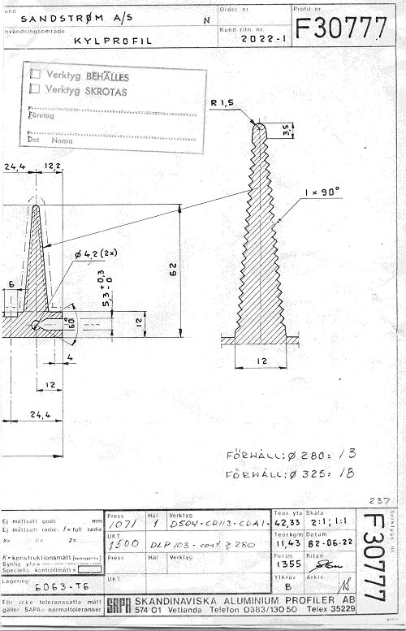

These cooling fins may be the best engineered fins ever made for an audio amplifier.

&nbsp; They are the result of a strong interest in thermodynamics I had at the time. The

fins are much thicher at the base than ordinary fins - and is gradually made thinner

outwards.&nbsp; This was done to improve heat transfer throught the fins, to get an even

surface temperature, thus the lowest heat transfer resistance.

The fins were very carefully designed, and every aspect was calculated to give optimal

performance.&nbsp; The compromise - size and weight - was found to be acceptable to the

gained performance.

If you take a closer look at a fin:

Note the zig-zag pattern. This was done to increase the overall surface area of the fin

with 40%, not bad, huh ?

We made a few tenths of these fins, and they performed as intentended.&nbsp; However,

none ever made it into a commercial amplifier.

</body>

</html>

