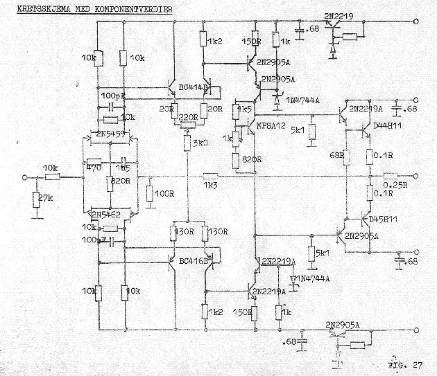

Oistein Klevhus, now at FHI (Public Health Institue) in Norway, and myself, did a project together at the
end of our engineering school.&nbsp; I am greatly in debt to Oistein, because he was the
one who made it possible for me to go through with that school. I was far to busy with
EC, and had far too little time for school. Oistein came over to me at EC with school work tasks
and other stuff I had to do, and in that way it was possible for me to manage doing the school
without nearly being present.&nbsp; I am forever grateful for that!

The amplifier :&nbsp; It was a very special design, fully complementary, and used
matched single field-effect transistors at the input, and some very interesting output
transistors, with a very low turnover point.&nbsp; 

I will come back with more info on the matching of the input transistors, but for now - they required manual matching, and it wasn't easy to find a pair that worked. Note also, the very low emitter resistors on the output stage.&nbsp; This matches a later
paper I did on the AES.&nbsp; More on this later. 

