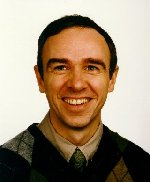
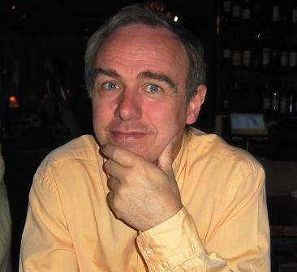

# Who Am I

## I am Terje Sandstrøm

|  |  |
|---|---|
|Born|15. September 1956 in Oslo, Norway|
|Spouse| [Ann-Louise](https://alkymi.net/)|
|Children|Uno,   Born 24.Nov. 1983 |
||Isabel Born 3. Oct. 1996|
|Occupation|Independent software programming consultant at [Hermit AS](https://hermit.no)|
|Open Source|[NUnit](https://nunit.org) Core Team Lead|
|Education|Cand. Scient in Physics (Masters degree) from the University of Oslo|
|Location|Hvalstad, a place in Asker 20 km south-west of Oslo, Norway|
|Awards|[Microsoft Visual Studio Development Techniques MVP, 2009-2024](https://mvp.microsoft.com/en-us/PublicProfile/4025028?fullName=Terje%20%20Sandstr%C3%B8m)|
|Blog|[at Hermit](https://hermit.no)|
|Twitter|[OsirisTerje](https://www.twitter.com/Terje)|

